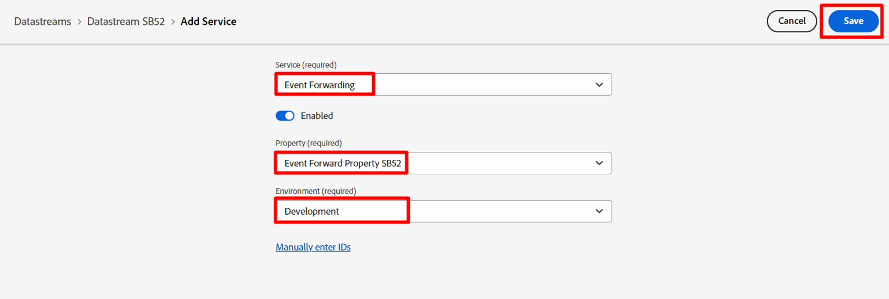
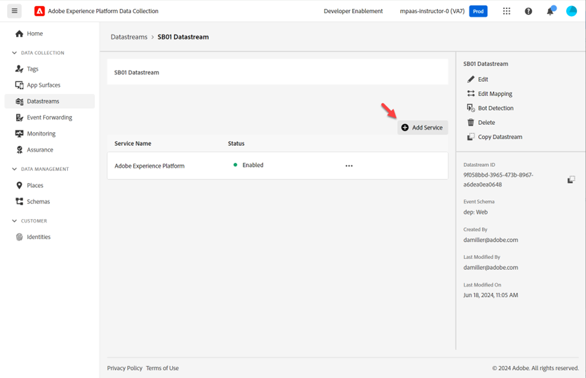
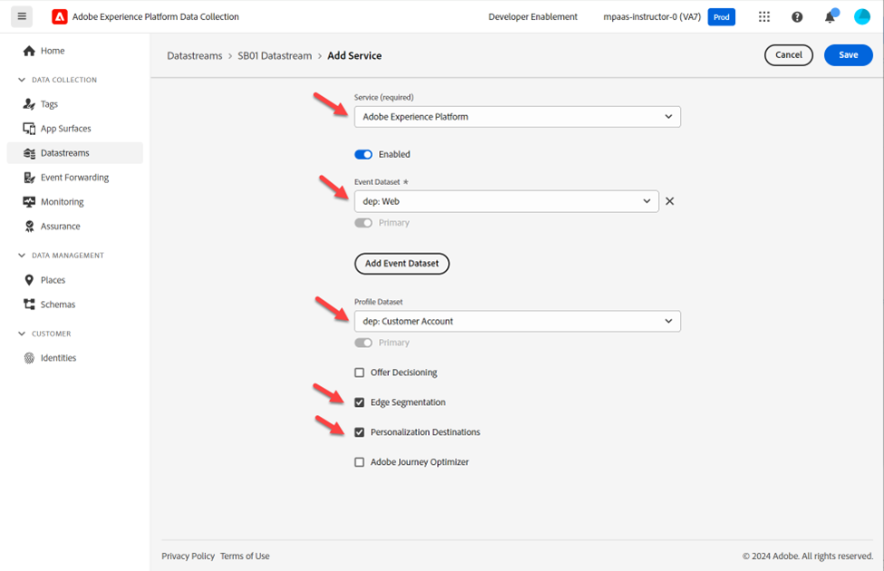

# データストリームを作成

データストリームは、それを利用するサービスを定義します。

- Edgeにデータを送信する場合、使用するデータストリームを指定します
- これらのデータストリームに送信されたデータは、設定されたサービスに従ってアクションを実行できます
  - イベント転送
  - Adobe Experience Platform

## 新しいデータストリームの作成

1. **データ収集**&#x200B;の下の左側のパネルで、**データストリーム**&#x200B;をクリックします
1. 次に、**新しいデータストリーム**&#x200B;をクリックして作成します

## データストリームの設定

次の情報を使用してデータストリームを設定します。

1. 名前 – > **データストリーム SB + \&lt; サンドボックス名> （データストリーム SB01）**
1. イベントスキーマ -> **dep: Web**
1. **位置情報とネットワーク検索**&#x200B;のすべてのオプションを&#x200B;**で**&#x200B;切り替え
1. 完了したら、**保存** ボタンをクリックします

>[!WARNING]
>
>「保存してマッピングを追加」をクリックしないでください。  誤ってキャンセルしてしまった場合

データストリームを保存すると、次の画面が表示されます。

新しいデータストリームを保存した直後に表示される

## イベント転送サービスの追加

これにより、このデータストリームで受信したデータにイベント転送を使用できます。

1. 「**サービスを追加**」をクリックします

   「サービスを追加」ボタンが強調表示された

1. 次の項目を設定します。

   - サービス -> イベント転送
   - プロパティ ->前の手順で作成したプロパティを選択します。  イベント転送プロパティ SB + \&lt;あなたのサンドボックス番号>
   - 環境/開発

1. 完了したら、**保存**&#x200B;をクリックします

## Adobe Experience Platform サービスを追加

これにより、データをハブに送信し、このデータストリームで受信したデータのデータセットに格納できます。

1. 「**サービスを追加**」をクリックします

   「サービスを追加」ボタンがハイライト表示された

1. 次の項目を設定します。

   - サービス -> Adobe Experience Platform
   - イベントデータセット -> dep: Web
   - プロファイルデータセット -> dep：顧客アカウント
   - チェックボックス/Edgeのセグメント化を選択します。
   - チェックボックス/Personalizationの保存先を選択

   

1. 完了したら、**保存**&#x200B;をクリックします。

1. 最終的な画面は、次の2つのサービスが表示されているはずです。 **Copy**&#x200B;および&#x200B;**save** the **Datastream ID**&#x200B;をローカルコンピューターに保存します（後でPostmanで使用します）

