# プロパティを作成

通常、エクスペリエンスイベントをサードパーティに転送します（必須ではありません）。 これは通常、特定の状況で第三者に通知するためにイベントのコピーがリアルタイムで必要な場合に使用されます（例：購入についてGoogle、Meta、TikTokに通知する）。

>[!NOTE]
>
>リマインダー：プロパティには、何をどこに送るかを決定するために必要なすべての拡張機能、データ要素、およびルールが含まれています

1. 左側のパネルで「イベント転送」をクリックします
2. 「New Property」をクリックして

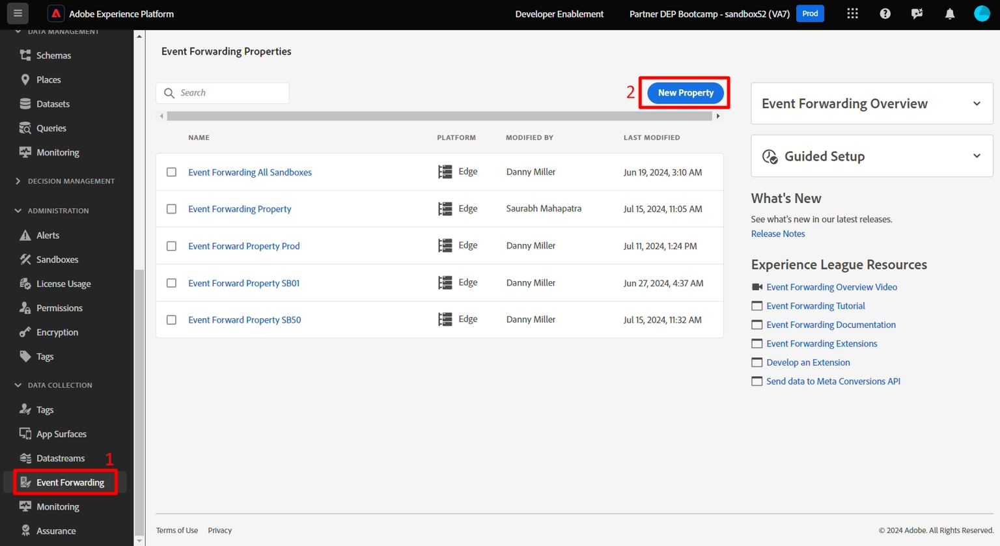

3. 次の数式を使用してプロパティ名を更新します：`Event Forward Property SB + [sandbox number]`。 最終名称は次のようになります。**イベント転送プロパティ SB01**

4. 完了したら、**保存**&#x200B;をクリックします


## 拡張機能をインストール

1. 作成したイベント転送プロパティをクリックします


2. 以下のような画面が表示されます。  **拡張機能**&#x200B;をクリックします。

「拡張機能」タブが強調表示された


3. 次の手順を実行して、拡張機能Adobe Cloud Connectorをインストールします。

4. 上部ナビゲーションの&#x200B;**カタログ**&#x200B;をクリックします
5. **Adobe Cloud Connector** カードをクリックします
6. 右側のパネルで「**Install**」ボタンをクリックします

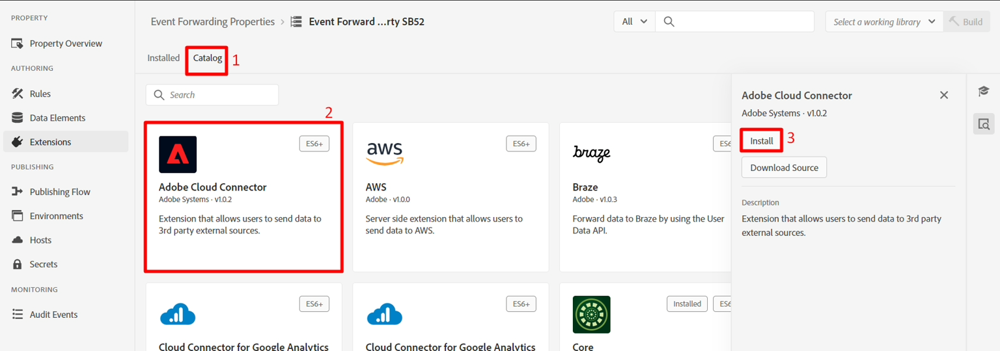


インストールをクリックすると、次に示すように、プロパティの「インストール済み」拡張機能の下に拡張機能が表示されます

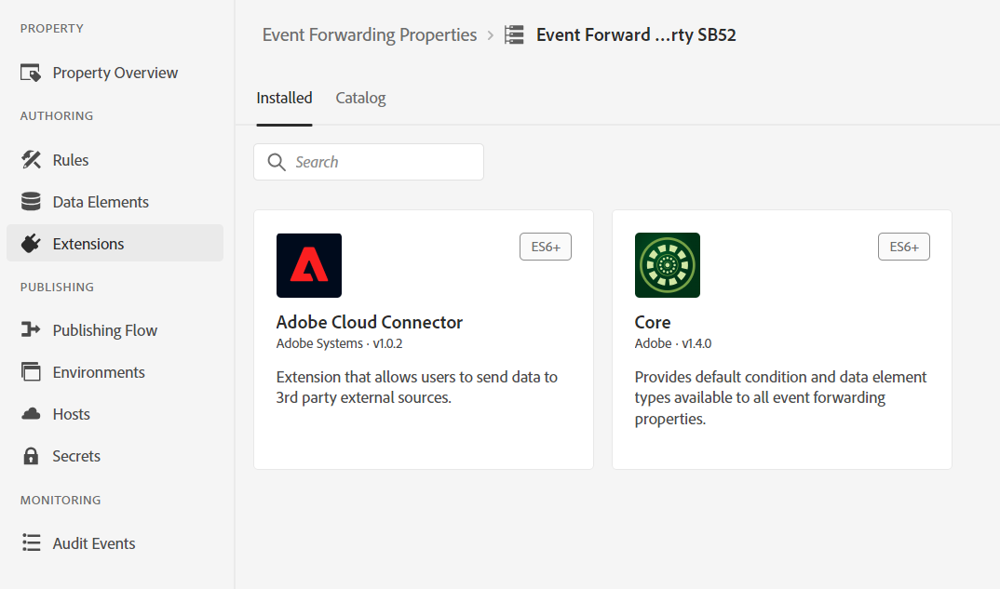

## データ要素を作成

>[!NOTE]
>
>データ要素は、受信イベントを参照し、必要に応じて複数の個々のコンポーネントに解析できます

1. 左側のパネルで、**データ要素**&#x200B;をクリックします


2. 「**新しいデータ要素を作成**」ボタンをクリックします


3. 次の情報を使用して、新しいデータ要素を設定します。

| 要素タイプ | 設定する値 |
| ----------------- | ------------------ |
| 名前 | データオブジェクト |
| 拡張機能 | コア |
| データ要素タイプ | カスタムコード |


4. ボタン **エディターを開く**&#x200B;をクリックして、次のカスタムコードを追加します。


5. このようにカスタムコードをエディターに追加し、保存します

```none
var xdm = arc?.event || '';
return xdm;
```

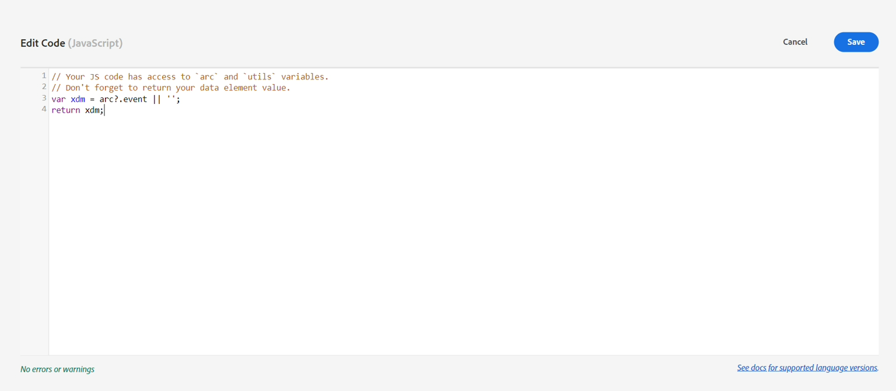

>[!NOTE]
>
>これにより、ペイロードに翻訳を行うことなく、xdm オブジェクト全体を取得します。  必要であれば、XDM オブジェクト内の個々の要素（ページ名、購入額など）を、フィールドごとに1つのデータ要素に解析できます。  これを行う理由は、構造が別の構造に変換された場合です


6. 「**保存**」ボタンをクリックして、データ要素を保存します。


完了すると、データ要素が追加されたことを確認する次の画面が表示されます。

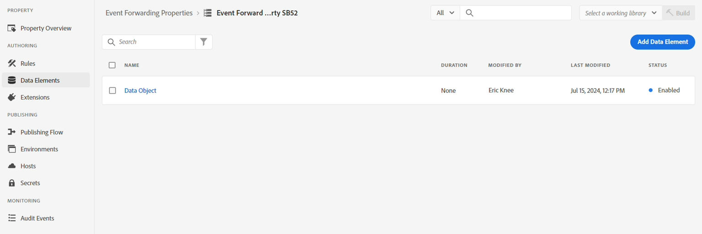


## ルールの作成

>[!NOTE]
>
>ルールには次のものが含まれます。
>
>1. 今後の措置に関する条件
>2. ペイロードを変換し、送信先を定義するアクション


1. 左側のパネルで「**ルール**」をクリックします

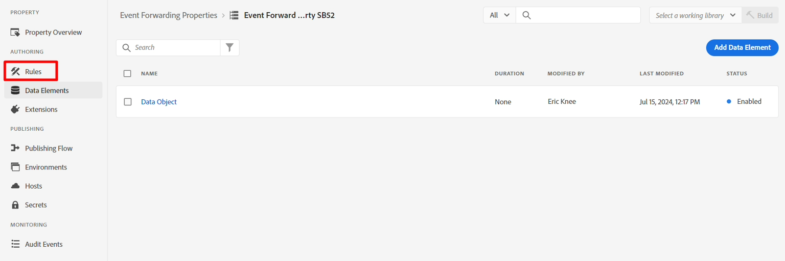


2. 次に、**新しいルールの作成**&#x200B;をクリックします


3. 次の数式を使用してルール名を更新します：`"EF Rule SB" + [your sandbox number]` （EF ルール SB01）。 次に示すように、ブラウザーウィンドウの右上にサンドボックス番号が表示されます。

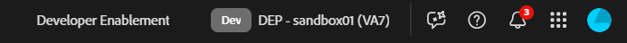で使用されているサンドボックス番号が表示されています

4. 完了したら、**保存**&#x200B;をクリックします

>[!NOTE]
>
>ルール名が`"EF Rule SB" + [sandbox number]`の数式パターンに従っていることを確認してください


5. 「+」記号をクリックしてルールにアクションを追加し、新しいアクションを追加します


## Webhook URLを取得（実際に使用）

>[!NOTE]
>
>このラボでは、ここでWebhookを使用して、データが送信先に到着したかどうかを確認できます。 現実世界のシナリオでは、代わりにその宛先にログインし、そのツールを使用して何が届いたかを確認します。


1. ブラウザーの新しいタブで次のリンクを開きます – > [https://webhook.site](https://webhook.site/)
2. 表示された一意のURLをコピーし、安全な場所に保存します

コピー用に一意のURLがハイライト表示された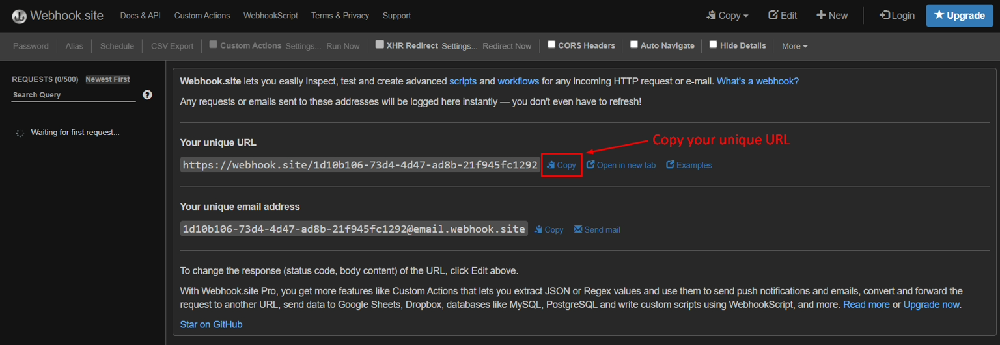


3. 次の情報を使用してアクションを設定します。

| 設定 | 値 |
| ----------- | ------------------------------------------------------------------------------------------------------------------------------------------------------------------- |
| 拡張機能 | Adobe Cloud Connector |
| アクションタイプ | 呼び出しの取得 |
| メソッド | 投稿 |
| URL | ストリーミング宛先の設定に使用したのと同じWebhook URLを使用します。 ブラウザーで新しいタブを開き、「宛先」/「参照」に移動すると、見つけることができます |
| 本文 | Raw |
| Body Data | \{ &quot;data&quot;: \{ &quot;event&quot;: &quot;\{\{Data Object\}}&quot; } } |

>[!NOTE]
>
>ここで参照されている\{{Data Object\}\}は、前に作成したデータ要素です。 ここで、下流システムの要件は、イベントオブジェクトをデータオブジェクトにラップすることでした。 ここにフォーマットを入力してください。
>
>\{\{Data Object\}\}を複数のフィールド（ページ名、購入など）に分割した場合、各フィールドを目的の場所に配置するJSON構造を変換して、宛先の一致をより詳細に制御できます。


完了したら、画面を下の画面と同じように検証し、**変更を保持**&#x200B;をクリックします

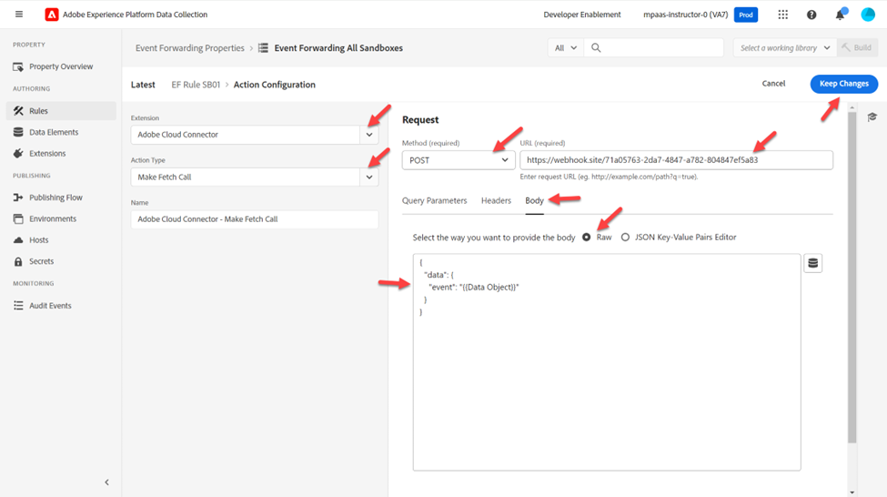


4. 完了すると、アクションがルールに追加されます。 **保存**&#x200B;をクリックして続行します。

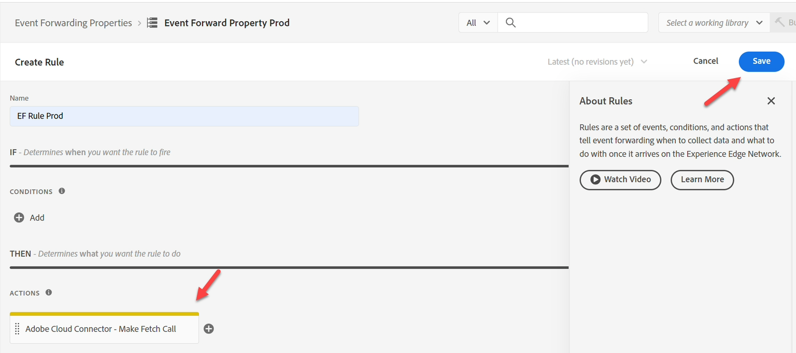

>[!WARNING]
>
>エクスペリエンスイベントを送信する場合、プロファイルではなく、その属性（Edge オーディエンスであっても）も含めて、イベントを送信します。
>
>これは、スピードアップの目的で行われます。


## 変更を公開

1. 左側のパネルで「**公開フロー**」をクリックします


2. 「**ライブラリを追加**」ボタンをクリック

ライブラリを追加ボタンがハイライト表示された


3. 次の情報を使用してライブラリを設定します。

- 名前 – > **EF ライブラリ**
- 環境 – > **開発**
- **変更されたすべてのリソースを追加**&#x200B;をクリックします


完了すると、画面は以下のスクリーンショットと同じように表示されます。  すべてが正常に見える場合は、「**開発に保存してビルド**」ボタンをクリックします

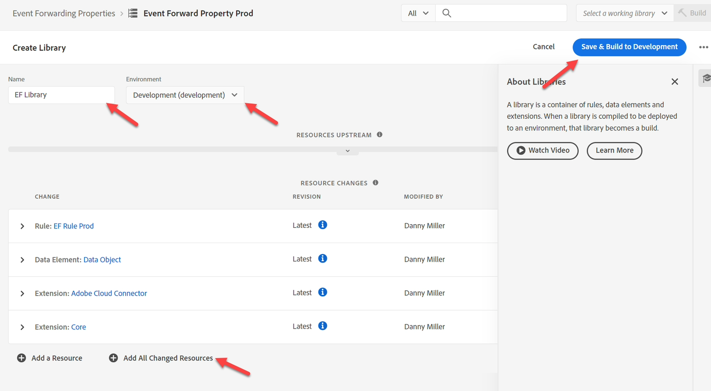


4. すると、開発ビルドが緑色になり、使用する準備ができたことが示されます


