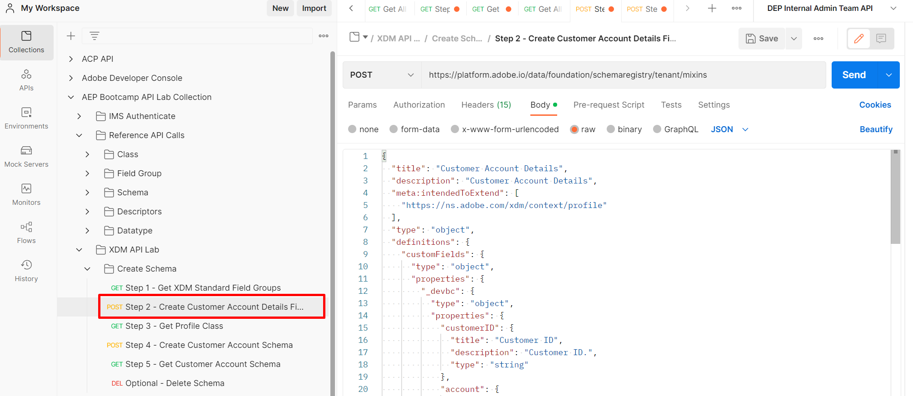
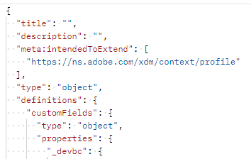
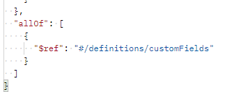
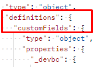

# カスタムフィールドグループの作成

## フィールドグループ構造

フィールドグループは、常に次のフィールドで構成されます。 これは次のステップのリクエストに表示されます。

| 必須の値 | 説明 |
| --------------------------- | ---------------------------------------------------------------------------------------------------------------------------------------------------------------------------------------------- |
| title | スキーマレジストリ内で作成するフィールドグループの名前。 名前は一意である必要があります。 |
| description | フィールドグループの目的についての簡単な説明 |
| タイプ | 常にオブジェクト |
| meta\:intendedToExtend | フィールドグループで使用できるクラスを定義します。 クラスは常に`$id`値で参照されます |
| allOf | フィールドグループに含めることができるリソースについて説明します。 カスタム定義フィールドの場合、パスは常に`#/definitions/customFields`です |
| definitions.customFields... | これは、カスタムフィールドグループの作成に必要なデフォルトのJSON スキーマ構造です。 上の`allOf`と一致する必要があります |
| \&lt;TENANT\_NAME> | テナント名（一意の名前）は、プロビジョニングプロセス中に作成されます。 これにより、行われたカスタマイズが、既存または将来のAdobe スキーマレジストリの変更と競合しないようにします |

## 「顧客アカウント詳細を作成」フィールドグループ

1. `XDM Schema Lab -> Create Schema` フォルダーのリクエスト `Step 2 - Create Customer Account Details Field Group` API呼び出しをクリックします

実行する前に、リクエストの本文を確認します。 フィールドグループの構造セクションで説明されている必須フィールドは、次のように表示されます。

に示すように、カスタムフィールドグループの必須フィールド

>[!NOTE]
>
>`allOf`の上の右側の画像で「/definitions/customFields」のパスを参照する方法に注意してください。  これは、XDM システムにカスタム作成オブジェクトの場所を伝えるために、スキーマで定義された構造（左側の画像）と一致する必要があります。
>
>

また、マッピングシートの各特定のフィールドがXDM JSON構造内でどのように実証されるかにも注目してください。

に変換

2. 次の形式を使用して、フィールドグループの`title`と`description`を更新します：`Customer Account Details - Sandbox <your number here>`

   

3. 「`Send`」ボタンをクリックして実行します。  以下のスクリーンショットのような応答が表示されるはずです。

4. 新しく作成した顧客アカウントの詳細フィールドグループの`$id`値をコピーします。

>[!WARNING]
>
>`$id`をどこかに保存するまで続行しないでください。  顧客アカウントスキーマを作成するには、後で必要になります
>
>
