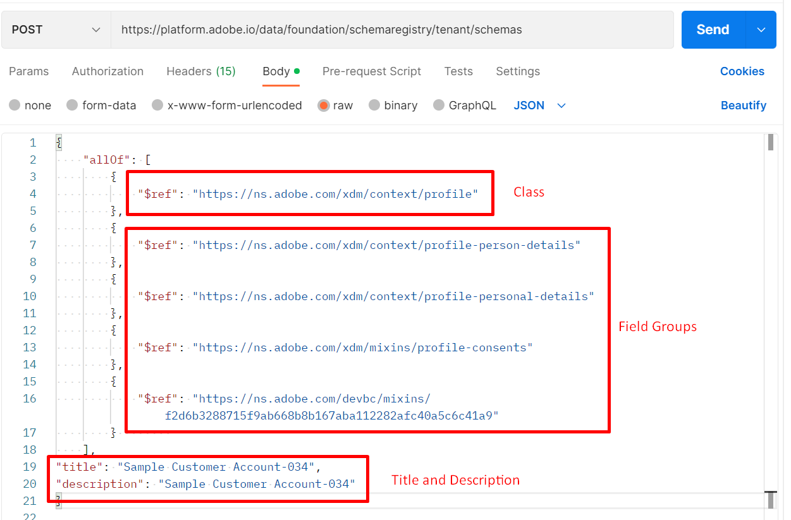

# スキーマの作成

## APIの本文を変更する

>[!CAUTION]
>
>**呼び出しを実行しません…まだ**

1. `XDM Schema Lab -> Create Schema` フォルダーの`Step 4 - Create Customer Account Schema` API呼び出しをクリックします。

   

2. 呼び出しの本文を開き、スキーマの定義方法の構造を表示します。 スキーマは、常に1つの（1）クラスと1つ以上のフィールドグループのみで構成されます。

3. スキーマの本文の`title`および`description` フィールドに次の情報を入力します。

   - タイトル -> `Sample Customer Schema - <your sandbox number>`
   - 説明 – > `Sample Customer Schema - <your sandbox number>`

4. 完了した以前のラボセクションから保存した`$ids`を`$ref` フィールドに入力します。[&#x200B; カスタムフィールドグループの作成](./create-custom-field-groups.md)と[&#x200B; プロファイルクラスの取得](./get-profile-class.md)。 次の項目ごとに$idを設定する必要があります。

   - クラス -> XDM個人プロファイル
   - フィールドグループ -> デモグラフィックの詳細
   - フィールドグループ/個人の連絡先の詳細
   - フィールドグループ/同意と環境設定の詳細
   - フィールドグループ（カスタム）/顧客アカウントの詳細

   クラスおよびフィールドグループ参照を追加する前に

5. 最終的な本文を確認し、このようになっていることを確認します

>[!NOTE]
>
>`$refs`の順序は問題ではなく、本体内の`title`と`description`の位置も問題ではありません。

## APIの実行

1. 続行する前に、API リクエストに変更を保存します。
1. `Send` ボタンをクリックしてAPIを実行します

スキーマを作成するための応答が成功すると、`201 Created` ステータスになり、次の画像のようになります

>[!WARNING]
>
>成功した場合は、リクエストを再実行しないでください

## スキーマ $idを見つけて保存します

1. API リクエストを実行したら、応答から`$id`と`$meta:altId`をコピーします
1. 値をどこかに保存して、後で再利用できるようにします

>[!WARNING]
>
>`$id`と`$meta:altId`をどこかに保存するまで続行しないでください。  これらは今後のラボステップで必要になります

>[!TIP]
>
>**おめでとうございます！ API**&#x200B;のみを使用してスキーマを作成しました
