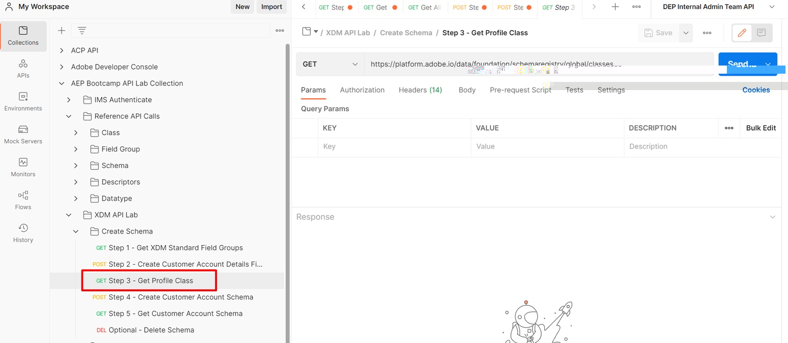

# プロファイルクラスを取得

## 手順3 - プロファイルクラスの取得

1. `XDM API Lab -> Create Schema` フォルダーの`Step 3 - Get Profile Class` リクエストをクリックします
1. `Send` ボタンをクリックして実行

>[!NOTE]
>
>GET リクエストで、`global` パス : .../schemaregistry/**global**/classesに注意してください。 `global`を使用すると、Adobe標準XDM オブジェクトのみを返すことをスキーマレジストリに伝えることを忘れないでください

## クラス $idを見つけて保存します

API リクエストを実行した後、次の手順を実行して、XDM Individual Profile クラスの`$id`を見つけて保存します。

1. 応答で`XDM Individual Profile` クラスを検索します
1. `XDM Individual Profile` クラスの`$id`をコピーし、後で参照できる場所に保存します。

>[!WARNING]
>
>`$id`をどこかに保存するまで続行しないでください。  顧客アカウントスキーマを作成するには、後で必要になります
