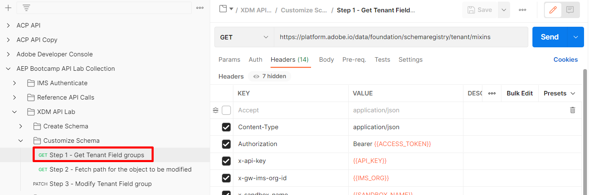
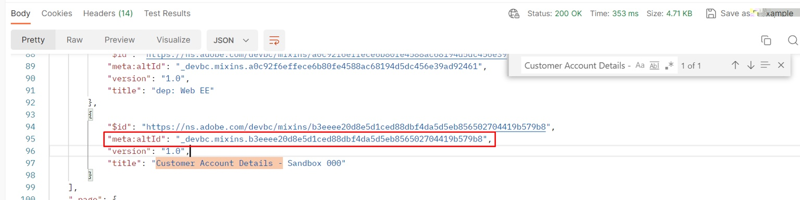
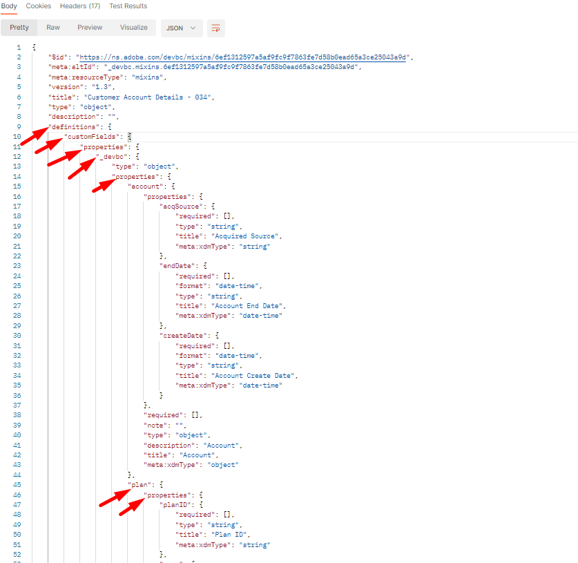
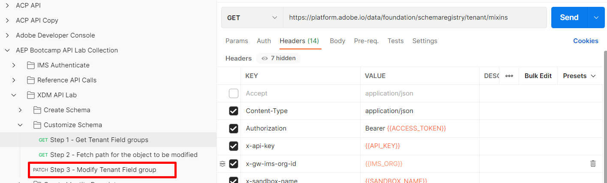
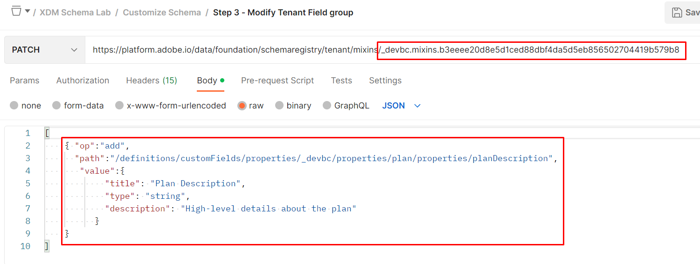

# スキーマの変更 – JSON パッチ

## 概要

スキーマの構築後、`planDescription`という名前の`plan` オブジェクトに追加のフィールドを追加する必要があるとします。 このニーズは、スキーマの作成時に追加するのを忘れた場合や、数か月後にリクエストが発生した場合に発生する可能性があります。 このタスクを実行するには、スキーマを新しいフィールドで更新する`PATCH`操作を実行します。

JSON PATCHについて詳しくは、以下のリンクを参照してください。 このラボでは、その仕組みを一般的に理解していると仮定します。

- [https://jsonpatch.com/](https://jsonpatch.com/)
- [Experience League APIの基本](https://experienceleague.adobe.com/docs/experience-platform/landing/platform-apis/api-fundamentals.html?lang=en#json-patch)


>[!NOTE]
>
>次の点に留意してください。
>
>- スキーマは、1つのクラスと1つ以上のフィールドグループで構成されます
>- スキーマに追加する前に、フィールドグループに新しいフィールドを追加する必要があります。 この制限により、フィールドグループを利用するあらゆるスキーマで、フィールドを再利用できます。


スキーマに新しいフィールドを追加するには、次の操作を順番に実行する必要があります。 このプロセスは、次のラボステップで実行します。

- 新しいプロパティを追加するフィールドグループを特定します
- フィールドグループを更新するためのJSON PATCH呼び出しを作成します
- JSON PATCH呼び出しを実行して、（スキーマが継承する）フィールドグループを更新します


## 更新するフィールドグループを見つけて特定

1. `XDM Schema Lab -> Customize Schema` フォルダーにある`Step 1 - Get Tenant Field groups` API呼び出しを選択します
1. `Send` ボタンをクリックしてリクエストを実行します

   

   >[!NOTE]
   >
   >カスタムフィールドグループ内に`plan` オブジェクトを作成したことを忘れないでください。 XDM スキーマレジストリ内のカスタム作成されたオブジェクトは「テナント」と呼ばれるので、`/schemaregistry/tenant/mixins/` パスを使用してAPI呼び出しを行います。


1. 応答で、以前に作成したカスタムフィールドグループ `Customer Account Details - Sandbox <your number here> `のスキーマ IDを検索します

1. `$meta:altId`をコピーし、次の手順に必要な場所に安全に保存します



>[!CAUTION]
>
>コピーする適切なフィールドグループを選択してください。 `dep: Customer Account Details`という同じ名前のフィールドグループは使用しないでください

>[!WARNING]
>
>今後のラボステップには`$meta:altId`が必要なので、続行する前に保存しておいてください


## $meta\:altIdでフィールドグループを検索します

1. `XDM Schema Lab -> Customize Schema` フォルダーで`Step 2 - Fetch path for the object to be modified` API呼び出しを選択します
1. リクエストのURLで、`<replace me>`を、前のセクションの手順で保存した`$meta:altId`に置き換え、次に示すように、呼び出しの最後まで保存します
1. リクエストに加えた編集を保存します
1. `Send` ボタンをクリックしてリクエストを実行します


応答を確認し、**plan** オブジェクトのJSON ポインターパスが、以下に強調表示されている各プロパティを使用して構築されていることに注意してください。




完全に構成されたパスは、以下のように表示されます。  このパスをコピーし、参照する場所に保存します

```none
/definitions/customFields/properties/_devbc/properties/plan/properties
```

>[!NOTE]
>
>上記のテナント名（\_devbc）を独自の名前で更新することを忘れないでください


## フィールドグループのPATCH

### JSON PATCH API ボディサンプル

```none
[
    {
        "op": "",
        "path": "",
        "value": {
            "title": "",
            "type": "",
            "description": ""
        }
    }
]
```

- **op （Operation）** ->これは、PATCHが実行する必要のあるアクションの手順を提供します
- **パス** ->作成、更新または削除するパス（つまり、新しいフィールドの場所へのJSON ポインター）です
- **値** ->これはオプションのフィールドで、既存のフィールドを作成または置換する場合にのみ使用されます


### API リクエストの実行

1. `XDM Schema Lab -> Customize Schema` フォルダーの`Step 3 - Modify Tenant Field group` API呼び出しをクリックします

   


2. リクエストの本文を次の情報で更新します

   - **op** ->` add`
   - **パス** -> `path from previous step +`` the new field name`
   - **値** ->
     - **title** -> `Plan Description`
     - **type** -> `string`
     - **説明** -> `High-level details about the plan`

   API リクエストは次のようになります

   

   >[!WARNING]
   >
   >新しいフィールド名&#x200B;**planDescription、**&#x200B;をパスに含めるようにしてください


3. すべてが良好に見える場合`Save`

4. PATCHを実行するための呼び出し`Execute`

フィールドグループに`200 OK`応答と`planDescription` フィールドが表示されます（例：）。

planDescription](assets/modify-schema-json-patch-step-3-200-ok-successful-patch.png "手順3 - 200 OK成功したPATCH")でフィールドグループに正常にパッチを適用した後、![200 OK応答

>[!SUCCESS]
>
>おめでとうございます。 JSON PATCHを使用してフィールドグループ/スキーマを正常に更新しました


## UIでの変更の表示

UIでスキーマを参照し、新しく追加したフィールドを表示します。

を変更
