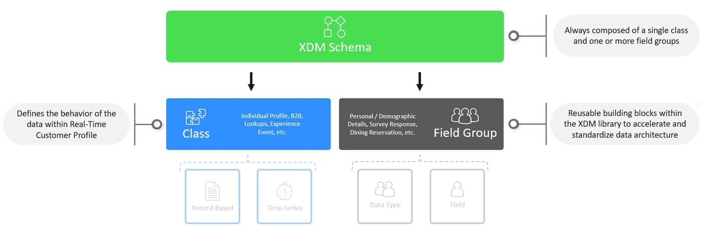
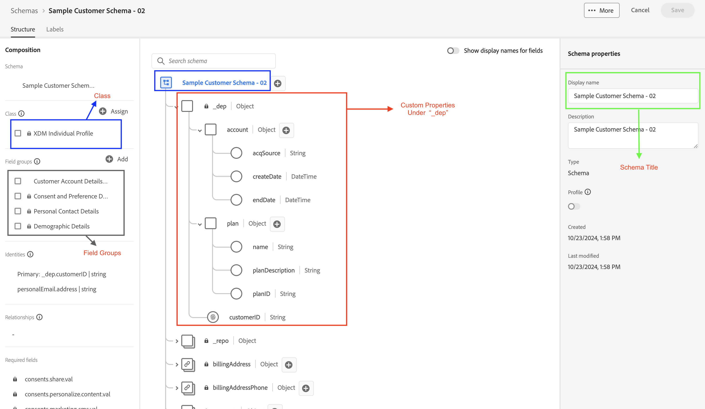
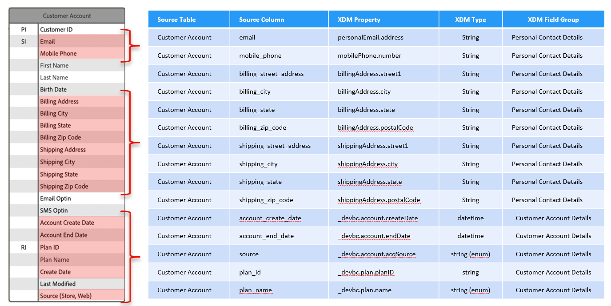

# スキーマの構築

## スキーマアセンブリ

XDMの一部であるすべてのスキーマは、同じ方法で構成されます。  スキーマは、常に1つのクラスと1つ以上のフィールドグループのみで構成されます。 さらに、スキーマのクラスは、Experience Platform内の他のシステムがデータをどのように解釈するかを決定します（つまり、レコードベースまたは時系列として）。

1つのクラスと1つ以上のフィールドグループで構成されたスキーマを示す

## 目標

このラボでは、以前に入力したマッピングシートを使用して、Connection 5G顧客アカウントスキーマを構築します。 ラボのこの部分を完了すると、次のようなスキーマが表示されます。

