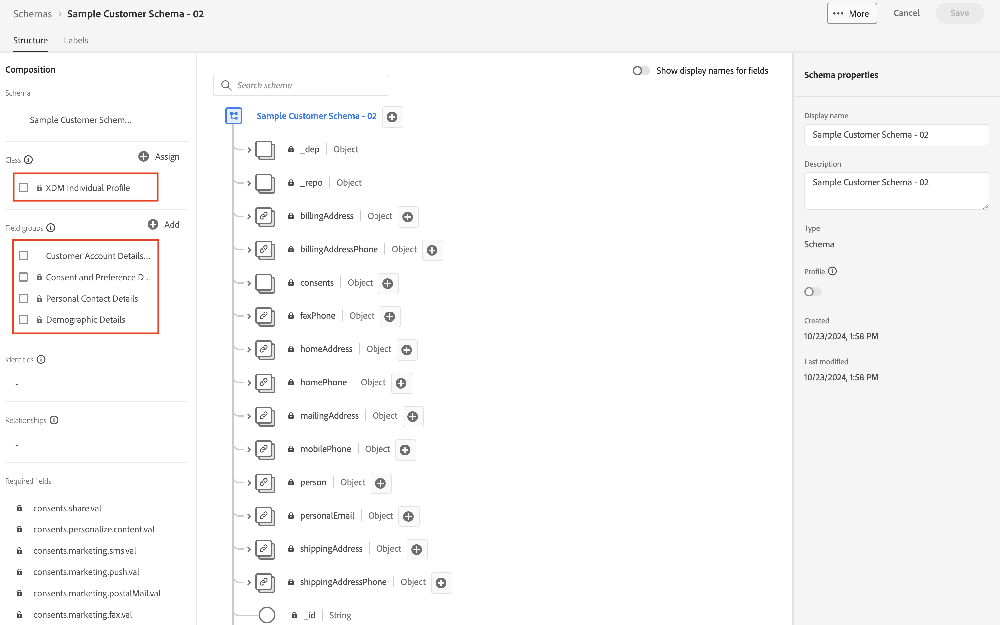

# スキーマの表示

## UI経由で表示

1. ブラウザーを開き、`Schema -> Browse` セクションに戻ります。

   >[!NOTE]
   >
   >UIを更新して表示します。このUIを作成したばかりで、スキーマレジストリを再クエリする必要があるからです

2. スキーマ `Sample Customer Schema - <your sandbox number>`を検索

3. 必須クラスと関連するフィールドグループがスキーマに追加されることに注意してください

クラスとフィールドグループを含むExperience Platform UIに表示される

## API経由で表示

1. `Step 5 - Get Customer Account Schema` APIをクリックして選択します。
1. リクエストのURLで、`<replace me>`を前のセクションから保存した`$meta:altId`に置き換えます（スキーマを作成します）。次に示すように、呼び出しの最後まで
1. リクエストに加えた編集を保存します
1. `Send` ボタンをクリックしてリクエストを実行します

`$meta:altId`を追加した後の最終要求の例

に追加したステップ 5 リクエスト

`200 OK`応答を受け取った場合は、レンズを通じて作成したスキーマをXDM JSON構造を参照できます

完全なサンプル顧客アカウントスキーマ JSON](assets/view-schema-sample-customer-account-schema.png " サンプル顧客アカウントスキーマ ")を示す![200 OK応答
