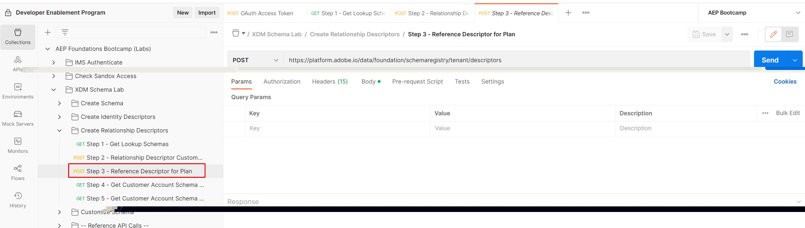

# プラン参照IDの作成

1. `XDM Schema Lab -> Create Relationship Descriptors` フォルダーの`Step 3 - Reference Descriptor for Plan` API リクエストをクリックします

   >[!CAUTION]
   >
   >リクエストを実行しないでください…まだ

   


2. API呼び出しの本文で次のプロパティを更新します。

- `xdm:sourceSchema` プロパティの値を、[ スキーマの作成](../build-schema/create-schema.md) ステップから保存した`Customer Account` スキーマの`$id`に更新します
- `xdm:sourceProperty`の値を`Customer Account` スキーマの`planID` フィールドのパスに更新します

>[!NOTE]
>
>`dep: Lookup Plan` スキーマの`planId` フィールドのドット表記値を使用し、`.`を`/`に置き換えます
>
>先頭の`/`を忘れないでください（😄）

例のみ

```json
{
  "@type": "xdm:descriptorReferenceIdentity",
  "xdm:sourceSchema": "https://ns.adobe.com/devbc/schemas/8415ac18dd8943e35d12caf0c24b57b4a5a9ab7fd637245e",
  "xdm:sourceVersion": 1,
  "xdm:sourceProperty": "/_devbc/plan/planID",
  "xdm:identityNamespace": "planID"
}
```

>[!NOTE]
>
>上記のテナント名（\_devbc）を独自の名前で更新することを忘れないでください


1. `Save` ボタンを使用し続ける前に、リクエストを保存してください

1. `Send` ボタンをクリックしてAPIを実行します

次のような`201 Created`件の回答が表示されました


>[!NOTE]
>
>参照ID記述子は、常にルックアップスキーマ（つまりsourceSchema）で定義されます

>[!NOTE]
>
>スキーマ UIから関係を作成すると、参照ID記述子がサーバー上に自動的に作成されます。 **APIを使用してスキーマを作成する場合にのみ、明示的に作成する必要があります**

>[!SUCCESS]
>
>すごいですね！ `dep: Lookup Plan` スキーマを`Customer Account` スキーマに関連付け、バッチセグメント化中に参照できるようにするには、必要なすべての記述子を作成しました
