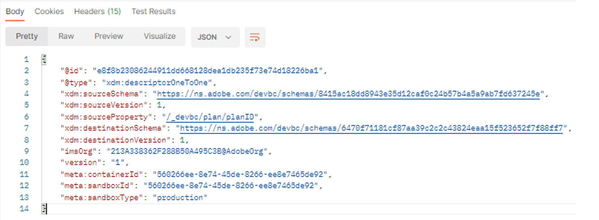

# スキーマ関係の作成

1. `XDM Schema Lab -> Create Relationship Descriptors` フォルダーの`Step 2 - Relationship Descriptor Customer Account To Plan` API リクエストをクリックします

   >[!CAUTION]
   >
   >リクエストを実行しないでください…まだ

   


2. API呼び出しの本文で次のプロパティを更新します。

- `xdm:sourceSchema` プロパティの値を、[&#x200B; スキーマの作成](../build-schema/create-schema.md) ラボステップから保存した顧客アカウントスキーマの`$id`に設定します
- `xdm:sourceProperty`の値を、顧客アカウントスキーマの`planID` フィールドのパスに設定します。
- `xdm:destinationSchema` プロパティの値を、最初の手順で保存した`dep: Lookup Plan` スキーマの`$id`に設定します

>[!NOTE]
>
>顧客アカウントスキーマのplanId フィールドのドット表記値を使用し、`.`を`/`に置き換えます
>
>
>先頭の`/`を忘れないでください（😄）

例のみ

```json
{
  "@type": "xdm:descriptorOneToOne",
  "xdm:sourceSchema": "https://ns.adobe.com/devbc/schemas/8415ac18dd8943e35d12caf0c24b57b4a5a9ab7fd637245e",
  "xdm:sourceVersion": 1,
  "xdm:sourceProperty": "/_devbc/plan/planID",
  "xdm:destinationSchema": "https://ns.adobe.com/devbc/schemas/6470f71181cf87aa39c2c2c43824eaa15f523652f7f88ff7"
,
  "xdm:destinationVersion": 1
}
```

>[!NOTE]
>
>上記のテナント名（\_devbc）を独自の名前で更新することを忘れないでください


1. `Save` ボタンを使用し続ける前に、リクエストを保存してください

1. `Send` ボタンをクリックしてAPIを実行します

次のような`201 Created`応答が表示されます



>[!NOTE]
>
>リアルタイム顧客プロファイル（およびすべてのExperience Platform）は、XDM Individual ProfileまたはXDM Experience Event スキーマから&#x200B;**one （1） hop join**&#x200B;と呼ばれるもののみをサポートしています（つまり、1 レベルのルックアップリレーションシップのみを作成できます）

>[!NOTE]
>
>関係記述子`@type`が`OneToOne`の値に設定されていることに気づきましたか？ XDM ERD on Paperの顧客アカウントとプランテーブルの関係は1\:Nではありませんか？  何が起こっていますか？
>
>
>リアルタイム顧客プロファイルは、個々の顧客の特性や行動を記述するために構築されています。  したがって、個人レンズから見ると、ルックアップテーブルは&#x200B;**only** **ever**&#x200B;で、セグメント化中に1:1の関係として定義されます。
>
>脳が痛くなったら…
