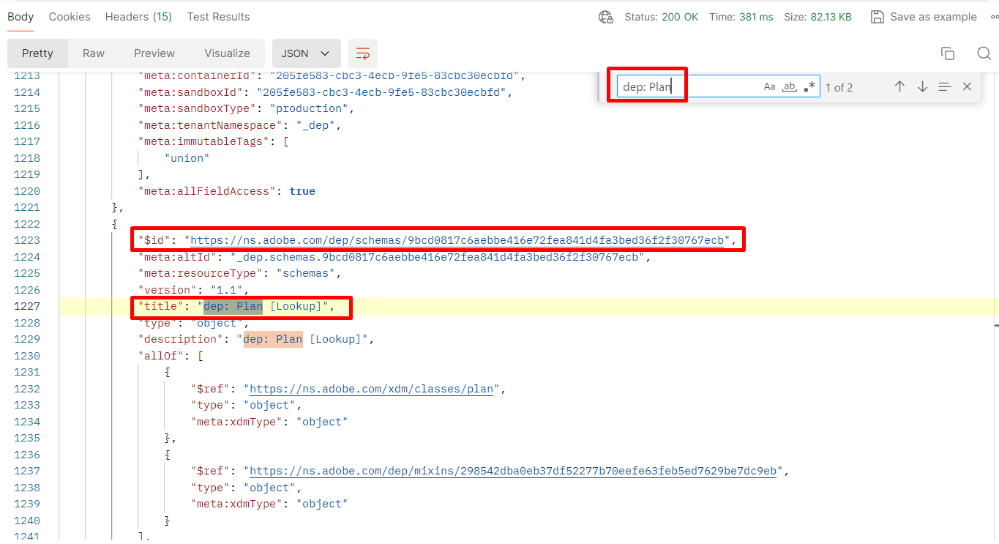

# プラン スキーマ IDを取得

## すべてのテナントスキーマのリスト

1. `XDM Schema Lab -> Create Relationship Descriptors` フォルダーの`Step 1 - Get Lookup Schemas` API リクエストをクリックします
1. `Send` ボタンをクリックしてAPIを実行します

>[!NOTE]
>
>このGET呼び出しは、スキーマレジストリの「テナント」部分内に存在するすべてのスキーマ（カスタム作成されたスキーマなど）を取得します。 **プラン** スキーマを検索するだけで、顧客アカウントスキーマに関連付けることができます。

## プランスキーマの特定

1. 呼び出し応答で`dep: Plan [Lookup] ` スキーマを検索します
1. スキーマの`$id`をコピーし、後で参照できるように保存します

>[!NOTE]
>
>このスキーマは、既にサンドボックスにデプロイされている必要があります

>[!WARNING]
>
>スキーマの`$id`をどこかに保存するまで続行しないでください。  関係記述子を作成するには、後で必要になります
