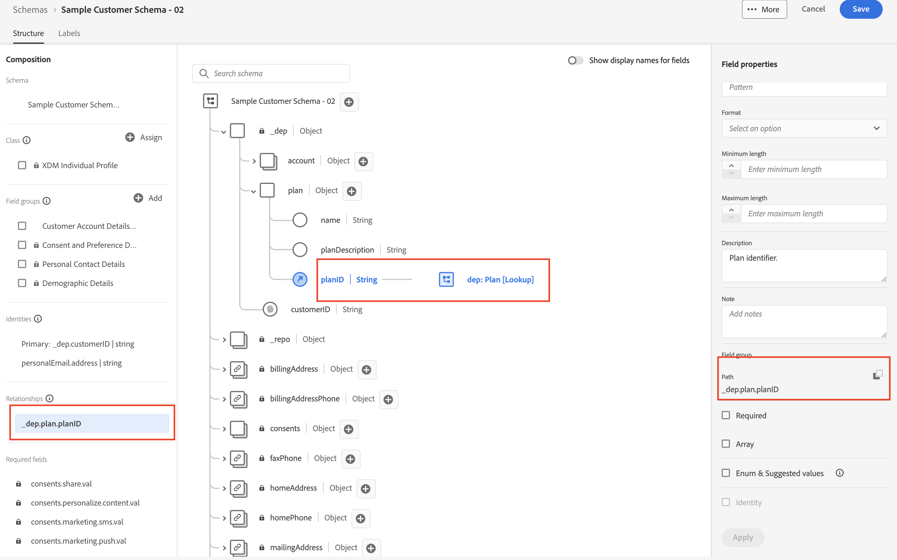
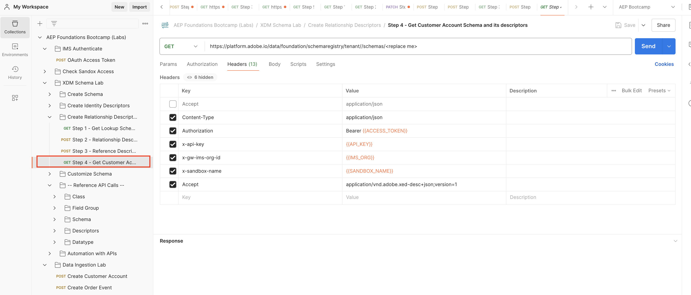
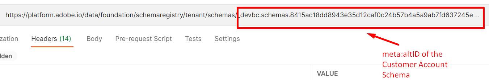

# スキーマの表示

## UI経由で表示

1. ブラウザーを開き、`Schema -> Browse` セクションに戻ります。
1. スキーマ `Sample Customer Schema - <your sandbox number>`を検索
1. `dep: Plan [Lookup]`との関係が定義されていることに注意してください

詳細：プランの参照の関係を示すExperience Platform UIの

## API経由で表示

1. `Step 4 - Get Customer Account Schema and its descriptors` APIをクリックして選択

2. リクエストのURLで、`<replace me>`を前のセクション [ スキーマの作成](../build-schema/create-schema.md)から保存した`$meta:altId`に置き換えます（下図を参照）

に追加したステップ 4 リクエスト

3. `Save` ボタンを使用してリクエストを保存します

4. `Send` ボタンをクリックしてリクエストを実行します

これで`200 OK`応答が表示され、作成したスキーマの最後まで参照して、XDM JSON構造のレンズを通じてIDを確認できるようになります

顧客アカウントスキーマ JSON](assets/view-schema-relationship-descriptor.png "関係記述子")に表示されるに表示される参照ID記述子
