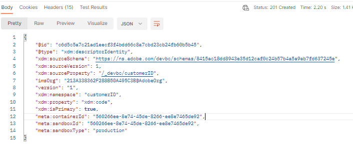

# プライマリ IDの作成

1. `XDM Schema Lab -> Create Identity Descriptors` フォルダーの`Step 1 - Create Primary Identity for Customer Account Schema` API リクエストをクリックします

   

   >[!CAUTION]
   >
   >まだリクエストを実行しないでください


1. [ スキーマの作成](../build-schema/create-schema.md) ラボステップから保存した`$id`を使用して、リクエストの本文の`xdm:sourceSchema`値を更新します

1. リクエスト本文の`xdm:isPrimary`値を`true`に更新します

   例のみ

   ```json
   {
     "@type": "xdm:descriptorIdentity",
     "xdm:sourceSchema": "https://ns.adobe.com/devbc/schemas/8415ac18dd8943e35d12caf0c24b57b4a5a9ab7fd637245e",
     "xdm:sourceVersion": 1,
     "xdm:sourceProperty": "/_devbc/customerID",
     "xdm:namespace": "customerID",
     "xdm:property": "xdm:code",
     "xdm:isPrimary": true
   }
   ```

   >[!NOTE]
   >
   >上記のテナント名（\_devbc）を独自の名前で更新することを忘れないでください


1. `Save` ボタンを使用し続ける前に、リクエストを保存してください

1. `Send` ボタンをクリックしてAPIを実行します。 次のような`201 Created`応答が表示されます



>[!TIP]
>
>おめでとうございます。  スキーマでプライマリ ID記述子を作成したばかりです
