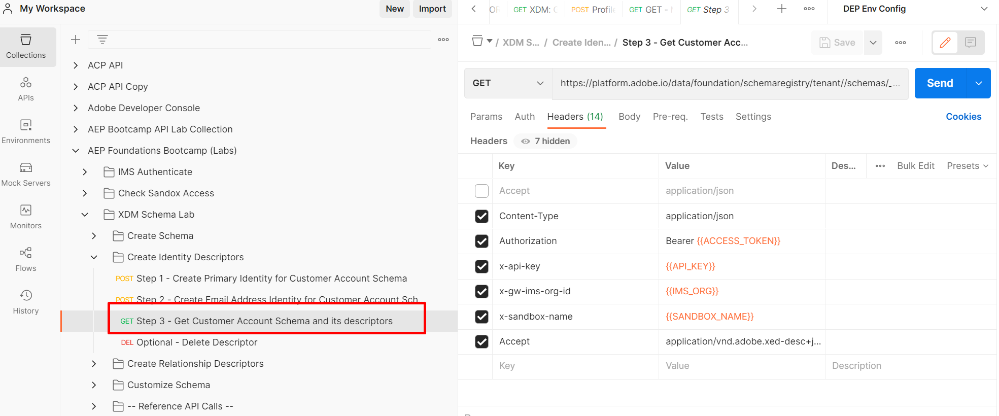
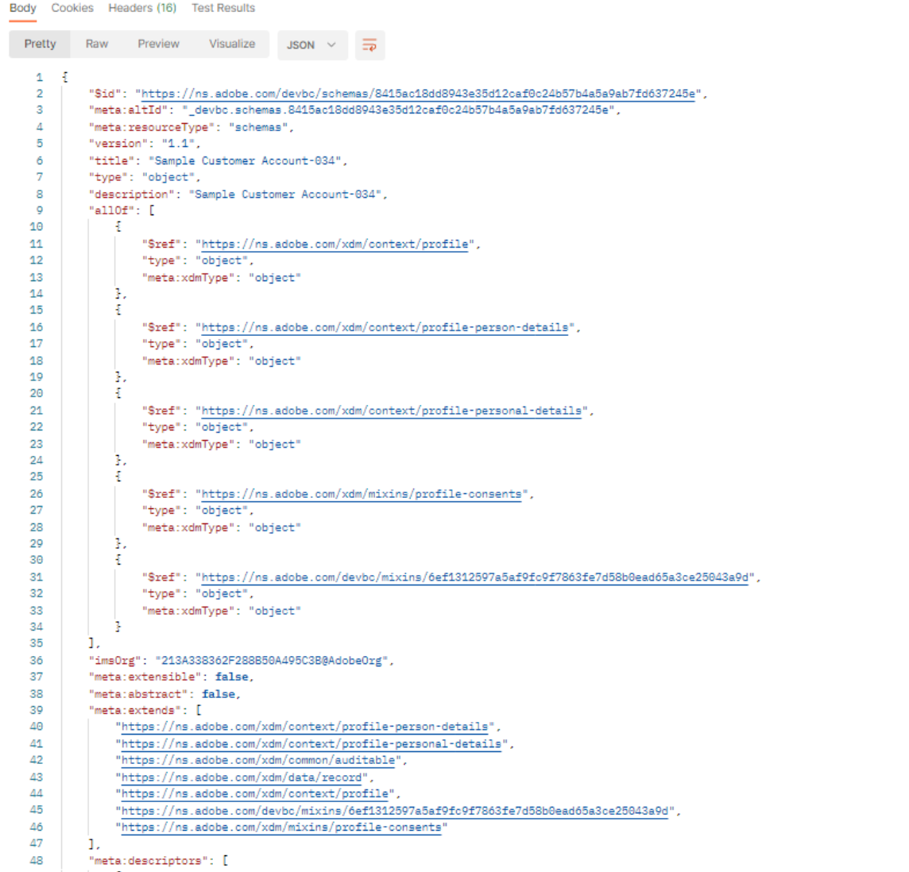

# スキーマの表示

## UI経由で表示

1. ブラウザーを開き、`Schema -> Browse` セクションに戻ります。
1. **顧客アカウント** スキーマを検索
1. IDがスキーマに追加されます

## API経由で表示

1. `Step 3 - Get Customer Account Schema and its descriptors` APIをクリックして選択します。

   

1. リクエストのURLで、`<replace me>`を前のセクションから保存した`$meta:altId`に置き換えます（スキーマを作成します）。次に示すように、呼び出しの最後まで

   

1. リクエストを行った編集を保存

1. `Send` ボタンをクリックしてリクエストを実行します

これで`200 OK`応答が表示され、XDM JSON構造のレンズを通じて作成したスキーマを参照できるようになります

作成したID記述子を確認するには、API応答で詳細を参照します

## ヘッダーを受け入れる

リクエストで使用される&#x200B;**Accept** ヘッダーに注意してください。 このヘッダーは、XDM スキーマレジストリに対して、スキーマの`$refs`未解決の値を返すように指示します（つまり、最小限の情報を表示します）。また、API応答に関連する記述子を返します。  Adobeには、スキーマに関する様々な詳細を取得するために使用できる他の&#x200B;**Accept** ヘッダーが用意されています。

>[!NOTE]
>
>様々なAccept ヘッダーについて詳しくは、こちらを参照してください – > [Experience League Schema API Endpoint](https://experienceleague.adobe.com/docs/experience-platform/xdm/api/schemas.html?lang=en#lookup)

これを実際に確認するには、**Accept** ヘッダーを変更して、スキーマレジストリに`$ref`および`allOf`のすべての完全に解決された（つまり、爆発した）および関連する記述子に応答するように指示します

1. `Accept` ヘッダー値を次のように更新します。
   `application/vnd.adobe.xed-full-desc+json; version=1`
1. `Save` ボタンを使用してリクエストを保存します
1. `Send` ボタンを使用してリクエストを実行します

応答は次のようになります。

>[!NOTE]
>
>スキーマのすべてのプロパティが応答に完全に表示されるようになったのに注意してください。以前の呼び出しでは、スキーマの`$ref`値（つまり、どのフィールドグループを参照していたか）のみが表示され、各フィールド/プロパティに完全に解決されたものはありません。

>[!NOTE]
>
>APIを使用する場合、スキーマの`$id`を取得するか、単にその構成を確認するだけであれば、完全に解決された応答が必要とは限らないので、理解しておくことが重要です
