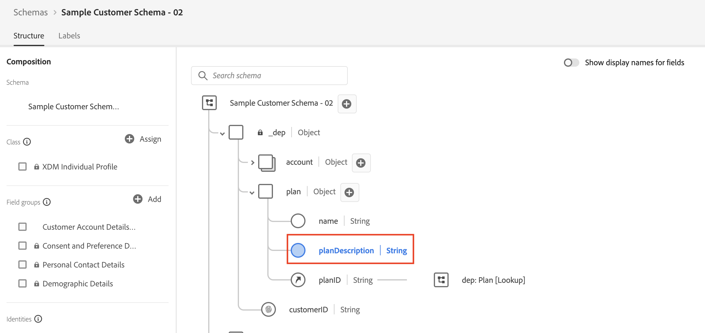

# まとめ

以下のビデオでは、API呼び出しを介してスキーマ、ID、関係記述子を作成する方法を説明し、JSON パッチを使用してスキーマを変更する方法を示します。

>[!VIDEO](https://video.tv.adobe.com/v/3459564/?quality=12&learn=on)

>[!SUCCESS]
>
>おめでとうございます。 この仕組みを理解することは、システム全体を理解するのに役立ちます。

## 顧客アカウントスキーマを作成しました

Adobeで作成したフィールドグループと、独自に作成したフィールドグループ（テナント）の両方で`$ref`を使用してスキーマを作成しました。 また、スキーマが表すクラス （つまり、XDM個人プロファイル）も`$ref`個あります

$ref](assets/recap-customer-account-schema.png "顧客アカウントスキーマ ")を介してフィールドグループとクラスを参照するで定義した`Customer Account Details`というカスタムフィールドグループにパッチを適用することで、スキーマ自体にパッチを適用するのではなく、パッチを適用することで実現しました。`$ref`

## マークされたID フィールド

顧客アカウントスキーマ内の`_devbc.customerID`と`personalEmail.address`の両方のフィールドに`Identity Descriptors`を作成するには、同じ`POST`呼び出しのうち2つを実行しました。

1. `_devbc.customerID` フィールドが&#x200B;**プライマリ** IDとして設定されました
1. `personalEmail.address` フィールドは&#x200B;**プライマリとして設定されませんでした**

プライマリ ID記述子と非プライマリ ID記述子を示す

## 参照の関係を作成しました

最後の手順は、XDM ERD on Paper ラボから顧客アカウントとプラン スキーマの関係を作成することでした。 これには、顧客アカウントスキーマで、関係記述子（`Customer Account` スキーマを`dep: Plan [Lookup]` スキーマに関連付ける方法）と参照ID記述子の両方を作成する必要があります。

顧客アカウントをプラン検索スキーマにリンクする

>[!NOTE]
>
>`referenceIdentity`記述子は、どのID名前空間に一致する`Customer Account` スキーマのどのフィールドがリアルタイム顧客プロファイルに表示されるかを示します。 ルックアップスキーマを定義する場合、フィールドをプライマリ IDとしてマークし、タイプ `non-person`の名前空間を割り当てる必要があります。
