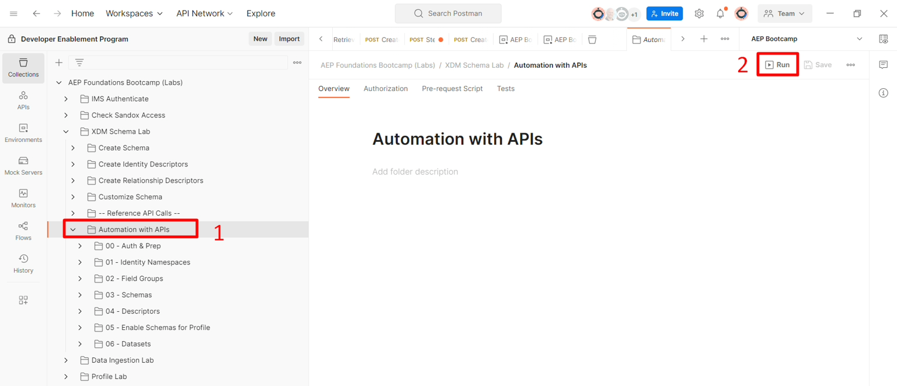
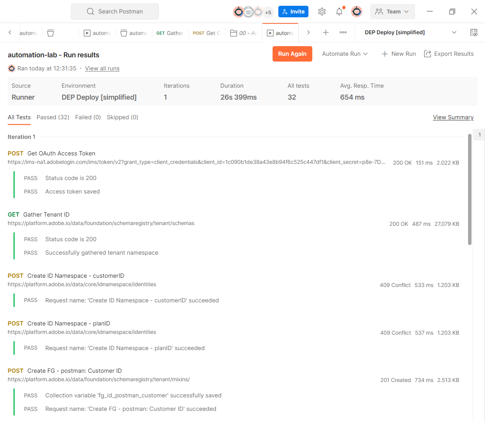
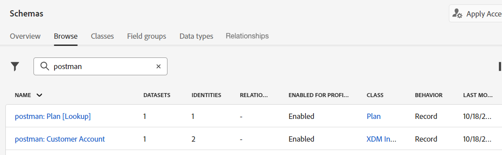
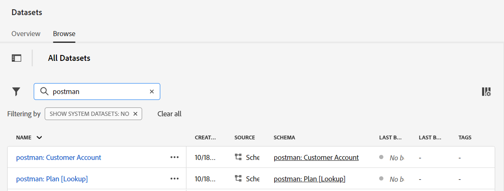

# APIによる自動化

## 概要

APIを使用してデプロイメントを自動化する方法を確認するには、次のオブジェクトを作成するAPIのフォルダーを実行します。

- 顧客アカウントとプラン \[Lookup] スキーマ
- 上記のスキーマを構成するフィールドグループ
- プロファイルに必要なID記述子
- 顧客アカウントとプラン間の関係を作成するために必要な関係と参照記述子\[参照]
- 作成された各スキーマに一致する2つのデータセット

## フォルダーを実行

1. Postmanで、**XDM Schema Lab** フォルダー内の&#x200B;**Automation with API** フォルダーに移動します

   

1. **Automation with API** フォルダーをクリックし、ワークスペースで「**実行**」ボタンをクリックします

   >[!NOTE]
   >
   >「実行」ボタンは、Postman ワークスペースの右上にあります

   

1. フォルダー内のすべてのAPI呼び出しを示す新しいウィンドウが表示されます。 **遅延**&#x200B;を&#x200B;**500ms**&#x200B;に設定し、**実行** ボタンをクリックします。

   をクリックする前に、遅延が500 ミリ秒に設定された自動化を実行ダイアログ

1. API呼び出しが順番に実行され始め、完了すると32の合格したテストが表示されます。

   

1. Experience Platform UIに移動すると、2つのスキーマと2つのデータセットが作成され、**postman:**&#x200B;というプレフィックスが付いたプロファイルに対して有効になります

>[!SUCCESS]
>
>おめでとうございます。  ID名前空間、フィールドグループ、スキーマ、ID/関係記述子のデプロイメントを自動化し、プロファイルのスキーマを有効にして、スキーマを使用してデータセットを生成しました
