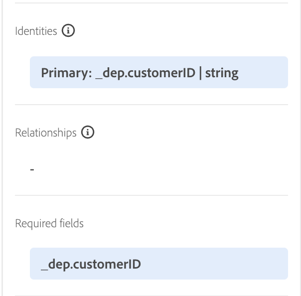
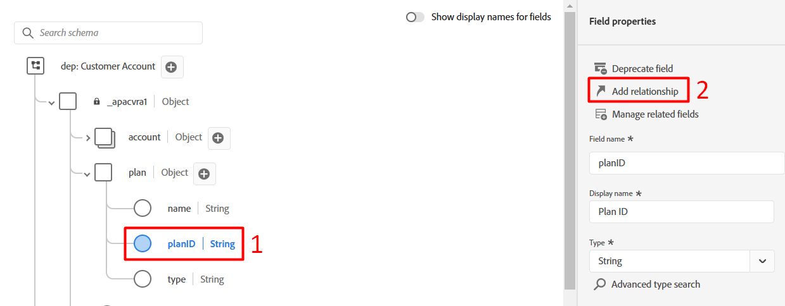
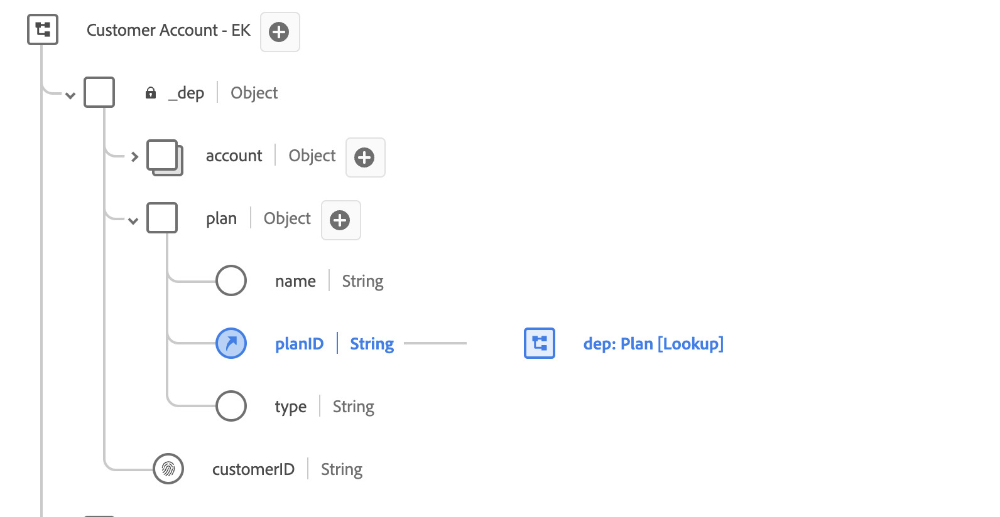
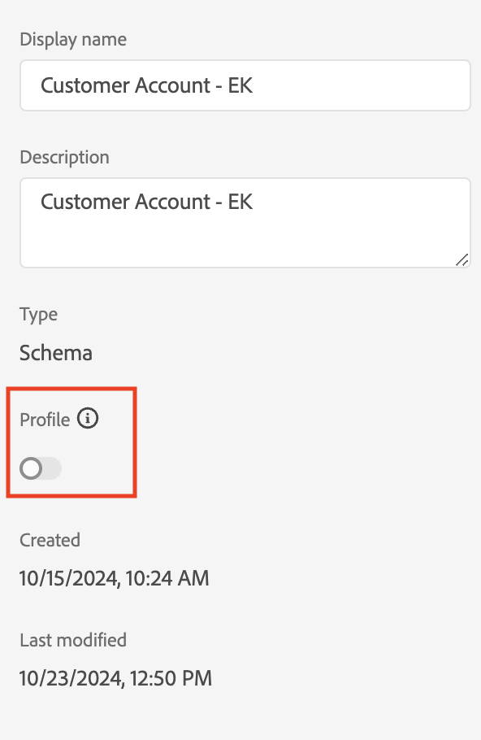
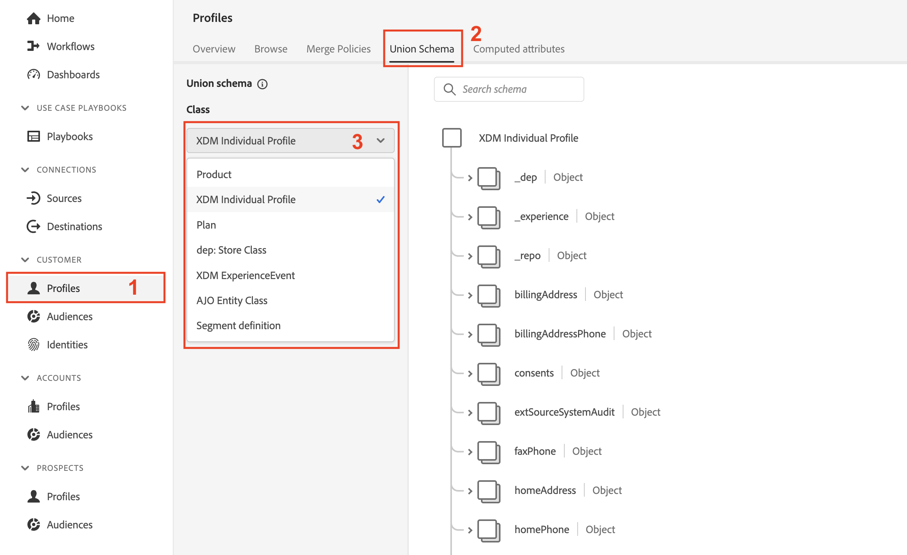

# プロファイル用に設定

## 概要

リアルタイム顧客プロファイルのスキーマを利用するには、まず、適切に設定されていることを確認する必要があります。 これは、LID ラボで特定したものをプライマリ/個人ID、関係IDなどとして取得し、それらの設定が各スキーマに対して確実に行われることを意味します。 すべてが完了したら、次に「スイッチを反転」して、プロファイルで使用するスキーマを有効にできます。

Paper Connection 5G ERDのXDMを見ると、顧客アカウントスキーマに関する次の情報が表示されます。  これは、リアルタイム顧客プロファイル内のスキーマを利用するために残っている作業です。

への接続

## プライマリ ID フィールドをマーク

あらゆるスキーマに、リアルタイム顧客プロファイルで使用する場合は、プライマリ ID フィールドが必要です。 フィールドをプライマリ IDとしてマークするには、次の手順に従います。

1. 作成した&#x200B;**顧客アカウント** スキーマを開きます
1. スキーマのフィールドをクリックして、**\_\&lt; テナント名>.customerID** フィールドを選択します
1. 右側のパネルで、**ID**&#x200B;と&#x200B;**プライマリ ID**&#x200B;の両方のチェックボックスをオンにします
1. ドロップダウンから&#x200B;**customerID**&#x200B;名前空間を選択します
1. 完了したら、右側のパネルの「**適用**」ボタンをクリックし、変更を&#x200B;**保存**&#x200B;します。

>[!NOTE]
>
>以下のように「適用」をクリックした後、フィールドにサムプリントが表示されていることを検証します
>
>IDとしてマークした後、フィールドに表示される
>
>

>[!NOTE]
>
>また、左側のパネルには、次の項目が表示されます。 ID （プライマリまたは非プライマリ）がここに表示され、**プライマリ**&#x200B;のIDも必須フィールドとしてマークされます。
>
>
>
>プライマリ ID フィールドと非プライマリ ID フィールドを示す左側のパネルの

## 個人ID フィールドをマークする

リアルタイム顧客プロファイル **で使用されるすべてのスキーマには、オプションで**&#x200B;個の他の個人ID フィールドを含めることができます。 フィールドを個人IDとしてマークするには、以前に作成した顧客アカウントスキーマで次のアクションを実行します。

1. **personalEmail.address** フィールドを選択します
1. 右側のパネルにある&#x200B;**ID** チェックボックスをオンにします
1. ドロップダウンから&#x200B;**電子メール** ID名前空間を選択します
1. **変更を適用して**&#x200B;保存

>[!NOTE]
>
>「適用」をクリックした後、フィールドにサムプリントが表示されていることを検証します

## スキーマ関係の作成

ERDに概説されている顧客アカウントスキーマにプランスキーマを関連付けるには、関係を定義する必要があります。 顧客アカウントとプラン（ルックアップ）スキーマの間にスキーマ関係を作成するには、次の手順に従います。

### 関係を追加

1. 以下に示すように、プランオブジェクト内の&#x200B;**planID** フィールドを選択します
1. 右側のパネルで「**関係を追加**」アイコンをクリックします

### 関係を定義

1. タイプ選択ボックスで、**1対1** オプションを選択します
1. 「参照スキーマ」選択ボックスで、**dep: Plan \[Lookup]**&#x200B;という名前のスキーマを選択します（これは事前に作成されたものです）
1. 「**適用**」と「**保存**」をクリック

![Depとの1対1の関係の定義：プラン [参照] スキーマ ](assets/configure-for-profile-define-one-to-one-relationship.png)

### 関係を確認

完了すると、作成した関係が下のスクリーンショットのように表示されます。

## プロファイルのスキーマの設定

リアルタイム顧客プロファイルは、様々な情報源からデータを統合し、個々の顧客の全体像を構築するものです。 スキーマによってキャプチャされたデータをこのプロセスに参加させる場合は、プロファイルで使用するようにスキーマを設定する必要があります。 そのためには、次の手順を実行する必要があります。

1. 新しく作成した&#x200B;**顧客アカウント - \[ イニシャル ]** スキーマを開きます
1. 左側のパネルからスキーマのタイトルをクリックします
1. 右側のパネルで「**ON**」のプロファイルトグルを切り替えて、プロファイルのスキーマを設定します
1. 表示されるモーダルで、「**有効化**」ボタンをクリックします
1. 完了したら、スキーマを&#x200B;**保存**&#x200B;することを忘れないでください。

顧客アカウントスキーマの右側のパネルで

>[!TIP]
>
>おめでとうございます。  リアルタイム顧客プロファイルで使用するスキーマを作成しました。

## プロファイル結合スキーマの確認

前述したように、XDMとリアルタイム顧客プロファイルの機能とは、個人のさまざまなフラグメントと行動を組み合わせて作成する能力のことです。  これは、お客様の「和集合」と呼ばれます。  以下の手順では、リアルタイム顧客プロファイル用に設定された各XDM クラスについて、この結合がどのように表示されるかをプレビューします

1. 左側のパネルの&#x200B;**プロファイル**&#x200B;に移動します
1. 上部メニューの「**結合スキーマ**」タブを選択します
1. ドロップダウンから&#x200B;**XDM Individual Profile** クラスを選択します

XDM Individual Profile クラスを参照し、XDM ExperienceEventやPlan クラスなどの他のクラスを確認します。

>[!NOTE]
>
>表示されるスキーマは、サンドボックス内のすべてのプロファイル対応スキーマの集約された結合ビューです。 階層XDM構造内の類似したフィールドは結合されますが、名前や階層が異なるフィールドは全体的なビューに追加されます。

>[!NOTE]
>
>XDM Individual Profile ベースのクラスのみが、同様の名前のフィールド間で結合を実行します。
