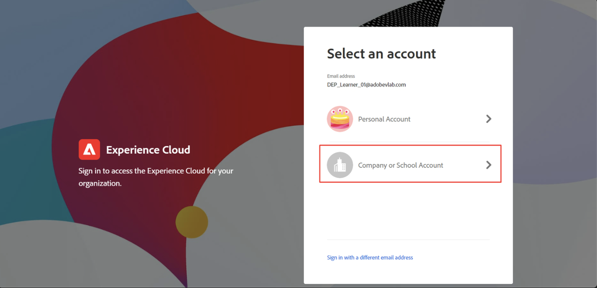
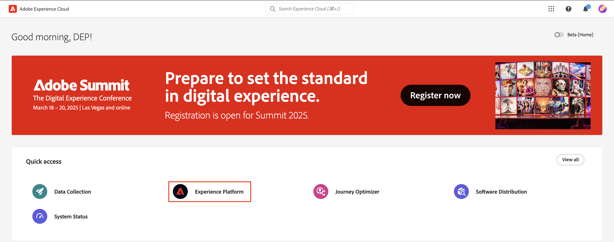
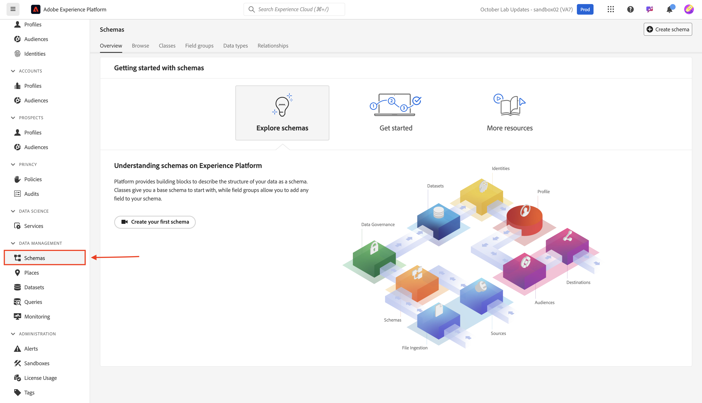

# ログインして参照

## UI経由でログイン

1. ブラウザーで[https://experience.adobe.com](https://experience.adobe.com/)に移動します。
1. サンドボックスへの開発者アクセス権を持つAdobe IDを使用してログインします。これは、[Developer Console設定](../../sandbox-setup/developer-console-setup.md)を完了するために使用したものと同じです。
1. **アカウントを選択**&#x200B;画面で、**会社または学校アカウント**&#x200B;を選択します。

## Experience Platformを起動

クイックアクセスパネルのExperience Platform アイコンをクリックして、bootcamp サンドボックスにアクセスします

>[!NOTE]
>
>この画面が表示されず、Experience Platformに直接起動される場合があります。  その場合は、この手順をスキップしてください。

## スキーマに移動

1. 左側のパネルの「**スキーマ**」タブをクリックします

   左側のレール ナビゲーションの「

1. 上部のナビゲーションには、既存のスキーマを参照するオプションと、現在XDM レジストリにあるフィールドグループとデータタイプを表示するオプションが表示されます。

を参照

>[!NOTE]
>
>サンドボックス内に既にスキーマが作成されていることがわかります。 これには、このブートキャンプの一部として事前に作成されたスキーマ（`dep`が先頭に付いています）と、Adobe Real-Time CDPとAdobe Journey Optimizerの両方のシステム生成スキーマが含まれます。

>[!TIP]
>
>スキーマの構築を開始しましょう。
