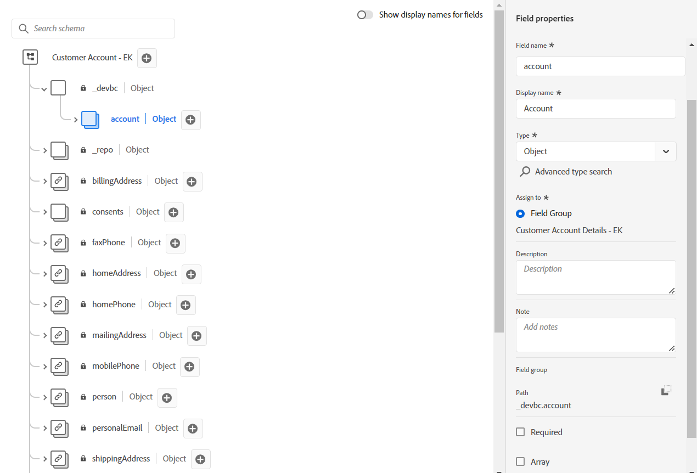
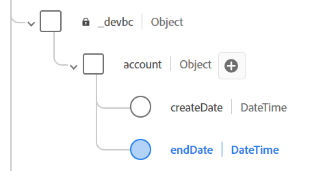
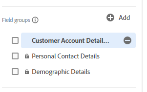
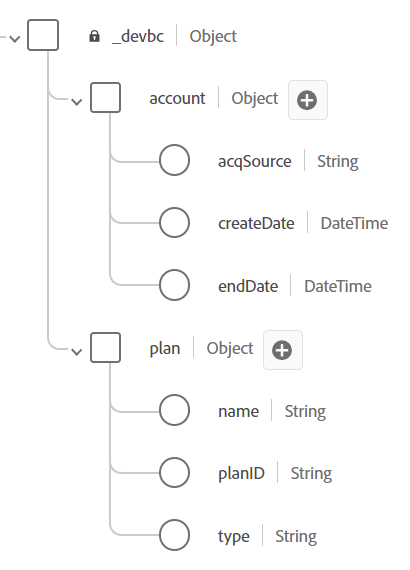
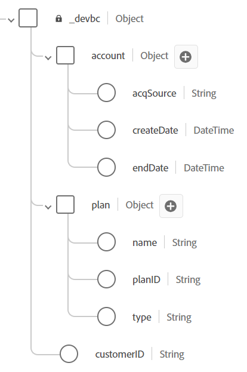
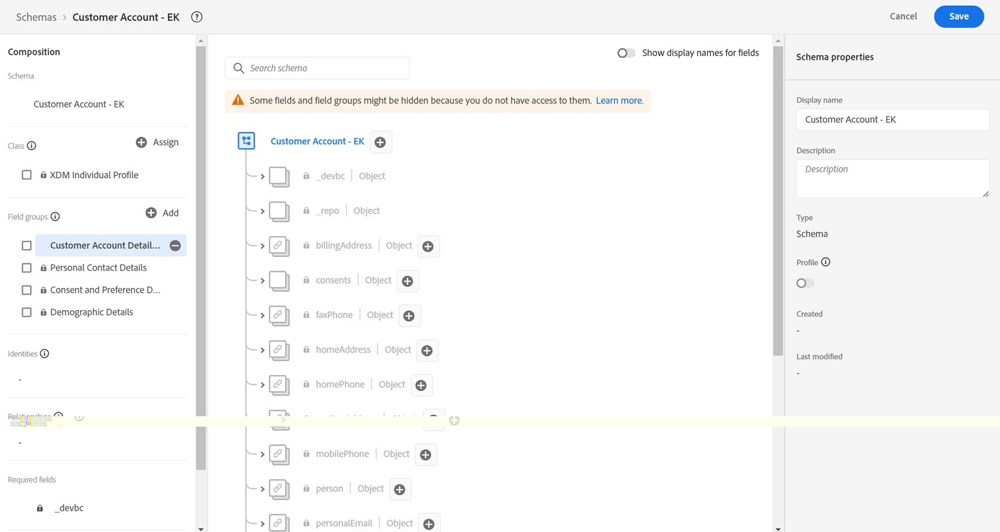

# カスタムオブジェクトのモデル化

## カスタムフィールドの追加

講義で説明したように、顧客アカウントのカスタムフィールドをモデル化する標準の事前構築済みフィールドグループやデータタイプはありません。  以下のフィールドは現在カスタムと見なされ、XDM スキーマ内でモデル化する必要があります。

- \_\&lt;tenant-name>.account.createDate
- \_\&lt;tenant-name>.account.endDate
- \_\&lt;tenant-name>.account.acqSource
- \_\&lt;tenant-name>.plan.planID
- \_\&lt;tenant-name>.plan.name
- \_\&lt;tenant-name>.customerID

>[!NOTE]
>
>\&lt;tenant-name>は、作業中の環境に固有です

## アカウントオブジェクトの作成

1. スキーマの上部にある「**+（追加）**」ボタンをクリックして、新しいフィールドを追加します

   

   >[!NOTE]
   >
   >右側のパネルが開き、入力するフィールドがいくつか表示されます

1. 次の詳細を使用して、アカウントオブジェクトを作成します。 完了したら、右側のパネルの&#x200B;**適用** ボタンをクリックして、スキーマワークスペースの変更を確認します

| フィールド名 | 表示名 | タイプ | 新しいフィールドグループへの割り当て |
| ---------- | ------------ | -------- | ----------------------------------------------------------------------------------------------------------------------------- |
| *アカウント* | *アカウント* | *オブジェクト* | *顧客アカウントの詳細 – \[ イニシャル ]* *（これを入力してドロップダウンを選択するか、Enter キーを押します）* |

>[!WARNING]
>
>フィールド名は、特定の大文字と小文字を区別する必要があります。 なぜなら、構築しているのと同じスキーマが既に作成済みだからです。 ケーシングがオフの場合、サンドボックス内の既存のスキーマのフィールドパスと競合が発生します

>[!NOTE]
>
>自動的に作成したカスタムフィールドが、スクリーンショットの`_devbc`で示されるテナント名前空間の下に配置されることに注意してください。 テナントの名前空間が異なる可能性があります。 テナント名前空間は、カスタムオブジェクトとAdobe標準オブジェクトを区別するために使用され、Adobe標準の今後の追加/更新がカスタム作成されたオブジェクトと競合しないようにします。

>[!NOTE]
>
>新しいカスタムフィールドグループが、ロックアイコンのない`Field groups`の下の左側のパネルに表示されることに注意してください。  このロックアイコンは、カスタム作成されたフィールドグループであることを示します。

>[!WARNING]
>
>この時点ではスキーマを保存できません。 そうすると、JSON スキーマで空のオブジェクトを作成できないので、その内容が何であるかを記述できないので、エラーが発生します

1. 作成したアカウントオブジェクトの下に、以下に示す次のフィールドを追加します。

   | フィールド名 | 表示名 | タイプ |
   | ------------ | ------------- | ---------- |
   | *createDate* | *作成日* | *日時* |
   | *endDate* | *終了日* | *日時* |

   >[!NOTE]
   >
   >新しいフィールドを追加する際に、「**割り当て**」オプションが既に入力されており、アカウントオブジェクトに使用したフィールドグループを参照していることがわかります。

1. 完了すると、スキーマのアカウントオブジェクトは次のようになります。 **スキーマを保存**&#x200B;してください！

   

1. アカウントオブジェクトにさらに1つのカスタムフィールドを追加します。 アカウントオブジェクトの横にある「**+（追加）**」ボタンをクリックします。  次のフィールドを作成します。

   | フィールド名 | 表示名 | タイプ | 列挙 |
   | ----------- | ----------------- | -------- | --------------------------------------- |
   | *acqSource* | *獲得したSource* | *文字列* | *web :: Web * *inStore :: In Store* |

   このフィールドには標準化された値が必要なので、フィールドのプロパティ内で&#x200B;**列挙と推奨値** オプションを使用します。 取り込み時にこのフィールドの検証を追加し、わかりやすいラベルを追加するには、**列挙** ラジオボタンを選択します。 次に示すように、列挙値を追加します。

   - *web :: Web*
   - *inStore :: In Store*

   

   >[!NOTE]
   >
   >列挙と推奨値の目標は、エンドユーザーのセグメンテーションを簡単にすることです。 列挙は、データ取り込み時に検証を適用しますが、推奨値は適用されません。 この機能について詳しくは、こちらのドキュメントをご覧ください – > [https://experienceleague.adobe.com/docs/experience-platform/xdm/ui/fields/enum.html?lang=en#enums-and-suggested-values](https://experienceleague.adobe.com/docs/experience-platform/xdm/ui/fields/enum.html?lang=en#enums-and-suggested-values)

1. 完了したら、「**適用**」ボタンをクリックして、新しいフィールドをスキーマに追加します。

1. スキーマを&#x200B;**保存**&#x200B;してください

>[!SUCCESS]
>
>XDM スキーマレジストリ内に最初のカスタムオブジェクトとフィールドが正常に作成されました。

## プランオブジェクトの作成

上記の手順を繰り返し、**プラン** オブジェクトと関連するフィールドを追加します。 すべての新しいフィールドは、顧客アカウントの詳細 – \[ イニシャル ] フィールドグループの下に追加する必要があります。

次の表のメタデータを使用して、プランオブジェクトとその関連フィールドを作成します。

| フィールド名 | 表示名 | タイプ | 列挙と推奨値 |
| ---------- | -------------- | -------- | ------------------------------------------------------------------------------------- |
| *プラン* | *プランの詳細* | *オブジェクト* | - |
| *planID* | *プラン ID* | *文字列* | - |
| *name* | *プラン名* | *文字列* | Enum  *basic :：基本&#x200B;* *ultimate :: Ultimate * *pro :: Pro* |
| *type* | *種類* | *文字列* | - |

>[!WARNING]
>
>作成した新しいフィールドを顧客アカウントの詳細 – \[ イニシャル ] フィールドグループに追加していることを確認します。  フィールドグループに自動的に追加されていることを確認する簡単な方法は、カスタムフィールドを追加する前に、左側のパネルでフィールドグループを選択することです。
>
>
>
>
>
>

完了したら、以下のスクリーンショットに一致するスキーマを検証します。 問題ないようです&#x200B;**スキーマを保存**&#x200B;してください

>[!TIP]
>
>素晴らしい！  ヘルプなしで独自のカスタムオブジェクトとフィールドを追加しました。

## 顧客ID フィールドの作成

このフィールドとして&#x200B;**customerID** フィールドを追加することは、スキーマのプライマリ IDとして機能するだけでなく、データを保持する一般的なフィールドとして機能するため、非常に重要です。

以前と同じ手順を実行し、次の表を使用してフィールドのメタデータを参照します。

| フィールド名 | 表示名 | タイプ | フィールドグループ |
| ------------ | ------------- | -------- | --------------------------------------------- |
| *customerID* | *顧客ID* | *文字列* | *顧客アカウントの詳細 – \[ イニシャル ]* |

>[!NOTE]
>
>`customerID`は、階層の観点からスキーマ内の任意の場所に配置できます。 このラボでは、customerID フィールドはルートに残り、以前に作成したカスタムオブジェクトの1つにネストされていません。  この場所は、データアーキテクチャに意見がある場所です
>
>😄

最終的な結果は、以下のスクリーンショットのようになります

に追加された顧客アカウントスキーマ

## 最終的なスキーマ結果

>[!SUCCESS]
>
>最初のXDM スキーマを構築しました。 次の節では、リアルタイム顧客プロファイルで使用するスキーマを設定します。
