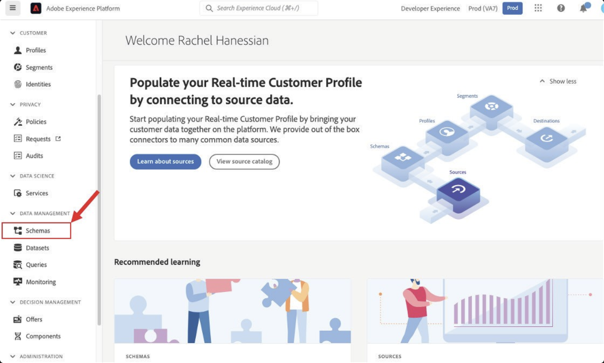
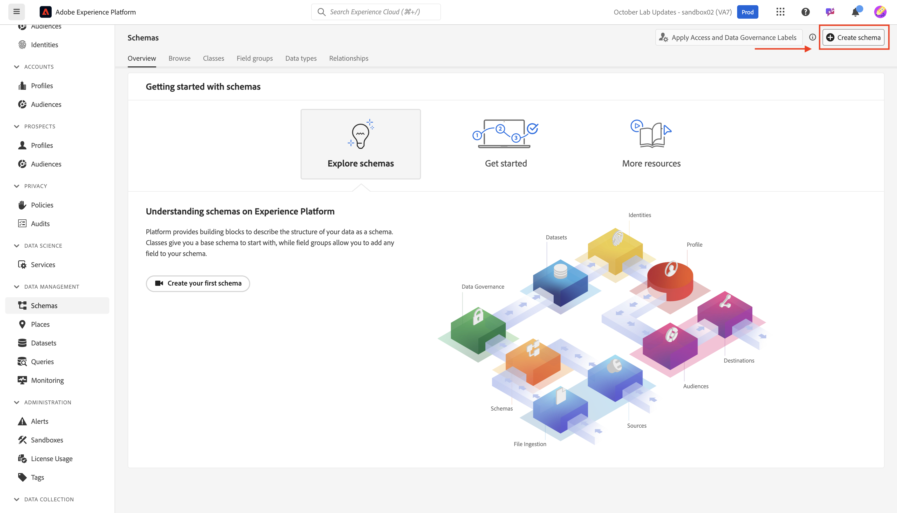
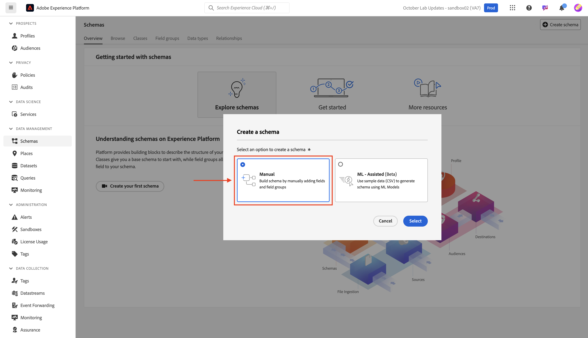
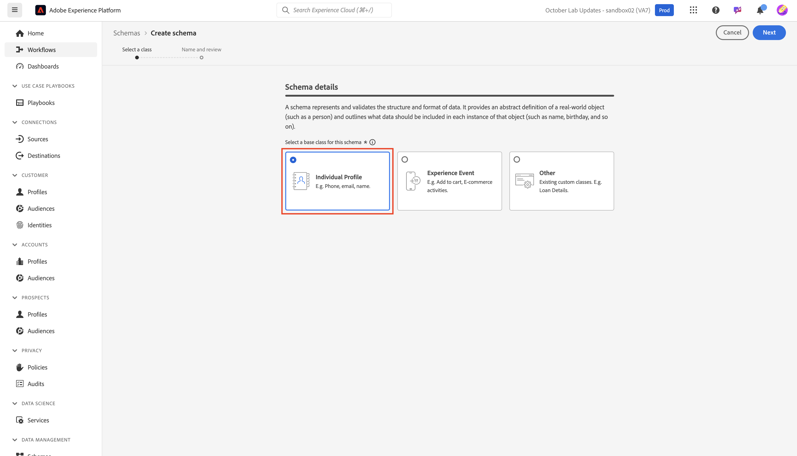
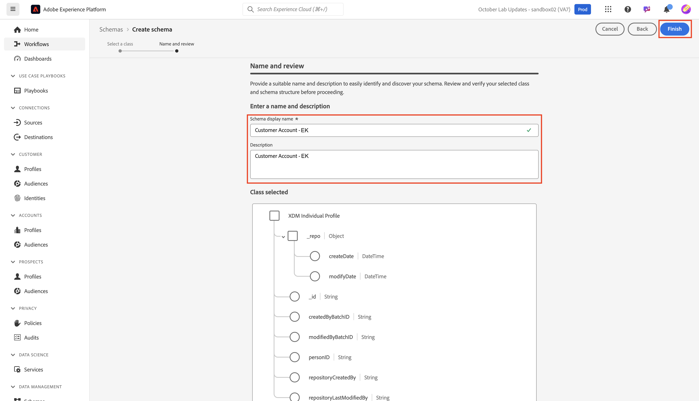
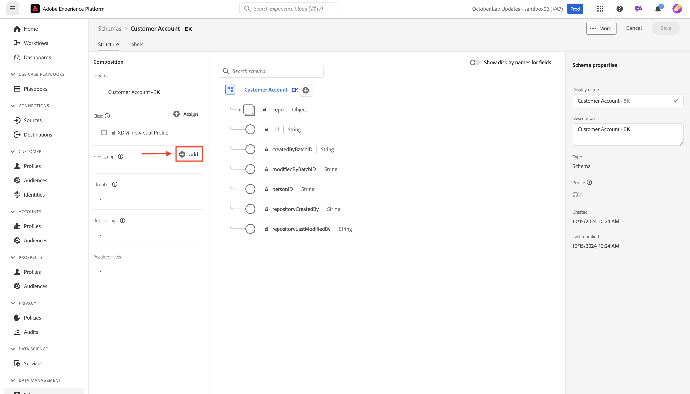
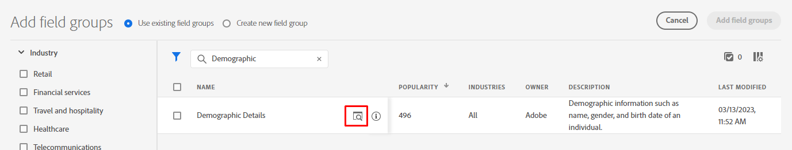
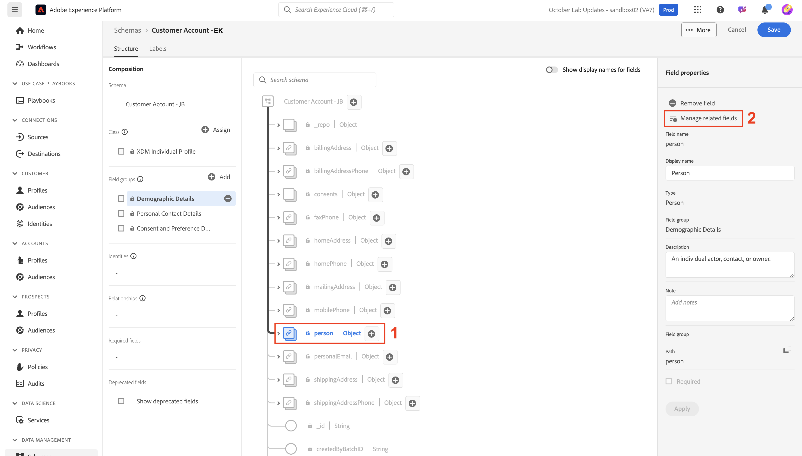
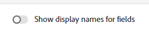

# 標準オブジェクトのモデル化

## スキーマに移動

1. 左側のパネルの「**スキーマ**」タブをクリックします

   左側のレール ナビゲーションの「

1. 上部のナビゲーションには、既存のスキーマを参照するオプションと、現在XDM レジストリにあるフィールドグループとデータタイプを表示するオプションが表示されます。

を参照

>[!NOTE]
>
>サンドボックス内に既にスキーマが作成されていることがわかります。 これには、このブートキャンプの一部として事前に作成されたスキーマ（`dep`が先頭に付いています）と、Adobe Real-Time CDPとAdobe Journey Optimizerの両方のシステム生成スキーマが含まれます。

## 個人プロファイルスキーマの作成

1. **スキーマの作成**&#x200B;をクリックして開始

   

1. **手動**&#x200B;を選択

   

1. **個人プロファイル**&#x200B;を選択

## スキーマに名前を付けます

XDM Individual Profile クラスベースのスキーマを使用すると、プロファイルにステッチされた個人に関する属性を収集できます。 クラス自体には、*modifiedByBatchID*、*PersonID*&#x200B;など、編集できないフィールドが含まれています。

1. スキーマに名前と説明を付けます。
   - **スキーマ表示名** —> *顧客アカウント - \[ イニシャル ]*
   - **説明** – このスキーマは、個人のID、プラン情報、デモグラフィックの詳細、および連絡先の詳細を収集します。
1. 右上の「**完了**」ボタンを使用してスキーマを保存します。

## デモグラフィックの詳細を追加フィールドグループ

Adobe Experience Platformには、スキーマに追加してカスタマイズするための標準XDMとして、多くのフィールドグループが存在します。

1. フィールドグループセクションの左側のパネルの&#x200B;**+（追加）**&#x200B;をクリックします。

   

1. **デモグラフィックの詳細**&#x200B;を検索するか、リストを参照して見つけます。

   - フィールドグループを見つけたら、フィールドグループの右側にある虫眼鏡をクリックして、その構造を表示します。  この手順は、スキーマに追加する内容を追加せずにプレビューするのに便利な方法です。
   - レビューが完了したらプレビューを閉じる

   

   

1. **フィールドグループの横にあるチェックボックスを** オンにし、**フィールドグループを追加** ボタンをクリックします

## その他の標準フィールドグループの追加

スキーマにさらに標準フィールドグループを追加する必要があります。 前の手順を繰り返して、2つの追加フィールドグループをスキーマに追加します。

- 個人の連絡先詳細
- 同意と環境設定の詳細

完了すると、スキーマは以下の画像のようになります。 必ず「**保存**」ボタンをクリックして、作品を保存してください。

デモグラフィックの詳細、個人の連絡先の詳細、同意と環境設定の詳細フィールドグループを追加した後の

>[!NOTE]
>
>選択して追加したフィールドグループがスキーマに表示され、左側のパネルに表示されます。 追加した各フィールドグループのすべてのフィールドが必ずしも必要なわけではありません。  次の手順では、不要なフィールドを削除します。

>[!WARNING]
>
>続行する前に、必ずスキーマを保存してください。

## 標準フィールドグループのカスタマイズ

### デモグラフィックの詳細フィールドグループ

デモグラフィックの詳細フィールドグループは多くのフィールドを持ってきましたが、LID手法のスキーマデザインに基づいて、次のフィールドのみが必要です。

- person.name.firstName
- person.name.lastName
- person.birthDayAndMonth
- person.birthYear

任意のAdobe標準フィールドグループからフィールドを削除するには、**関連フィールドを管理** オプションを使用します。 関連フィールドを管理すると、スキーマから標準フィールドを削除できるので、必要なフィールドのみが残ります。

1. スキーマで&#x200B;**person** オブジェクトを選択します
1. 右側のパネルの&#x200B;**関連フィールドの管理**&#x200B;をクリックします

   

1. 人物の左側にある山形をクリックして人物オブジェクトを展開し、名前オブジェクトの左側にある山形をクリックしてフルネームオブジェクトを展開します。 次のフィールドのみを保持します。

   - person.name.firstName
   - person.name.lastName
   - person.birthDayAndMonth
   - person.birthYear

   完了したら、右上隅の「**確認**」ボタンをクリックします。

   

   >[!NOTE]
   >
   >**デモグラフィックの詳細**&#x200B;の一番上のチェックボックスをクリックして、すべての子オブジェクトの選択を自動的に解除し、必要なオブジェクトのみを再選択できます。

1. 完了すると、スキーマ内に次のようにperson オブジェクトが表示されます。 スキーマを保存するには、問題がなければ&#x200B;**保存** ボタンをクリックします。

### 同意と環境設定フィールドグループ

以前と同じ手順を実行しますが、今回は同意と環境設定フィールドグループに対して実行します。

1. 左側のパネルの&#x200B;**同意と環境設定** フィールドグループ名をクリックして、スキーマでそのフィールドを強調表示します。
1. **同意** オブジェクトを選択し、**関連フィールドの管理** プロセスを使用して、同意オブジェクトから不要なフィールドを削除します。 次のフィールドのみを保持します。

- consents.marketing.email.val
- consents.marketing.sms.val

>[!NOTE]
>
>スキーマワークスペースの右上隅にある「**フィールドの表示名を表示**」のトグルがオフになっていることを確認します
>
>

完了すると、最終的なスキーマは次のようになります。 続行する前に、必ず「**保存**」をクリックしてください。

>[!SUCCESS]
>
>これで、標準コンポーネントのスキーマへの追加が完了しました。 お疲れ様でした。 スキーマのカスタム属性の作成に進みます。
