# AI アシスタントとコンテンツパーソナライゼーション

**目的：** Adobe Journey OptimizerのAI アシスタントを使用して、件名の生成、メールテキストの調整、トーンの調整、ブランドに即したFirefly画像の作成を、電子メールデザイナー内で直接行う方法を説明します。

## 学習目標

このモジュールの終わりまでに、次のことが可能になります。

1. AI アシスタントを使用して、件名とプリヘッダーを生成します。
1. ヒーローテキスト、説明、トーン、メッセージを調整する。
1. AIを利用した言い換え、要約、トーン調整を適用できます。
1. Adobe Fireflyの参照スタイルとブランド設定を利用して画像を生成。
1. メールデザイン内で、プレースホルダーを生成画像に置き換えます。

## 概要

AJOのAI アシスタントは、よりスマートでブランドに即したコンテンツの構築を支援します。
次のことが可能です。

- 件名を生成
- 既存のテキストの改善
- トーンと明瞭度の調整
- Fireflyを使用してブランド画像を作成する
- すべてがConnection 5G ガイドラインに準拠していることを確認します

この演習では、AI アシスタントを使用して作成したメールを改善します。

> [!NOTE]
>
>AI アシスタントは&#x200B;**非決定論的**&#x200B;です。つまり、使用されるたびに少し異なるコンテンツが生成される可能性があります。 練習中に表示される内容は、このガイドのスクリーンショットや例と完全に一致しない場合があります。 それは構いません。同じ結果を期待するのではなく、プロセスと概念を学ぶことに焦点を当てます。

## AI アシスタントを使用してメールの件名を作成

1. 戻るボタンをクリックしてCampaignに戻るか、前のモジュールで作成したメールを編集します。 前の手順から、右側の「**設定**」タブをクリックできます。
2. メールコンテナをクリックし、「メールを編集」ボタンをクリックします。
3. 「コンテンツ」タブをクリックし、「メール本文」をクリックします
4. 「**件名**」フィールドを選択します。
5. **AI アシスタント アイコン**&#x200B;をクリックします。 （以下を参照）

6. 初期設定では、ブランドガイドラインが選択されています。
7. プロンプトを入力します。

>IPhone 17を発表しました。件名の魅力的さを強調し

8. **Generate**&#x200B;を押します。
9. 生成された4つのバリエーションを確認します。
10. 最適な整列スコアのバリエーションを選択し、**選択**&#x200B;をクリックします。

> [!NOTE]
>
>結果はラボガイドとは完全に異なる場合があるため、心配する必要はありません。 正しいタイトルと思われるものを選択し、ラボに進みます。

## ヒーローのタイトルと説明を改善

1. 「メール本文を編集」ボタンをクリックしてメールを開きます。

2. 「**Product Catchy line**」見出しをクリックします。
3. 「**テキストを生成して選択**」をクリックして、AI アシスタントを開きます

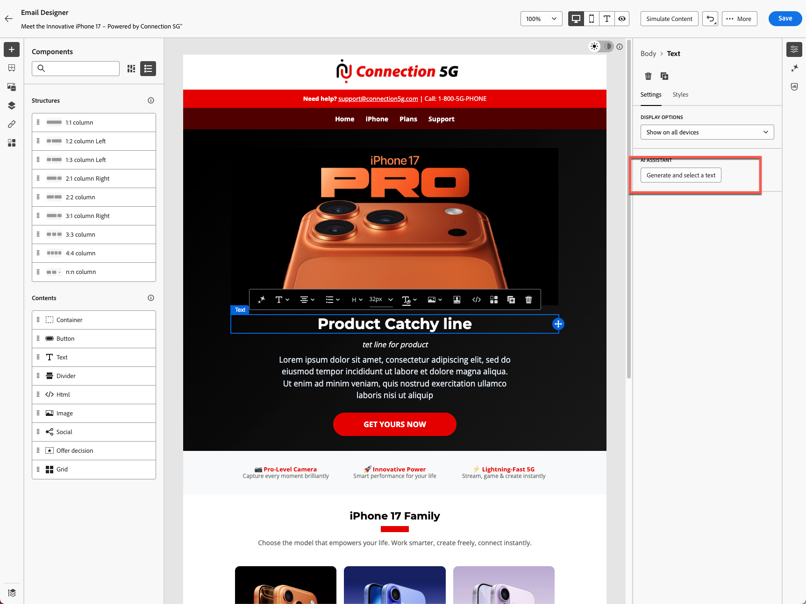

4. ドロップダウンから「**接続5G ブランドガイドライン**」を選択します。

AI アシスタント ドロップダウンで「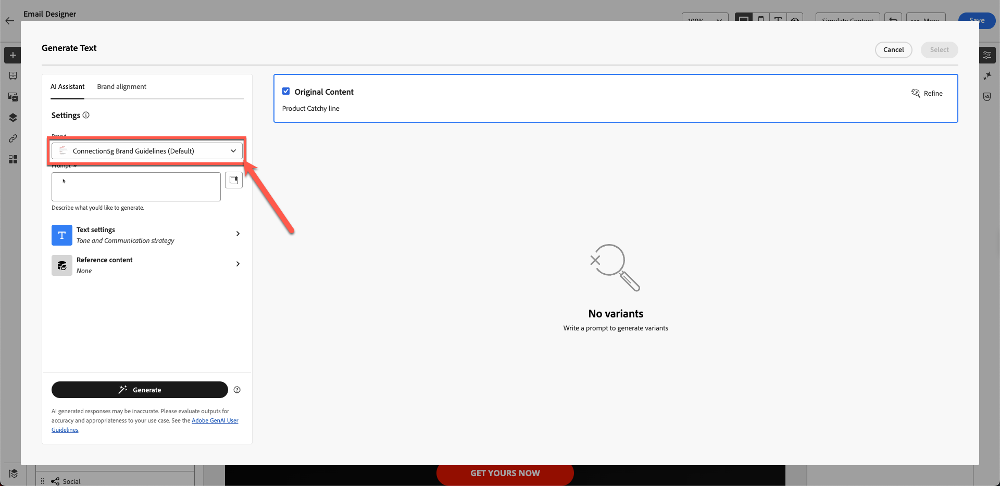

5. プロンプト：

>*iPhone 17のローンチに向けて、注目を集める大胆な見出しを作成します。 10語以内にする*

6. 「テキスト設定」をクリックして、トーンとコミュニケーション戦略を変更します。 コミュニケーション戦略を&#x200B;**FOMO （見逃すことへの恐れ）**&#x200B;に、言語を&#x200B;**英語**&#x200B;に、トーンを&#x200B;**刺激的**&#x200B;に変更します。 ダイヤルを下げて短いバージョンを使用します。

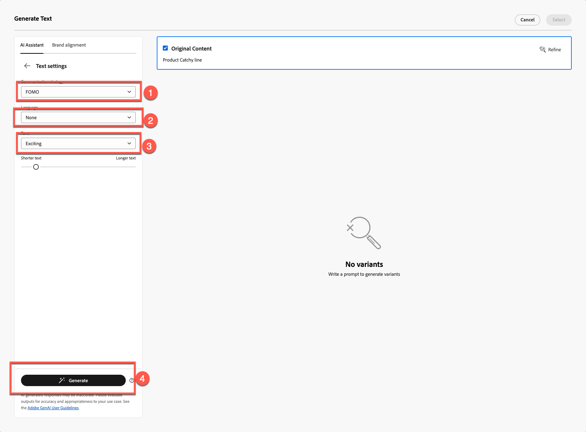

7. 「**生成**」ボタンをクリックします
8. 最適なバージョンを確認して選択し，
9. テキストが長い場合は、スライダーを使用して&#x200B;**「短いテキスト」**&#x200B;にして、テキストを再生成します。

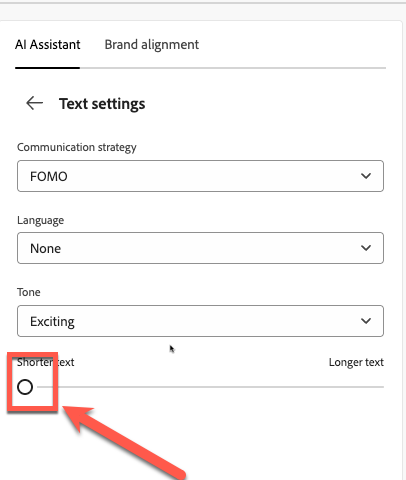

10. テキストに問題がなければ、**選択**&#x200B;をクリックします

## 説明プロンプト

AIを活用して課題を特定する方法を解説します。

1. 下のテキストはテンプレート化されたテキストで、意味がありません。

2. 次に示すように、「評価」ボタンをクリックします。

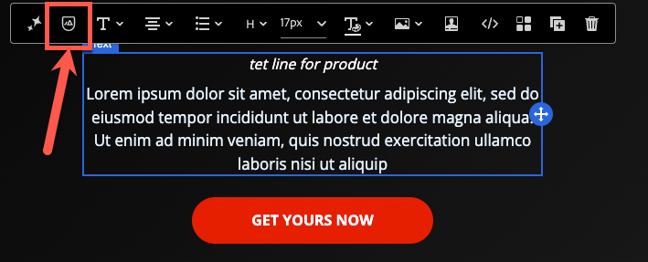

3. 次の手順1と2に示すように、元のコンテンツはブランドに合わせて自動的に選択されます。 「**評価**」ボタンをクリックして続行します。

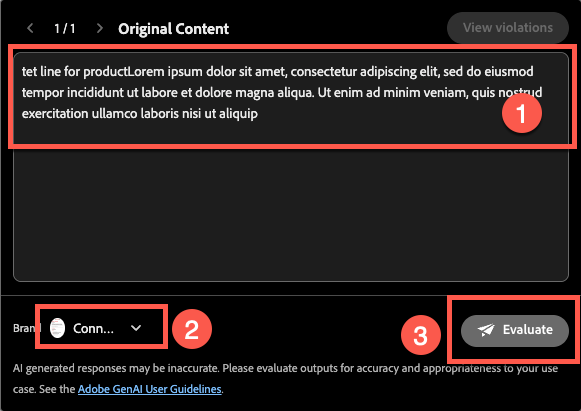

4. 予想どおり、ブランドガイドラインに違反するエラーが多数発生しています。 これらはAIを使って修正することができますが、この場合、既存のマテリアルを修正することはできません。 そのままにしておき、ブランド基準に完全に合致した新しいコンテンツをゼロから制作することになります。

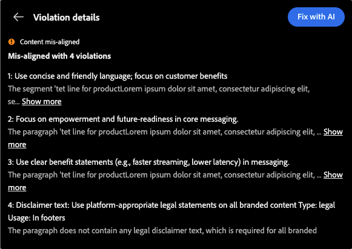

5. 以下のプロンプトでAIを使用して生成された新しい段落を使用します。 説明テキストに対しても、以下のプロンプトを使用して同じ方法を使用できます。

プロンプト：

>*新しいiPhone 17の魅力的な商品説明を作成します。 高度なカメラ、バッテリー寿命、パフォーマンスなど、最も印象的な機能を強調します。 トーンは、幅広いオーディエンスに対して、プレミアムで刺激的、かつ理解しやすいものである必要があります。 3文以内にしてください。*

時間を節約するために、テキストは既に作成されています。 以下をコピー&amp;ペーストしてテキストを取得します。

>IPhone 17™は、美しい写真を撮影するための高度なカメラを搭載し、一日中使い続けることができるバッテリー寿命、そして先を行く超高速のパフォーマンスを備えています。 この革新的な体験をお見逃しなく。

メールは次の例のようになります。

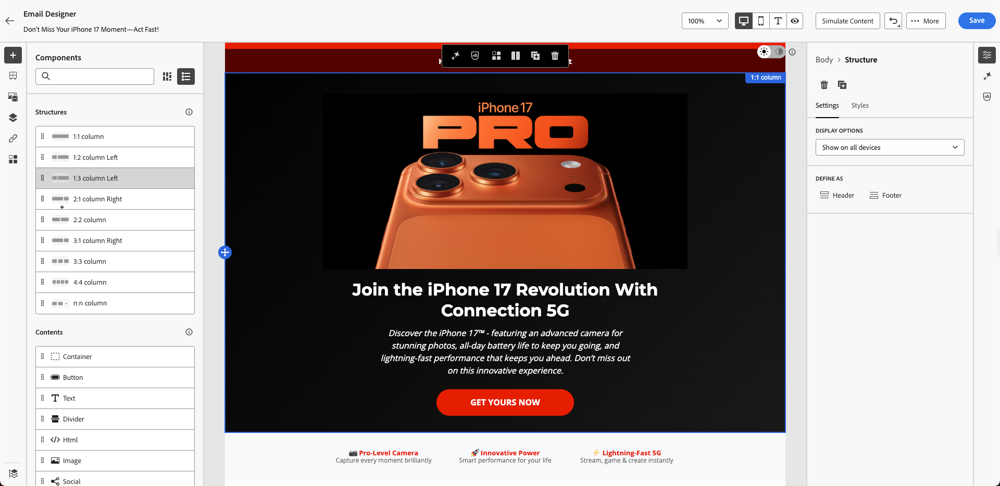

## Fireflyで生成された画像を追加

これまで、件名とテキストにAI アシスタントを使用したテストを実施しました。 画像について？

AIによる画像生成に取り組む前に、どのような体験を構築できるかを確認しましょう。

私たちはプロファイルの誕生年があることを理解しています。 異なるバリエーションのブロックを作成することもできます。 Adobe Journey Optimizerなら、それが可能で、Adobe Experience Platformをベースとする最大のメリットのひとつです。 次のモジュールでは実験について説明しますが、まず以下のブロックを準備します。

1. **画像** コンポーネントをiphone 17 ファミリーブロックの下の左側の列にドラッグします。

2. 外側をクリックして、画像プレースホルダーを選択します。 （必ず画像をクリックしてください。そうしないと、「Firefly」オプションが表示されません）。

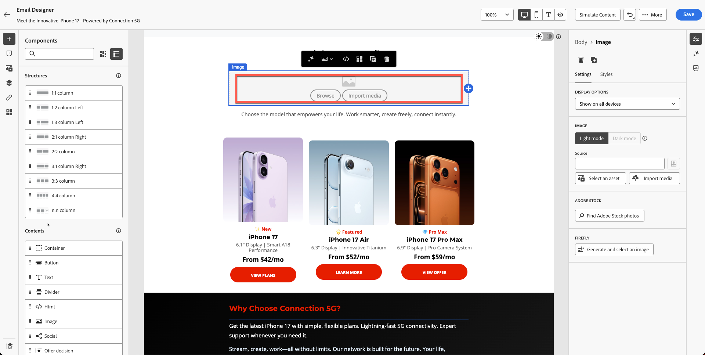

3. **Firefly**&#x200B;で、**生成をクリックして画像**&#x200B;を選択します。

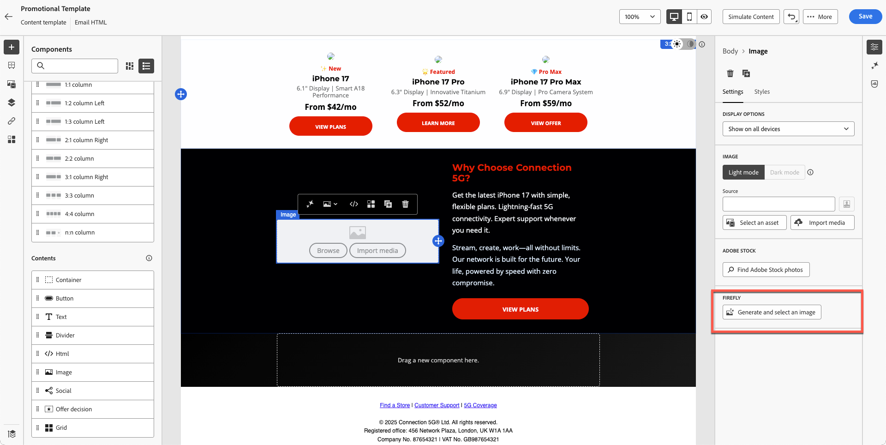

## 参照画像をアップロード

1. **参照スタイル**&#x200B;をオンにします。
2. ブランド選択時に&#x200B;**接続5G ブランドガイドライン**&#x200B;を選択

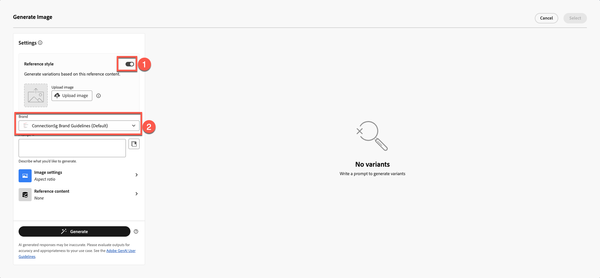

3. 「アップロード画像」をクリックします

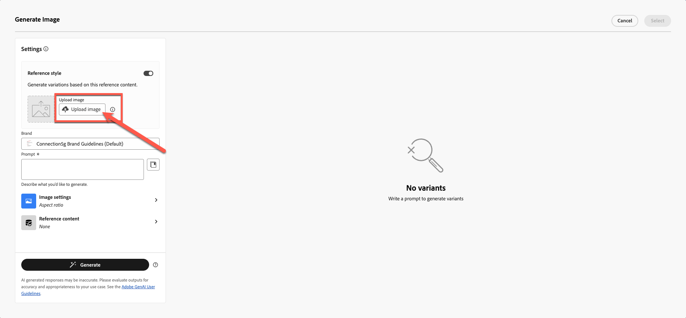

4. ツールキットフォルダーからreference.jpgを選択します

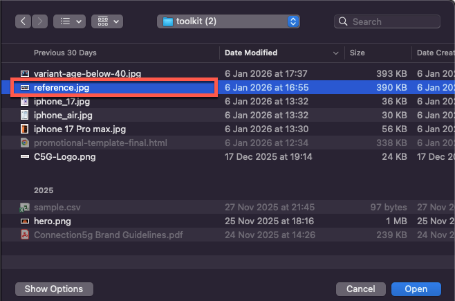

5. 画像プロンプトを追加
   `Portrait-oriented image of a confident man in his early to mid-40s, standing alone at night in a neon-lit urban street, focused on his smartphone. Cinematic cyberpunk-inspired city atmosphere with colorful LED signs, cool blue and warm orange lighting, shallow depth of field, soft bokeh lights in the background. Modern lifestyle, tech-savvy mood, realistic skin tones, high contrast, photorealistic, professional lighting, ultra-detailed`.

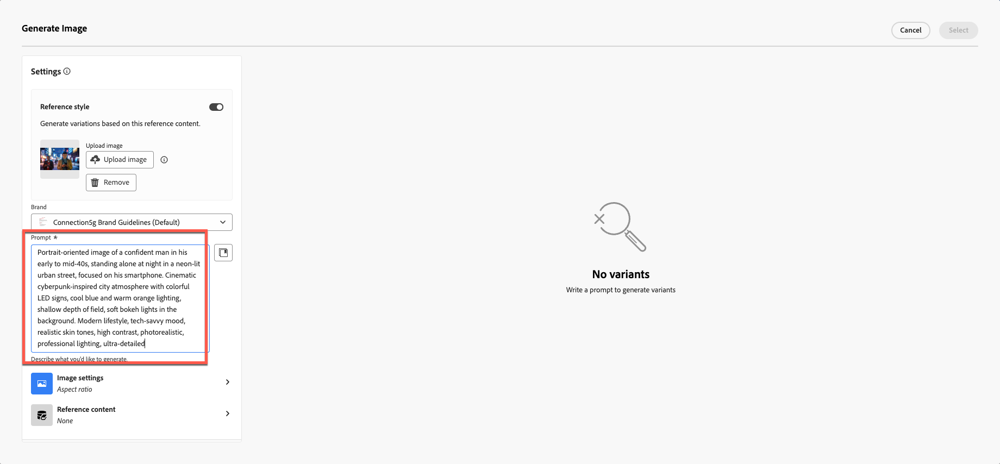

## 画像設定の選択

**画像の設定**&#x200B;を選択します。

1. 次の設定を選択します。
   - **比率：**&#x200B;横（4:3）
   - **コンテンツの種類：**&#x200B;写真
   - **カラーとトーン：** クールなトーン
   - **照明：**&#x200B;劇的な照明
1. 「**生成**」ボタンを押します

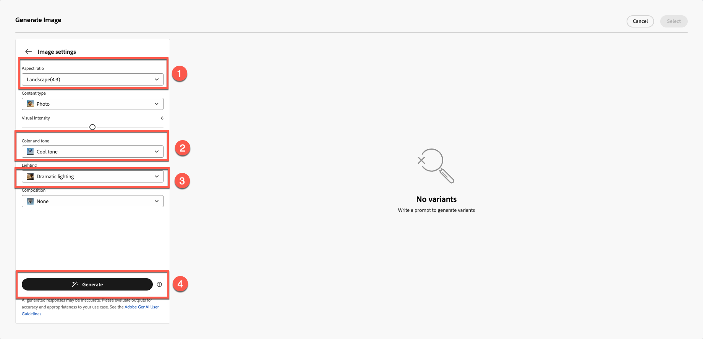

## 生成された画像を選択して挿入する

1. 生成されたすべての画像を確認して、Fireflyの結果を確認します。

2. 目的の選択画像の&#x200B;**選択**&#x200B;をクリックします。

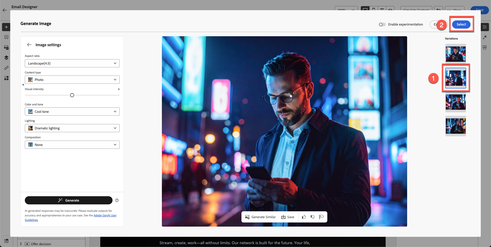

3. アップロードモーダルの入力を求められた場合は、**次へ**&#x200B;をクリックします。

4. 次に、**読み込み**&#x200B;をクリックします。

## ブロック設計を最終決定

丸みを帯びた境界線の半径を10に設定すると、モダンに見えます。

いくつかのイテレーションとバリエーションを経て、最終版のデザインが完成します。 最後のレイアウトは例に似ています。

この時点で、AIを活用してコンテンツ制作を加速し、向上させることに自信を持つはずです。

## まとめ

AI アシスタントを使用して、次の操作を実行しました。

- 件名を生成
- ヒーローテキストを調整
- 段落を言い換える
- メッセージのトーンを変える
- 参照スタイルを使用したFireflyのブランドイメージの作成
- 生成された画像をメールに挿入する

これで、次のモジュールである&#x200B;**Personalizationとcontent experimentation**&#x200B;の準備が整いました。ここでは、プロファイル駆動型のバリエーションとテストを構築します。
