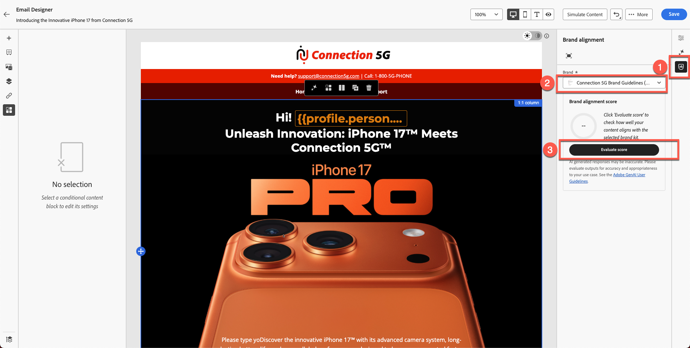
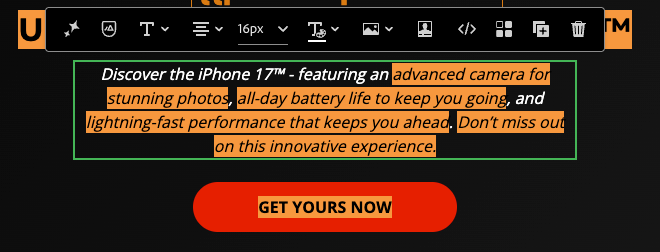
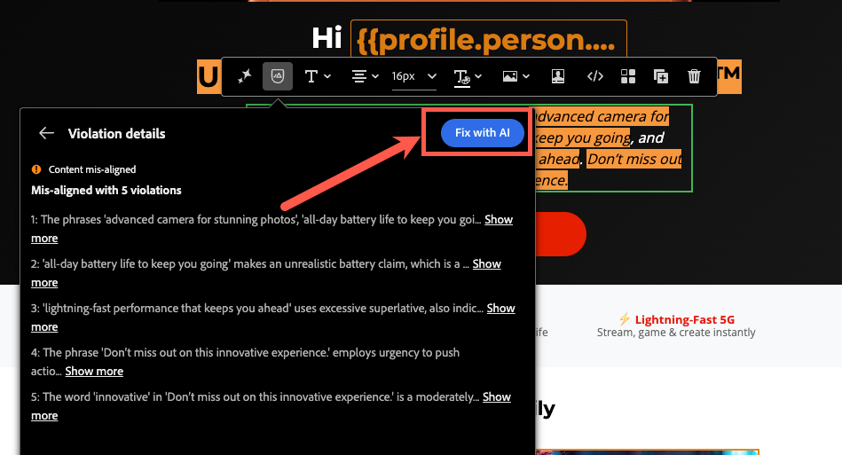
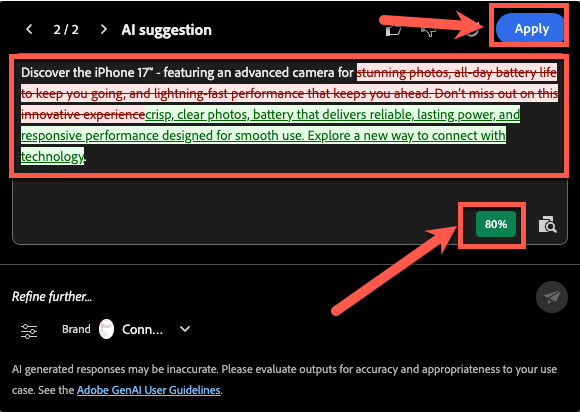
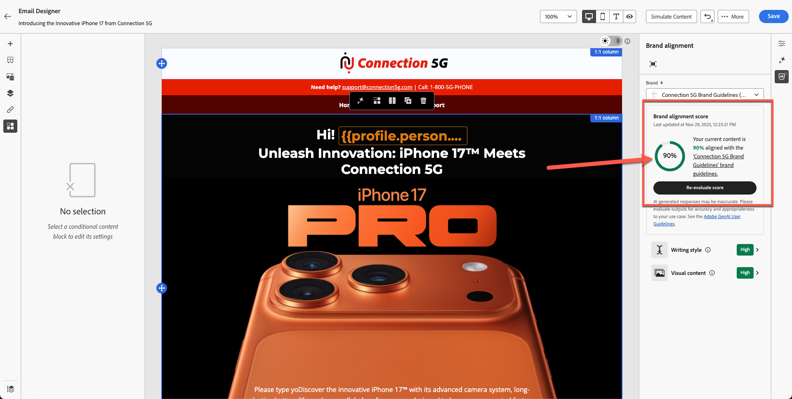

# ブランド一致

**目的：** Adobe Journey Optimizerのブランド調整機能を使用して、メールコンテンツを評価し、ガイドライン違反を特定し、AIを活用したレコメンデーションを適用してブランドコンプライアンスを改善する方法を説明します。

## 学習目標

このモジュールの終わりまでに、次のことが可能になります。

1. Brand Alignment パネルにアクセスして解釈します。
1. ブランドガイドラインに照らし合わせてメールコンテンツを評価する：
1. AIがフラグを立てた問題を特定：
1. 提案を適用してブランドとの整合性を向上：
1. スコアを再評価して改善を追跡する。

## 概要

Adobe Journey Optimizerには、**Connection 5G**&#x200B;の公開されたブランドガイドラインに照らし合わせてコンテンツをチェックする&#x200B;**AI主導のブランドアライメントスコア**&#x200B;が含まれています。

これにより、次のことが可能になります。

- ブランドに合わせたトーン、スタイル、メッセージ
- 法的要件が満たされている
- 画像は視覚的なルールに従う
- コンテンツ制作者は大規模な一貫性を維持する

このモジュールでは、AIを活用して評価の実行、結果の解釈、コンテンツの改善を行う方法を解説します。

## ブランド調整パネルを開きます

1. 前のモジュールで作成したメールを開きます。
2. 右側のパネルの「**ブランドの調整**」タブ、またはサイドバーの「**%」アイコン**」を見つけます。
3. クリックしてパネルを開きます。

4. 適切なブランドが適用されていることを確認する：
   - **接続5G** （デフォルト）。
5. 「**スコアを評価**」をクリックします。

**ブランドスコアとフィードバックの解釈：**&#x200B;しばらくすると、コンテンツのブランドコンプライアンススコアが表示されます。 このスコアは、カラーインジケーター（緑、黄、赤）および評価時間とともに、評価（例：高、Medium、低）またはパーセンテージとして表示できます。 スコアが高い場合はコンテンツとブランドガイドラインが強く一致し、スコアが中または低い場合は中程度または不十分であることを示します。

ガイドラインの各カテゴリについて、パネルに表示される詳細なフィードバックを確認します。

通常、フィードバックはガイドラインのカテゴリー（トーン、スタイル、画像など）ごとに整理され、どのルールが合格したか、どのルールに注意が必要かなどを示します。

特定のメッセージやハイライトを書き出します。例えば、パネルに、特定の単語やフレーズが所定のトーンと一致しない、画像が視覚的な標準に一致しない、といった具合です。 改善点を特定しましょう。

>[!NOTE]
>
>スコアが下の画面と異なることに注意してください。 目標は、ブランドガイドラインとAIを活用してスコアを向上させることです。

評価後の

## 整合性スコアの確認

評価後、AJOには次の情報が表示されます。

- ブランド調整スコア
- 評価（高/Medium/低）
- カラーインジケーター（緑/黄/赤）
- タイムスタンプ
- ガイドラインのカテゴリ（トーン、スタイル、画像など）

結果を解釈して、メールがConnection 5G ガイドラインにどの程度適合しているかを把握します。

## 詳細なフィードバックを確認

1. ガイドラインのカテゴリをスクロールします。
1. 警告または赤いインジケーターを探します。
1. フラグが付けられた各ガイドラインをクリックして、AIの詳細なフィードバックを開きます。
1. 次のような提案をレビューします。
   - トーンの不一致
   - 不正確なフレーズ
   - 禁止されている単語
   - 商標の使用がありません
   - 画像スタイル違反

## AI レコメンデーションを適用

1. メール内のフラグ付きのテキストブロックや画像をクリックします。
2. 以下に示すように、前の演習で貼り付けた段落を使用します。

のフラグ付きテキストブロック

3. AIが提供する修正案を使用します。 次に示すように、アイコンをクリックします。

4. 以下に示すように、「**AIで修正**」ボタンをクリックします。

5. 下の図のように、緑でハイライト表示された変更が提案され、取り消し線で赤で表示されたテキストが削除されます。 また、スコアが更新されています（この場合は80%）。 変更を有効にするには、**適用** ボタンをクリックします。

6. 変更は新しいテキストで適用されます。
7. AIを利用するか、手作業で編集するかにかかわらず、強調されているすべての領域を確認し、コンテンツを修正するために必要な更新をおこないます。 続行する前に、必要なすべての変更が完了していることを確認してください。
8. 変更を保存します。

## ブランドスコアの再評価

1. AIを使用するか手動でコンテンツを修正するには、すべての場所を変更します。
2. ブランドの整列パネルに戻ります。
3. 「**スコアを再評価**」をクリックします。
4. 新しいスコアと前のスコアを比較します。

例：

- 元のスコア：**56%**
- 更新されたスコア：**90%**

これは、更新がブランド基準に沿ったメールであることを示しています。

5. 「**保存**」をクリックして、メールを確定します。

## まとめ

このモジュールでは、次のことを学びました。

- ブランド調整スコアを使用した電子メールの評価
- カテゴリーレベルのフィードバックを解釈
- ライティング、トーン、レイアウトの問題の特定
- AIが推奨する修正を適用する
- コミュニケーション全体でブランドの一貫性を向上できます

コンテンツが検証され、次のモジュールでテストの準備が整いました – **メールをテスト**。
