# ブランド管理

**目的：** Adobe Journey Optimizer（AJO）内でConnection 5G ブランドガイドラインを設定、改良、公開して、すべてのコンテンツとAI機能をブランドに合わせることができます。

## 学習目標

このモジュールの終わりまでに、次のことが可能になります。

- Adobe Journey Optimizerで新しいブランドを作成します。
- PDFからブランドガイドライン情報をアップロードして抽出します。
- 「ブランドについて」、「文体」、「ビジュアルコンテンツ」の各タブで、ブランドの詳細を確認および調整できます。
- 除外ルールを追加して、電子メールボタンのコピーをプッシュしないようにします。
- ブランドを公開して、テンプレート、フラグメント、AI アシスタント、ブランド調整で利用できるようにします。

ファイルをダウンロード — [toolkit.zip](assets/toolkit.zip)

>[!NOTE]
>
>ハンズオンラボを開始する前に、必ずツールキットファイルをダウンロードしてください（以下のtoolkit.zipを参照）。 ファイルを解凍して、演習に必要な画像とサポートファイルにアクセスします。 ラボ全体でこれらのアセットを参照するので、これらのアセットにアクセスしやすい場所に置いてください。

## 概要

このモジュールでは、準備されたブランドガイドライン PDFを使用して、AJO内で&#x200B;**Connection 5G** ブランドを構築します。

Adobe Journey Optimizerの&#x200B;**ブランド**&#x200B;機能は、あらゆるマーケティング活動で一貫したIDを定義し、維持するのに役立ちます。 ロゴや色から声のトーンやメッセージスタイルまで、ブランドを構築することで、あらゆるメール、キャンペーン、コンテンツに統一された個性を反映させることができます。

このラボでは、レクチャー（AJOのみ）のパターン 1を使用します。 アセットは&#x200B;**Assets Essentials**&#x200B;を使用して保存されます。

Connection 5G Brand Guideline ドキュメントから始め、それをアップロードし、AJOに主要情報を抽出させ、その結果を絞り込んで公開します。

## ブランドガイドラインの準備

1. ツールキット フォルダーから&#x200B;**Connection 5G Brand Guideline** PDFを開きます（必ず先に解凍してください）。

   ツールキット フォルダーから

2. ドキュメントを確認して、Connection 5Gに使用されるコンテンツを理解します。
   - 声の調子
   - 色とビジュアルスタイル
   - スタイルとメッセージの例
   - 画像ガイダンス
   - 法務およびコンプライアンスに関するメモ

## AJOで新しいブランドを作成する

1. Adobe Journey Optimizerで、左側のナビゲーションに移動し、**ブランド**&#x200B;をクリックします。
2. 「**ブランドを作成**」をクリックします。

   

3. **名前** フィールドに、`Connection 5G Brand Guidelines`と入力します
4. アップロード領域で、**Connection5g Brand Guidelines.pdf** ファイルをドラッグ&amp;ドロップします（または、**ファイルを選択**&#x200B;してコンピューターから選択します）。

   

5. 「**ブランドを作成**」をクリックして、抽出を開始します。

   AJOがファイルを分析する際に、進行状況の画面が表示されます。 ドキュメントのサイズによっては数分かかる場合があります。

   AJOがブランドガイドラインファイルを分析する際に表示される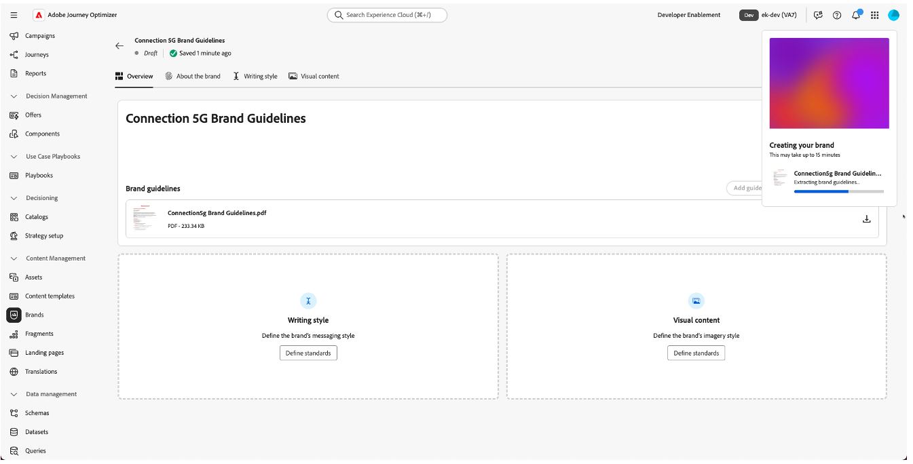

6. 抽出が完了したら、次の操作を行います。
   - 上部に緑色の確認バーが表示されます。
   - 自動的にブランド設定画面にリダイレクトされます。
   - コンテンツおよびビジュアル作成標準は、アップロードされたブランドガイドラインファイルに基づいて自動的に入力されるようになりました。

   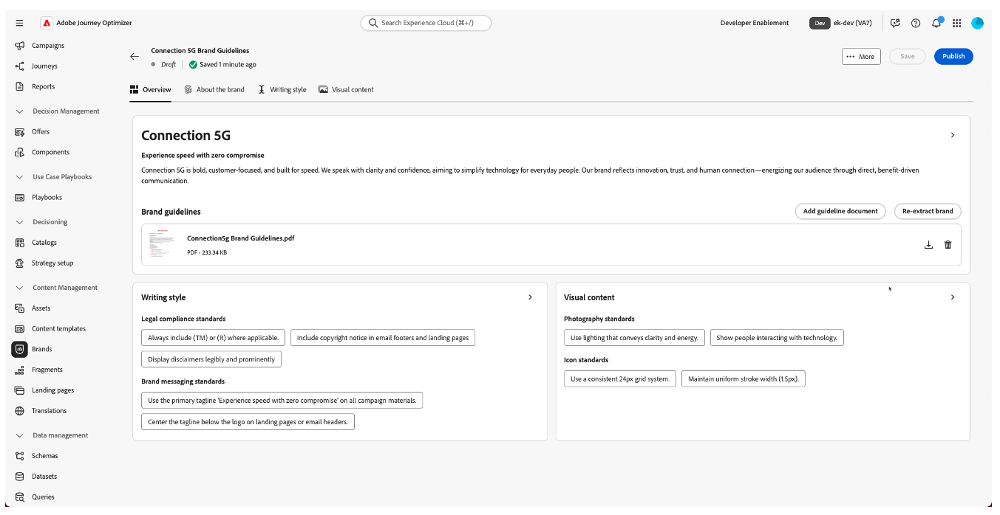

7. 「**公開**」ボタンをクリックして、ブランドガイドラインを公開します。

   

8. 確認するには「公開」ボタンを押して確認します。

   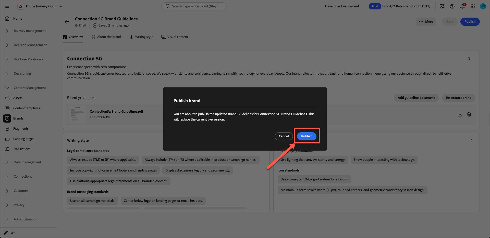

   ページの下部に緑色の確認バーが表示され、ブランドの公開が成功したことを示します。

9. メインのブランドページでクリックし、ブランドがライブになったことが表示されます（これは、**&quot;Live&quot;**&#x200B;というラベルの付いた緑のドットで表示されます）。

緑色のLive ステータスラベルを付けた新しいブランドを表示する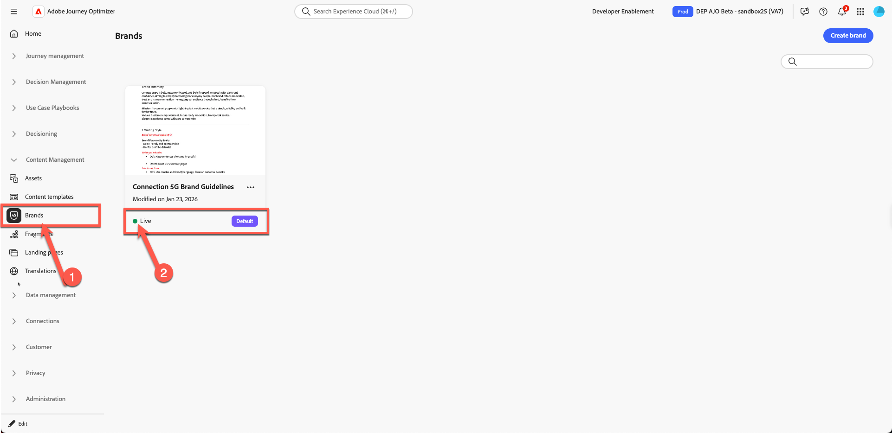

## ブランドタブの確認

これで、Connection 5Gに入力された3つの主要なタブを確認し、理解することができます。

### ブランドについて

このタブは、ブランドのアイデンティティを詳細に定義します。 通常、次の要素が含まれます。

- ブランド名
- コア値
- 指針
- ブランドの目的と約束
- 企業が望む感情は

システム内の他のすべてはこの基盤から構築されるため、このタブがConnection 5Gの真のDNAを反映していることが重要です。

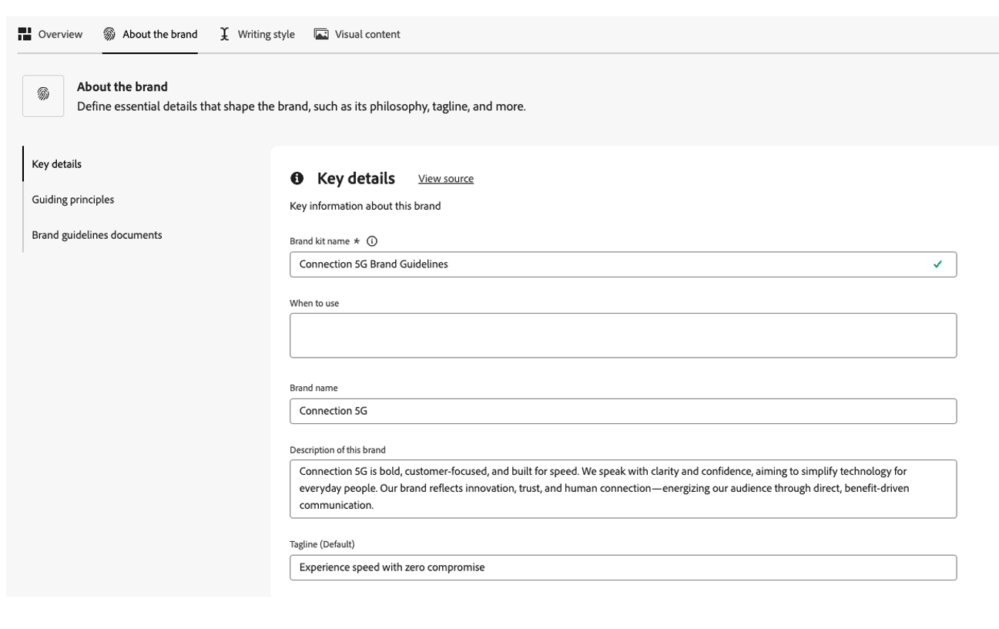

抽出したフィールドを参照し、元のPDFと一致するかどうかを確認します。

### 文体

「**手書きスタイル**」タブは、ブランドのコミュニケーション方法を定義します。 次の内容を含みます。

- トーンガイドライン
- ドットとドット
- フレーズとキーメッセージの例
- タグラインとスローガン
- 商標を含める場合などの法的ルール

自然言語でルールを追加および調整し、電子メールやSMSなどの特定のチャネルにのみルールを適用することもできます。 これにより、AI アシスタントやコンテンツ制作者が、柔軟かつ正確にコンテンツの作成方法を制御できるようになります。

### 視覚的コンテンツ

「**ビジュアルコンテンツ**」タブには、ブランドの外観の概要が表示されます。 カバーしている内容：

- 写真基準
- イラストスタイル
- アイコンのルール
- Visual DosとDon&#39;t

これにより、画像からアイコンに至るまで、あらゆるものが一貫性を持ち、Connection 5Gのコアバリューに沿ったものになります。

## 見落としていたビジョンと市場のポジショニングを追加

抽出されたコンテンツでは、いくつかの指針が不完全である可能性があります。 PDFの公式表現を使って完成させましょう。

1. 作成したブランドをクリックします

   

2. 「**ブランドを編集**」をクリックします。 確認タブが表示されます。**ブランドを編集**&#x200B;をもう一度クリックして確認します。

   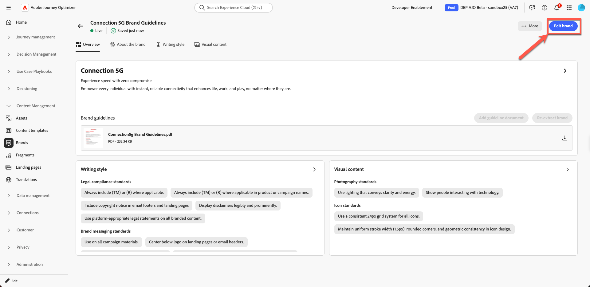

3. 「**ブランドについて**」タブに移動します。

   

4. **ガイドの原則**、**ビジョン**、または類似の詳細な説明のセクションを探します。

   「ブランドについて」タブの「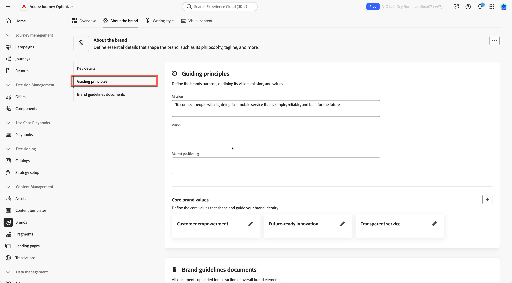

5. 次のテキストを追加します。

   **ビジョン：**

   >すべての個人が、どこにいても、生活、仕事、遊びを向上させる信頼性の高い接続を利用できるようにします。

   **市場でのポジショニング：**

   >Connection 5Gは、比類のない信頼性、シンプルさ、将来に向けたイノベーションで際立った、デジタルライフスタイルのために設計されたプレミアムスピードのモバイルサービスを提供します。

   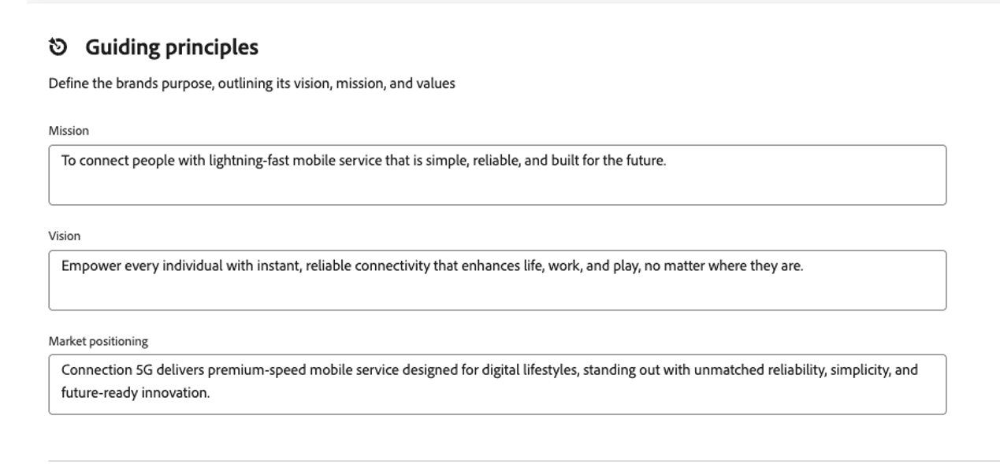

6. **保存**&#x200B;をクリックします。 （**保存** ボタンが表示されない場合は、最初に「**概要**」タブをクリックしてから、**保存**」をクリックしてください）。

>[!TIP]
>
>ブランドの目的、ビジョン、市場でのポジショニングが、AJOで明確に表現されるようになりました。

## メールボタン除外ルールの追加

次に、電子メールボタンがわかりやすい方法で記述されないようなルールを追加して、ブランドを強化します。

1. 「**書き方**」タブに移動します。

   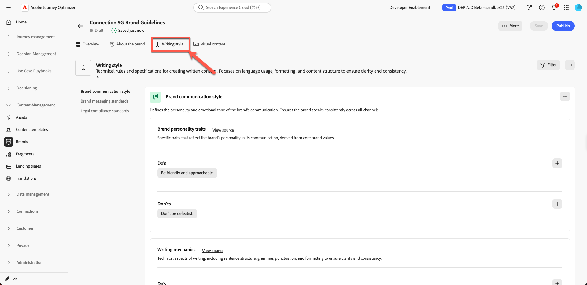

2. **ブランドのコミュニケーション スタイル** セクションに属していることを確認してください。

   「書き方」タブの

3. **しない**&#x200B;領域で、**プラス** アイコンをクリックして、新しいルールを追加します。

   

4. ルールを次のように設定します。
   - **除外：** `Be pushy`

   >[!NOTE]
   >
   >これは、「しない」ルールとして追加されます。つまり、企業はクッキーレスのCTAを望んでいません

   **チャネル：**&#x200B;電子メール

   **要素：** ボタン

5. 「**追加**」をクリックします。

   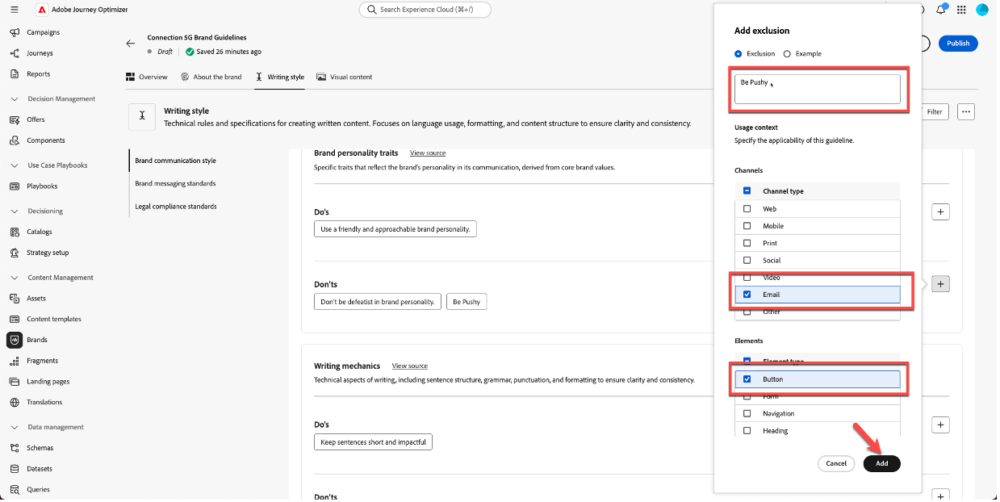

6. 新しい「しない」ルールがリストに`Be pushy`として表示されることを確認します。

   

7. **保存**&#x200B;をクリックします。

このルールは、AI アシスタントや作成者がメールボタンのコピーに取り組む際にいつでも適用され、CTAとConnection 5Gのトーンの整合性を保ちます。

AI アシスタントと作成者に対して

>[!NOTE]
>
>スクリーンショットと完全に一致しない他の「しない」ルールが表示される場合があります。 これを期待される動作として無視します。

## ブランドガイドラインの公開

設定に問題がなければ、次の手順を実行します。

1. 「**概要**」タブに戻ります。 **保存**&#x200B;をクリックします。
2. 右上隅の「**公開**」をクリックします。

   

3. Connection 5Gの更新されたブランドガイドラインを公開しようとしていることを説明する確認ダイアログが表示されます。 「**公開**」をもう一度クリックして確認します。

   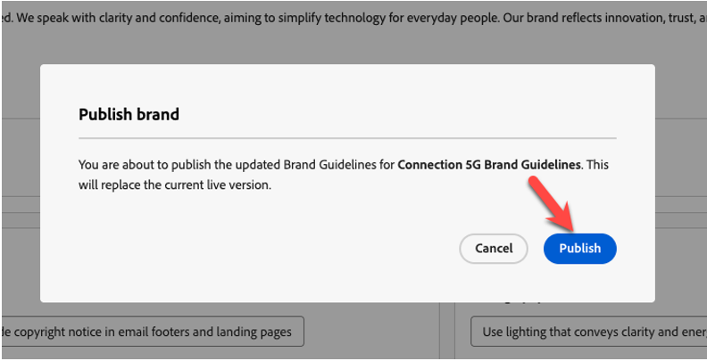

4. 緑色の確認バーが表示されるのを待ちます。
5. 「**戻る**」をクリックして、ブランドリストに戻ります。
6. **接続5G ブランドガイドライン**&#x200B;に新しいカードが表示され、ステータスが「ライブで利用可能」であることを確認します。

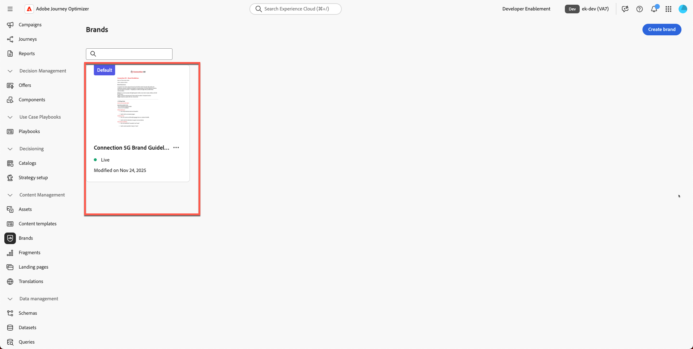

ブランドは公開され、Adobe Journey Optimizer全体で使用する準備が整います。

## まとめ

このモジュールでは、次の操作を行います。

- Connection 5Gのブランドガイドライン、PDFを確認。
- Adobe Journey OptimizerでConnection 5Gの新しいブランドを作成。
- ブランドガイドラインファイルをアップロードし、AJOが重要な情報を抽出できるようにしました。
- 「ブランドについて」、「ライティングスタイル」、「ビジュアルコンテンツ」の各タブを見直し、改善しました。
- 特定の除外ルールを追加して、メールボタンがプッシュされないようにしました。
- ブランドを公開し、AI アシスタント、ブランドの整合、テンプレート、フラグメントを強化した。

これで、完全に設定および公開された&#x200B;**Connection 5G**&#x200B;のブランドプロファイルが作成されました。このプロファイルは、すべてのコンテンツをブランド基準に保つために、ラボの他の部分で使用されます。
