# コンテンツフラグメントの作成

## テンプレートとフラグメントを利用したコンテンツ制作

**目的：** Adobe Journey Optimizerで再利用可能なフラグメントを作成し、ジャーニー内で実際のメール内に適用する方法を説明します。

## 学習目標

このモジュールの終わりまでに、次のことが可能になります。

1. 電子メールデザインを再利用可能なフラグメントに分割する。
1. ヘッダー、フッター、バナー、本文、CTAの各フラグメントを作成します。

## フラグメントが重要である理由

フラグメントを使用すると、電子メール、キャンペーン、ジャーニーをまたいで再利用できる、一貫性のあるブランドに即したコンテンツを作成できます。

### フラグメント

次のような再利用可能な構成要素。

- ヘッダー
- フッター
- CTA
- バナー
- 免責事項

フラグメントが更新されると、それを使用しているすべての電子メールが自動的に更新されます。

## これがメール作成にどのように適合するのか

- ほとんど変更されない要素の&#x200B;**フラグメント**&#x200B;を作成します。
- **それらのフラグメントを使用するテンプレート**&#x200B;を作成します。
- **キャンペーンメールでテンプレート**&#x200B;を使用し、そのコンテンツをカスタマイズします。

以下は、このラボから作成する最終的なメールです。

デザインチームは通常、次のようなテンプレートを提供します。

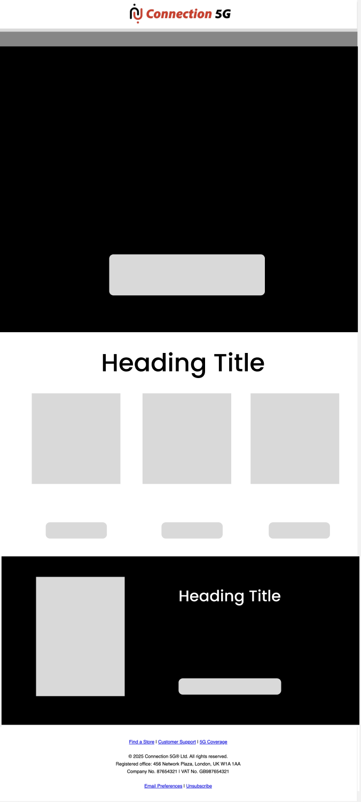

## 手順1：コンテンツフラグメントの作成

以下のテンプレートは汎用的なデザインテンプレートで、私たちの目標はこれを繰り返し可能なコンテンツブロックに分割することです。 Adobe journey optimizerでは、これは&#x200B;**フラグメント**&#x200B;と呼ばれます。

最初のステップは、作成する必要があるフラグメントの数を特定することです。 このテンプレートでは、以下に示すように5つのフラグメントを使用することが理にかなっています。

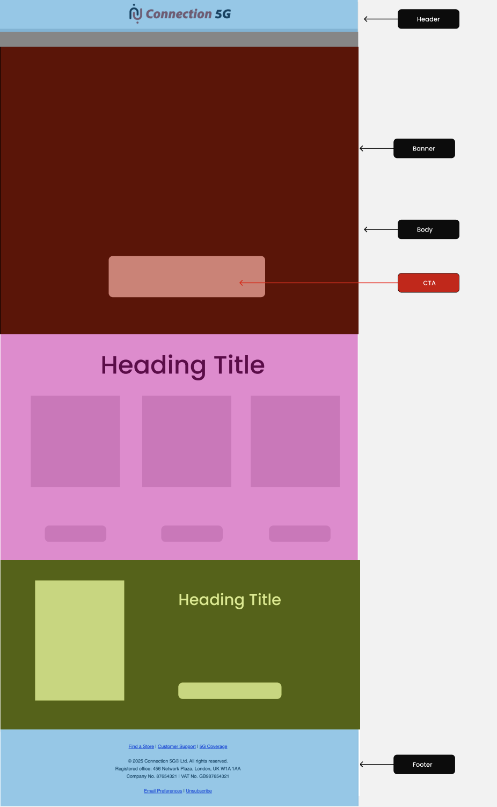

テンプレートには次の5つのフラグメントが必要であることがわかりました。

- ヘッダー
- バナー
- CTA
- 本文
- フッター

>[!NOTE]
>
>この演習では、時間を節約するために1つのヘッダーフラグメントのみを作成します。

最初にヘッダーフラグメントを作成します。 ただし、フラグメントを作成する前に、アセット環境が共有されているので、アセットフォルダーを設定します。 これを行うには、まず独自のフォルダーを作成します。

1. 左側のナビゲーションから、**Content Management** セクションを見つけ、**Assets**&#x200B;をクリックします。

   左側のナビゲーションに「

2. Assets管理セクションの「**Assets**」をクリックします。

   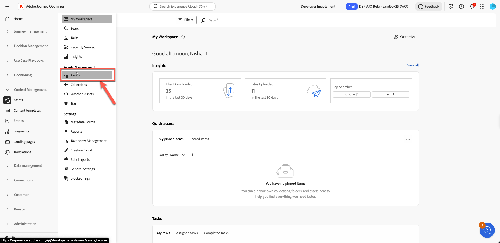

3. **「フォルダーを作成」ボタン**&#x200B;をクリックしてフォルダーを作成します。

   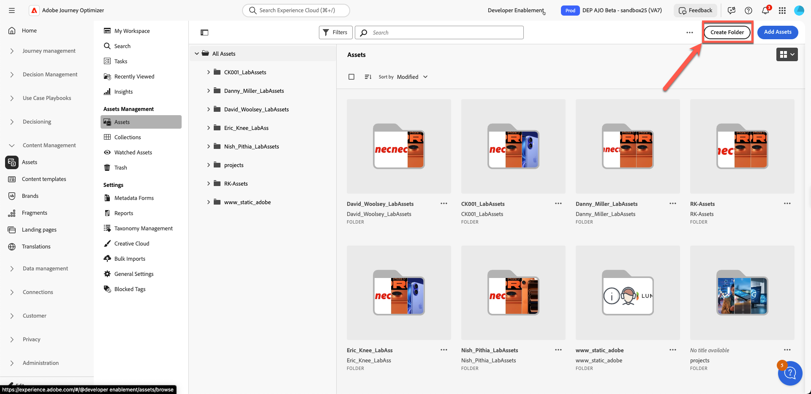

4. 姓と名のような名前を付けます。 例： Nish\_Pithia\_LabAssets （覚えておいて欲しいもの）

   

5. **新しいフラグメントを作成します：** コンテンツ管理で、**フラグメント**&#x200B;をクリックし、新しいフラグメントを作成します。

   コンテンツ管理の下の

   次のように、わかりやすい名前を付けます。 すべての詳細を次のように追加します。

   **名前：** ヘッダー

   **説明：** テンプレートのフラグメントヘッダー

   **種類：** ビジュアルフラグメントを選択

   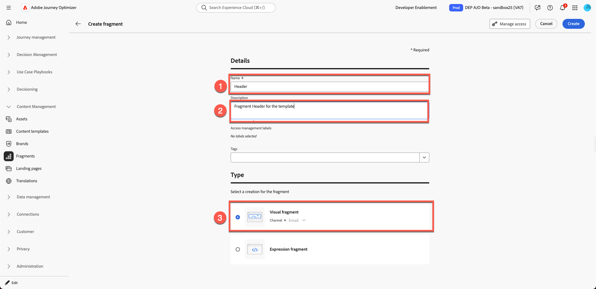

6. 右上の「**作成ボタン**」をクリックします。

   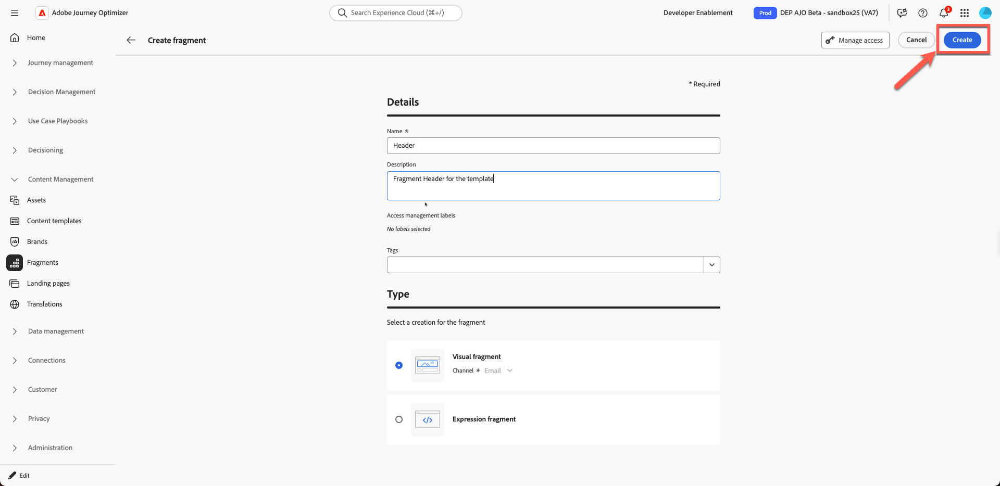

   空白のフラグメント作成画面が開きます。

7. 「構造」の下の1:1列をクリックし、以下に示すようにカンバス上でドラッグします。 （以下の画像をクリックしてアニメーショングラフィックをご覧ください）

   

8. 次に、追加したばかりの1:1行の「**image**」をドラッグします

   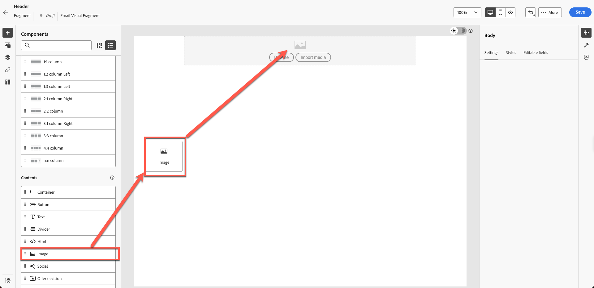

9. 提供されたロゴ画像をアップロードします。 **「メディアの読み込み」ボタンをクリックします。**

   

10. **ロゴをアップロードします：** ロゴ （*C5G-Logo.png*）を画像のツールキットフォルダーからアップロードし、「次へ」をクリックします。

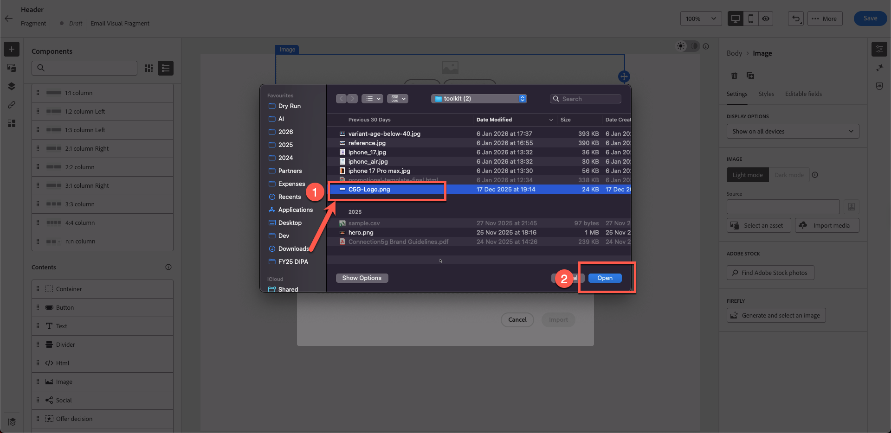

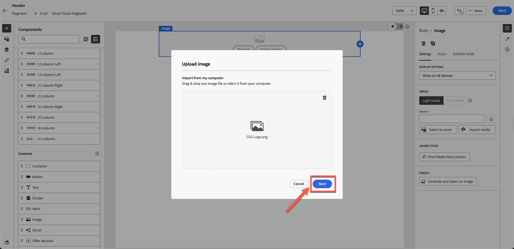

11. 作成した&#x200B;**アセットフォルダー**&#x200B;を選択し、**読み込み**&#x200B;をクリックします。 ファイルはフォルダーに保存されます。

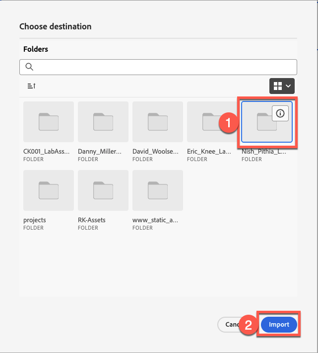

12. ロゴは正しく配置されていますが、大きすぎるため、サイズを変更する必要があります。 ロゴのサイズを変更するには、プロパティを更新します。 次に示すように、スライダーをドラッグして、**スタイル タブ**&#x200B;をクリックし、幅を40%に設定します。

>[!NOTE]
>
>トグルボタンがオンになっている場合、40の数値はピクセルではなく%を表します。 絶対ピクセルパーフェクト値を設定する場合は、ボタンをpxに切り替えます。

13. 「**&quot;保存&quot;**&#x200B;をクリックすると、フラグメントが保存されます。 確認に緑色のバーの通知が表示されます。

14. 保存されたフラグメントはドラフトモードです。 使用する前に、公開する必要があります。 「**戻る**」ボタンをクリックします。

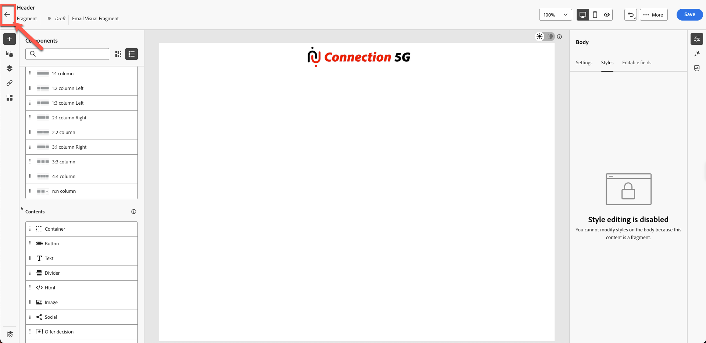

15. 「**公開**」ボタンをクリックします。 「フラグメントを公開しています。これには時間がかかる場合があります。 一度通知します」 確認について。 フラグメントをテンプレート作成に使用する準備ができました。

ステータスが&#x200B;**「ライブ」**&#x200B;に変更されます。 この時点で、次の手順で使用するヘッダーフラグメントの作成が完了しました。

>[!NOTE]
>
>この演習では、1つのフラグメントのみを作成したことに注意してください。 実際、アーキテクトは、ヘッダー、フッター、その他の再利用可能なコンポーネントなど、複数のフラグメントを作成できます。

## まとめ

このモジュールでは、次の操作を正常に実行しました。

- 電子メールを再利用可能なヘッダーフラグメントに分解する
- ヘッダーコンテンツブロックを作成しました

これで、次のモジュール「**コンテンツテンプレートの作成**」に進む準備が整いました。このモジュールでは、作成したフラグメントを使用して新しいテンプレートを生成します。
