# コンテンツテンプレートの作成

## テンプレートとフラグメントを利用したコンテンツ制作

**目的：** Adobe Journey Optimizerで再利用可能なテンプレートを作成する方法を説明します

## 学習目標

このモジュールの終わりまでに、次のことが可能になります。

1. インポートしたHTMLとフラグメントを使用して、完全なメールテンプレートを構築。

## テンプレートが重要である理由

テンプレートを利用すれば、電子メール、キャンペーン、カスタマージャーニーをまたいで再利用できる、一貫性のあるブランドに即したコンテンツを制作できます。

### テンプレート

次の構造の設計図：

- ヘッダーの配置
- 本文の内容
- フッター領域
- 標準レイアウトのスタイル

テンプレートは、チームをまたいでブランドの一貫性を確保し、制作時間を大幅に短縮します。

## フラグメントを使用した新しいテンプレートの作成

テンプレートにより、ユーザーはキャンペーンをまたいで完全なレイアウトを再利用できます。 Adobe Journey Optimizerのコンテンツテンプレートは、施策やジャーニー向けに再利用可能なコンテンツを制作する方法を簡素化し、合理化するために設計された強力なツールです。 電子メールやSMS、プッシュ通知などを作成する場合でも、テンプレートを利用すれば、プロジェクト全体で容易にカスタマイズおよび共有できる事前にデザインされた構造を用意することで、時間を節約できます。

スタンドアロンテンプレートを作成し、Adobe Journey Optimizerのキャンペーンやジャーニー全体でカスタムコンテンツを簡単に再利用することで、デザインプロセスを高速化および改善できます。

この機能により、コンテンツ指向のユーザーが、キャンペーンやジャーニー外のテンプレートで作業できるようになります。 マーケティングユーザーは、自分のジャーニーやキャンペーン内で、これらのスタンドアロンのコンテンツテンプレートを再利用し、適応させることができます。

## テンプレートを作成

1. **コンテンツ管理→コンテンツテンプレート**&#x200B;に移動します。

&#x200B;2. 「**テンプレートを作成**」をクリックし、次の項目を入力します。
   - **名前：** `Promotional Template`
   - **説明：** `Promotional Template for phone products`
   - **チャネル：** `Email`

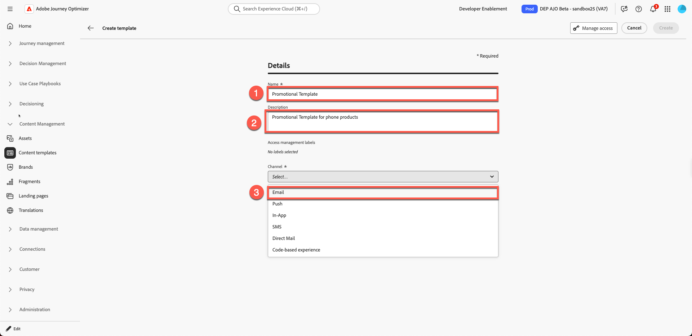

&#x200B;3. 「**作成**」をクリックします。

## 件名を追加して電子メールデザイナーを開く

1. 件名を追加：`Promotional Template`、メール本文&#x200B;**の**&#x200B;をクリックして編集するために開きます

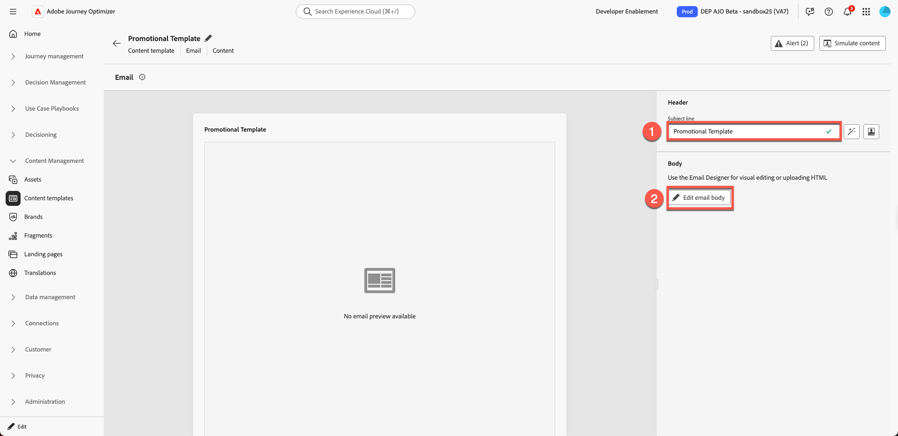

&#x200B;2. 3つのオプションが表示されます。
   1. ゼロからデザイン
   2. 独自のコーディング
   3. HTMLの読み込み

3つ目のオプションを選択します。 「**HTMLの読み込み**」をクリックします

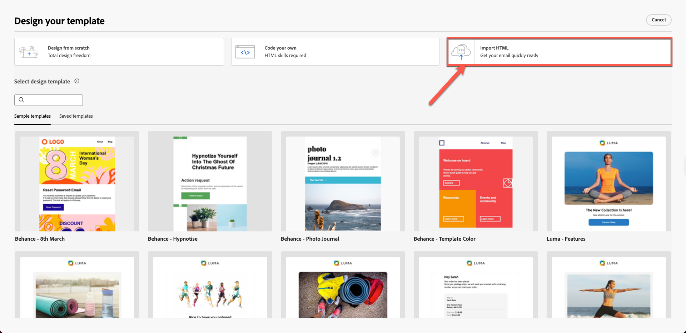

## 提供されたHTML テンプレートの読み込み

1. ツールキット フォルダー`promotional-template-final.html`からテンプレート html ファイルをアップロードします

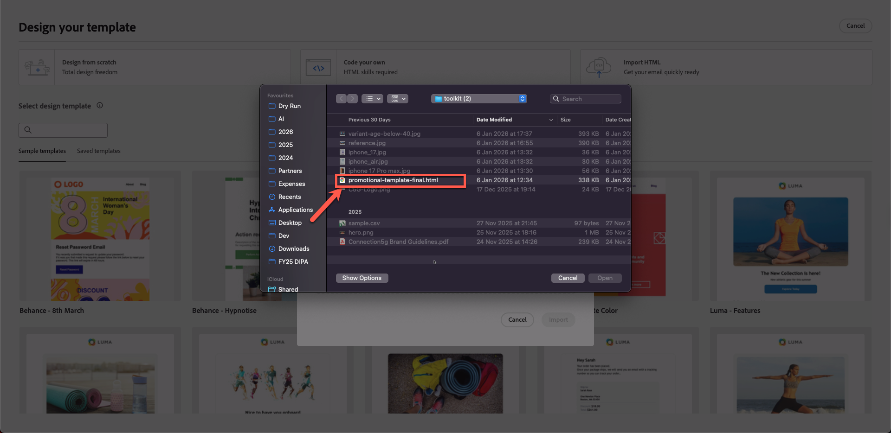

&#x200B;2. 「インポート」ボタンをクリックして、テンプレートを&#x200B;**インポート**&#x200B;します。

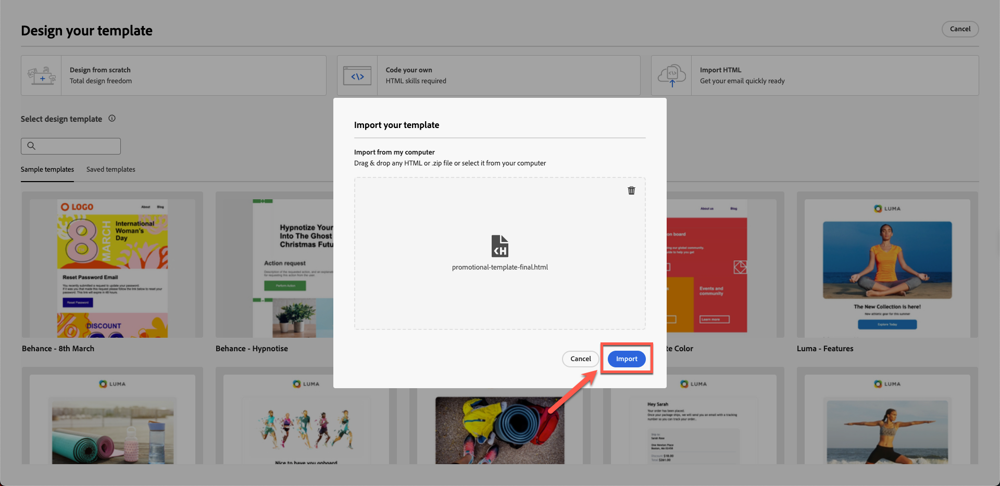

&#x200B;3. レイアウトがレンダリングされるのを待ちます。 画像のリンク切れやブランディングの欠落などの問題が発生します。 （プレースホルダーアセットがあるため、これは期待される動作です）

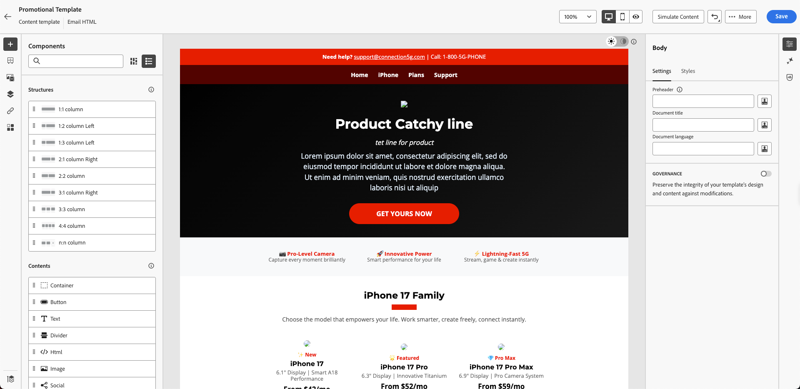

## テンプレート構造を見る

### 左パネル

Adobe Journey Optimizer（AJO）の「**構造**」および「**コンテンツ**」コンポーネントは、メール、ランディングページ、コンテンツフラグメントをデザインする際に使用される必須の要素です。 構造はレイアウトフレームワークを定義し、コンテンツはレイアウト内に配置された実際の構成要素を提供します。

Adobe Journey Optimizerの「本文」セクションは、メールまたはページコンテンツのメインコンテナです。 ビジュアルデザイン空間のルーツとして機能し、あらゆる構造コンポーネント（列、レイアウト）とコンテンツコンポーネント（テキスト、画像、ボタンなど）が含まれます ネストされています。

### 右パネル

Adobe Journey Optimizerの「本文」セクションの「**設定**」および「**スタイル**」オプションを使用すると、メールまたはページの基本的な外観とレイアウトを定義できます。 これらのコントロールは、ボディがすべてのコンポーネントの親となるため、デザイン全体に影響を与えます。

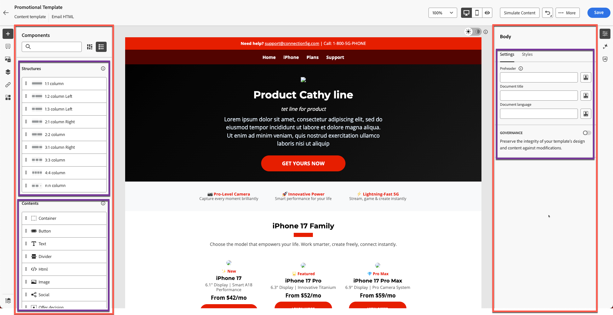

左側のレールバーには、次のセクションがあります。

- フラグメント
- ファイル
- ボディ構造
- トラッキングされたURL

前の演習で作成したヘッダーフラグメントは、以下のように表示されます。 ヘッダーフラグメントがドラフトモードではなく、青色のドットで「ライブ」と表示されていることを確認します。 残りのセクションは確認に時間をかけます。

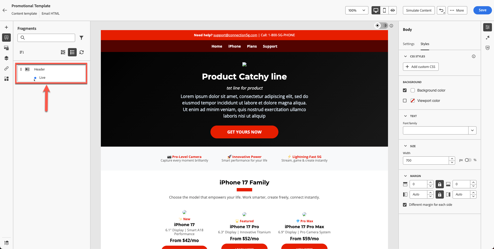

&#x200B;> [!NOTE]
>
>ここにフラグメントが表示されない場合は、フラグメントを適切に保存しなかったため、再アップロードする必要があることを意味します。

## ヘッダーフラグメントの挿入

テンプレートを改善します。 ヘッダーとフッターは作成済みです。

1. 既存のコンテンツの上に&#x200B;**1:1列**&#x200B;をドラッグします。

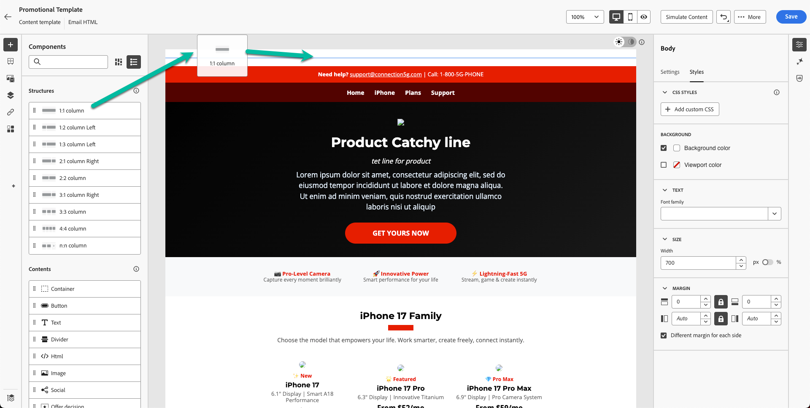

このような表示になります。

&#x200B;2. 背景には、テンプレートの背景色が使用されています。現在は黒です。 **背景色を白に設定します。 右側のパネルの「スタイル」タブで「**」をクリックし、カラーピッカーから白い色を使用します。

&#x200B;3. **フラグメント**&#x200B;を開き、**ヘッダー** フラグメントにドラッグします。

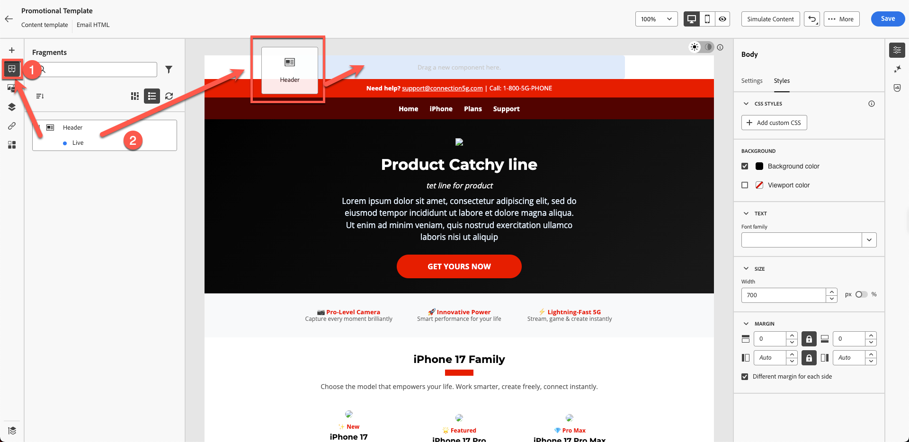

&#x200B;4. 次に示すように、ヘッダーフラグメントがテンプレートに整列していることに注意してください。

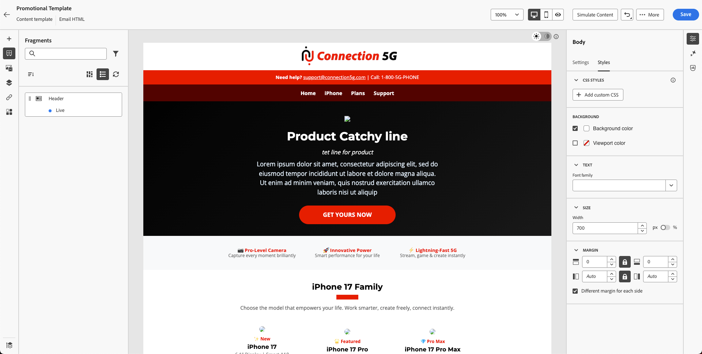

&#x200B;5. **保存** ボタンをクリックしてテンプレートを保存し、**戻る**&#x200B;をクリックします。

戻るをクリックする前にテンプレートを保存するには、保存ボタンを使用します

>[!NOTE]
>
>壊れた画像が表示される場合があります。 後で修正します。

## まとめ

このモジュールでは、次の操作を正常に実行しました。

- 完全なプロモーションテンプレートを構築するためにHTMLをインポートしました

これで、次のモジュールに進む準備ができました – **メールの作成**
