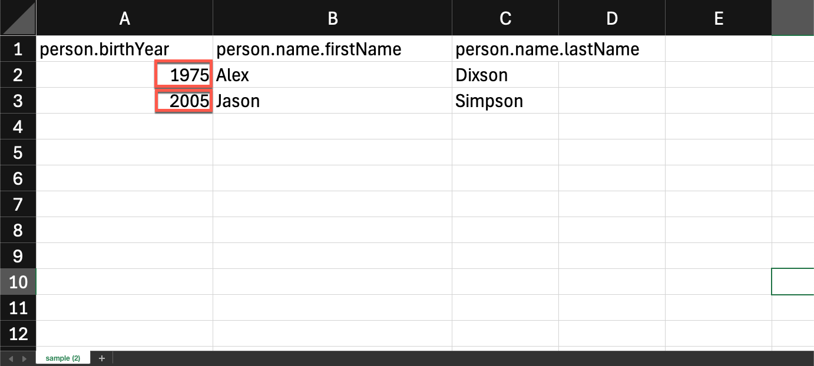
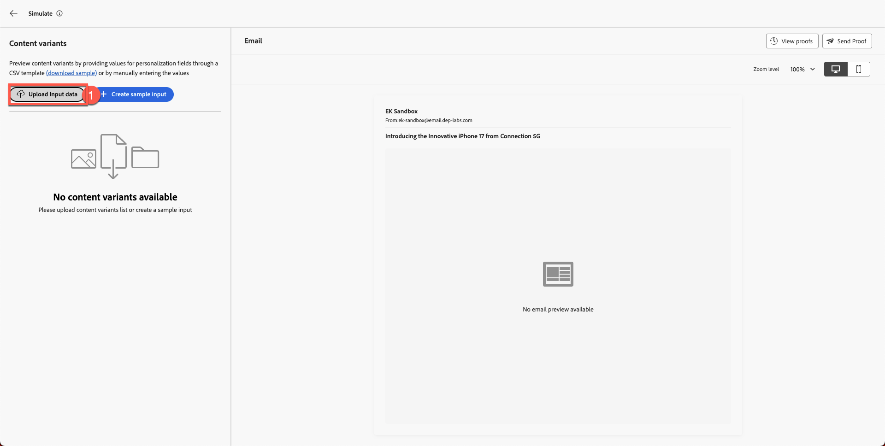
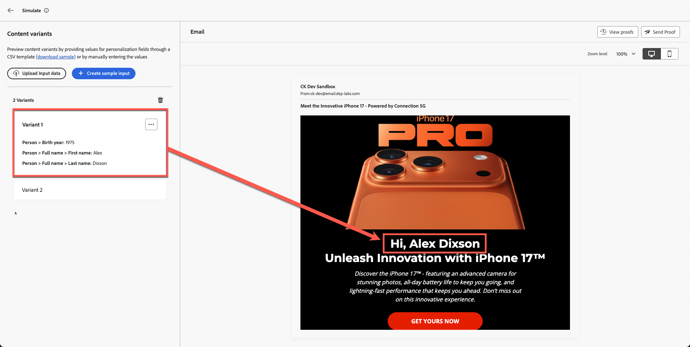
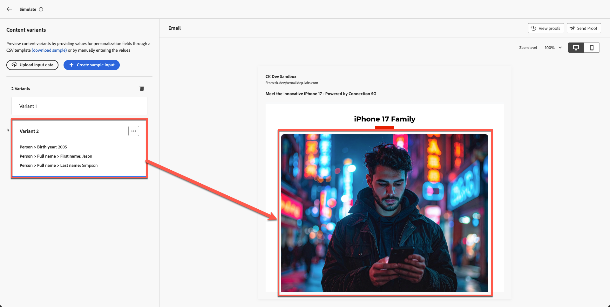

# コンテンツシミュレーション

**目的：** Adobe Journey Optimizerのシミュレーション ツールとプルーフ ツールを使用して、パーソナライゼーション、条件付きロジック、コンテンツのバリエーションを検証します。

## 学習目標

このモジュールの終わりまでに、次のことが可能になります。

1. テストプロファイルデータをアップロードしてシミュレーションに使用します。
1. パーソナライズされたフィールドとバリエーションのロジックを検証。
1. 欠落データまたは一致しないデータのフォールバック動作をテストします。

## 概要

この最後のモジュールでは、Adobe Journey Optimizerのシミュレーションツールを使用して、**2つの条件付きバリエーション**&#x200B;を使用してメールをテストします。
これにより、さまざまな顧客がパーソナライズされたメッセージをどのように体験するのかをプレビューし、キャンペーンを開始する前の正確性を確保できます。

ツールキットからサンプル テスト プロファイル ファイル **sample.csv**&#x200B;を使用します。

## シミュレーションツールを開く

1. 完成した電子メールを開きます。
1. 「**コンテンツをシミュレート**」をクリックします。
1. 「**コンテンツのバリエーションをシミュレート**」を選択します。

数秒後にシミュレーションパネルが開きます。

## テストプロファイルデータのアップロード

1. ツールキット フォルダーから&#x200B;**sample.csv**&#x200B;を開きます。
   - **Alex** → 40歳以上
   - **Jason** → 40歳未満
2. 「**入力データをアップロード**」をクリックします。

   

3. **sample.csv**&#x200B;を選択し、**続行**&#x200B;をクリックします。

AJOがファイルを処理し、プレビューを準備します。

## バリエーションのレンダリングを確認

AJOには、アップロードされたプロファイルに基づいて、両方のバリエーションが並べて表示されます。

**期待される結果：**

- **Alex** → **バリアント 1** （40歳以上）が表示されます

40より上の年齢のAlex プロファイルレンダリングのバリアント 1

上にスクロールすると、以下のように、名前が付いたパーソナライズされたフィールドも表示されます。

バリアント 1のAlexに表示される パーソナライズされた名前フィールド

- **Jason** →見る&#x200B;**バリアント 2** （40歳未満）

40歳未満のJason プロファイルのレンダリング バリアント 2

ジェイソンのフルネームも。 なんてクールなんだろう。

バリアント 2のJasonに表示される パーソナライズされたフルネーム フィールド

## フォールバック動作の検証

**フォールバックとデフォルト：**&#x200B;欠落しているデータや一致しないシナリオがメールで適切に処理されていることを確認します。 例えば、「誕生年」フィールドが空のプロファイルや、ターゲットオファーに該当しないフィールドを使用して、プロファイルをシミュレートします。 プレビューには、破損したコンテンツや空のコンテンツの代わりに、デフォルトのコンテンツブロックまたは適切なプレースホルダーを表示する必要があります。 シミュレーションでコンテンツを配置する必要がある空のセクションが表示される場合は、デザインでフォールバックオファーまたはデフォルトテキストを設定する必要がある場合があることを示します。

## まとめ

このモジュールでは、次の操作を正常に実行しました。

- サンプルプロファイルを使用したパーソナライズされたコンテンツのシミュレーション
- バリアントスイッチングロジックを検証
- 確認されたパーソナライズされたフィールドの入力が正しく行われる

次のモジュールの準備が整いました – **ブランド調整**,
AIを活用したConnection 5Gのブランドガイドラインに照らしてメールを評価します。
