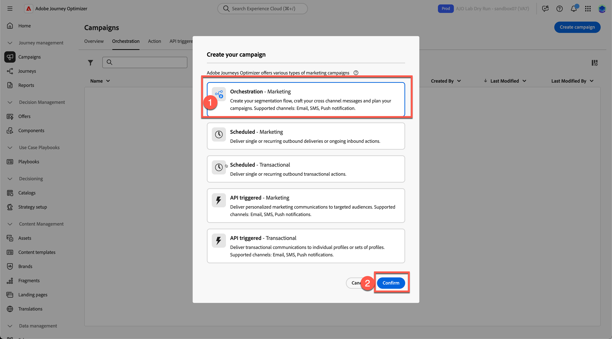
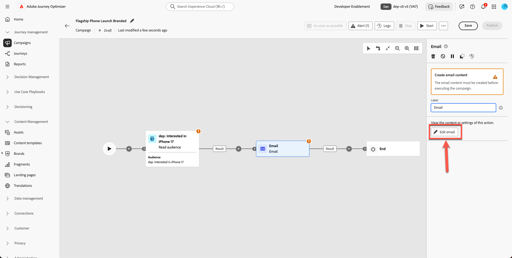
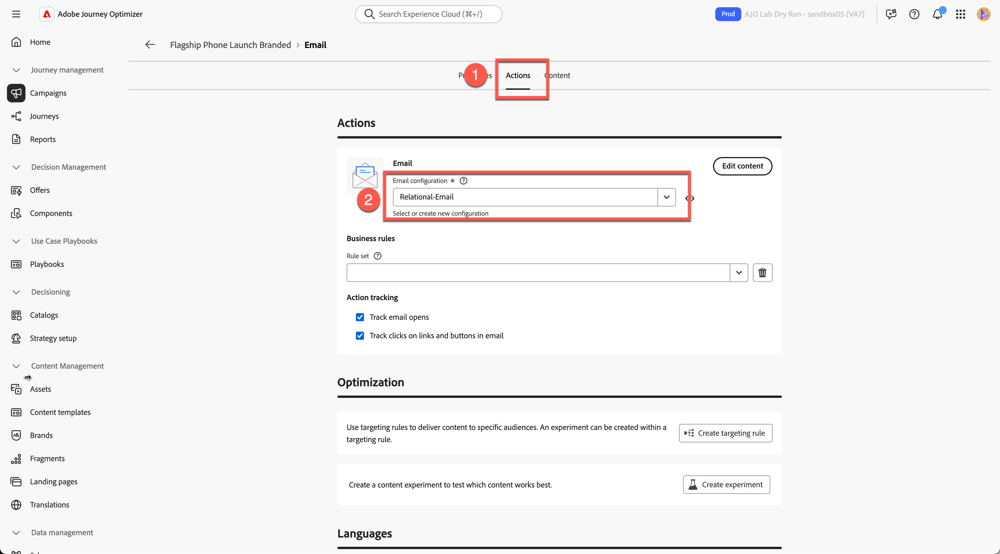
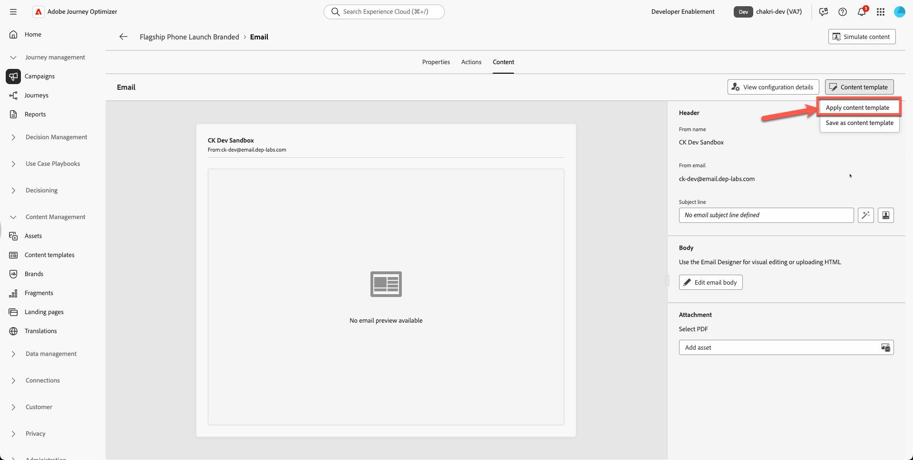
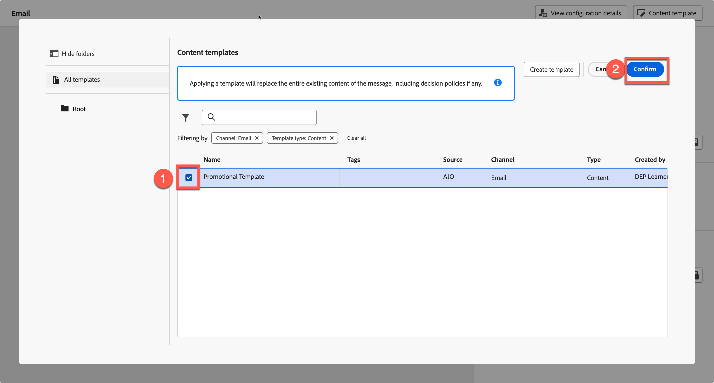
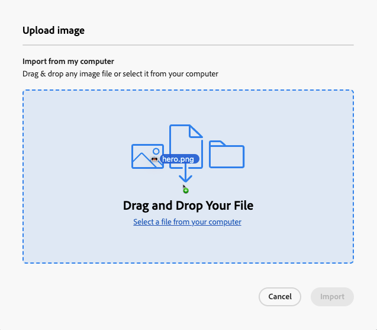
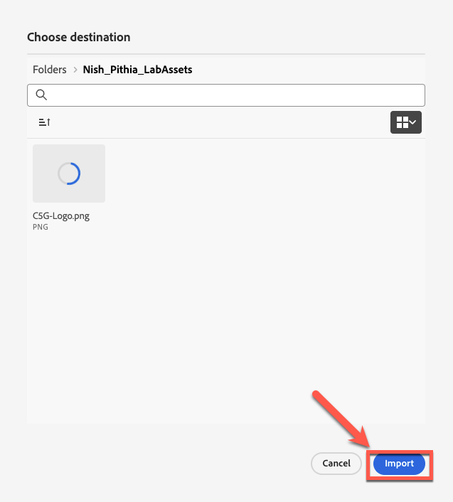

# 電子メールの作成

## テンプレートを利用したコンテンツ制作

**目的：** Adobe Journey Optimizerで再利用可能なテンプレートを作成し、キャンペーン内の実際のメール内に適用する方法を説明します。

## 学習目標

このモジュールの終わりまでに、次のことが可能になります。

1. 新しいキャンペーンを作成し、新しいブランドテンプレートを使用します。
1. ヒーロー画像、商品画像、ボタン、レイアウトのスタイルを更新。

## キャンペーンでのメールの作成と更新

### 目標

この演習では、作成したテンプレートをジャーニー内のメールに適用する方法について説明します。 理想的なシナリオでは、既存のジャーニーやキャンペーンを使用し、標準化されたテンプレートにメールコンテンツを置き換えることで、ブランドの一貫性と迅速な実行を実現できます。

このステップでは、テンプレートをジャーニーをまたいで再利用し、電子メールをゼロから作成することなくデザインを更新できる方法を示します。

## 新しいメールキャンペーンの作成

1. メイン画面に戻り、**キャンペーン管理→ジャーニー**&#x200B;をクリックします。
2. **キャンペーンの作成**&#x200B;をクリックします

   

3. 「**オーケストレーション – マーケティング**」を選択し、**確認**&#x200B;をクリックします

   

4. キャンペーンに`Flagship Phone Launch Branded`という名前を付けます。 「**保存**」ボタンを押します。

   します

5. **以上の署名**&#x200B;をクリックし、**オーディエンスを読み取り** アクティビティを選択します

   

6. 次の手順は、**「オーディエンスを読み取り」ボックスを選択し、** オーディエンスフォルダーアイコン **をクリックすることです**

   を読む

7. 「**dep: Interest in iPhone 17** audience」を選択し、「**Add Audience**」ボタンをクリックします

   

8. エンティティを選択 – **dep-rel：顧客アカウント - customer\_id** （またはこの部分では問題にならないため）
9. **以上の署名**&#x200B;をクリックして&#x200B;**電子メールアクティビティ**&#x200B;を追加し、チャネルアクティビティから「**電子メール**」を選択します。

   

10. **メールを編集**&#x200B;をクリックします。

1. 「**アクション」タブ**&#x200B;をクリックし、**メール設定**&#x200B;を選択します。 サンドボックスにはこれがリレーショナルメールとして表示される場合があります。 （任意を選択）

   メール設定が選択された

1. **コンテンツ タブ**&#x200B;をクリックします

   

1. 「**コンテンツテンプレートを適用**」をクリック

   

1. 作成したテンプレート **「プロモーションテンプレート」**&#x200B;を選択し、**確認**&#x200B;をクリックします

   

1. **メール本文を編集**&#x200B;をクリックします

   

1. 新しいヘッダー、ヒーロー、フッター、コンテンツブロックが正しく表示されることを確認します。

## ヒーロー画像と商品画像の置き換え

ヒーロー画像と電話画像を変更します。 ツールキットフォルダーからアセットにコンテンツをアップロードする必要があります。 現在、製品ヒーローバナー画像はプレースホルダーになっています。

1. 壊れたヒーローバナー画像をクリックします。

   

2. 一時ソース URLを削除します。

   

3. **メディアの読み込み**&#x200B;をクリックします

   

4. ツールキットから`hero.png`をアップロードします。 （ファイルをドラッグできます）

   

5. **次へ、**&#x200B;をクリックします。アセット **のフォルダー**&#x200B;を選択し、**import**&#x200B;を押します

   

6. メールテンプレートが正常に表示されます。 次のようです。 **「保存」**&#x200B;をクリックして、作品を保存します。

## 任意の演習

### 製品画像の置換

先に進み、すべての製品画像（ツールキットフォルダーに用意されている画像）を更新し、好みに丸みを帯びた境界線を追加します。 下の図のように、メールのリンクが壊れていなくても見やすくなります。 すべての製品カードに対して、このプロセスを繰り返します。

## まとめ

このモジュールでは、次の操作を正常に実行しました。

- ブランドのテンプレートを使用して、メールを含む新しいキャンペーンを作成した
- ヒーロー画像と商品画像を更新
- スタイルの強化

次のモジュールである&#x200B;**AI アシスタントとコンテンツパーソナライゼーション**&#x200B;に進む準備が整いました。AIを利用してテキストを微調整し、画像を自動的に生成します。
