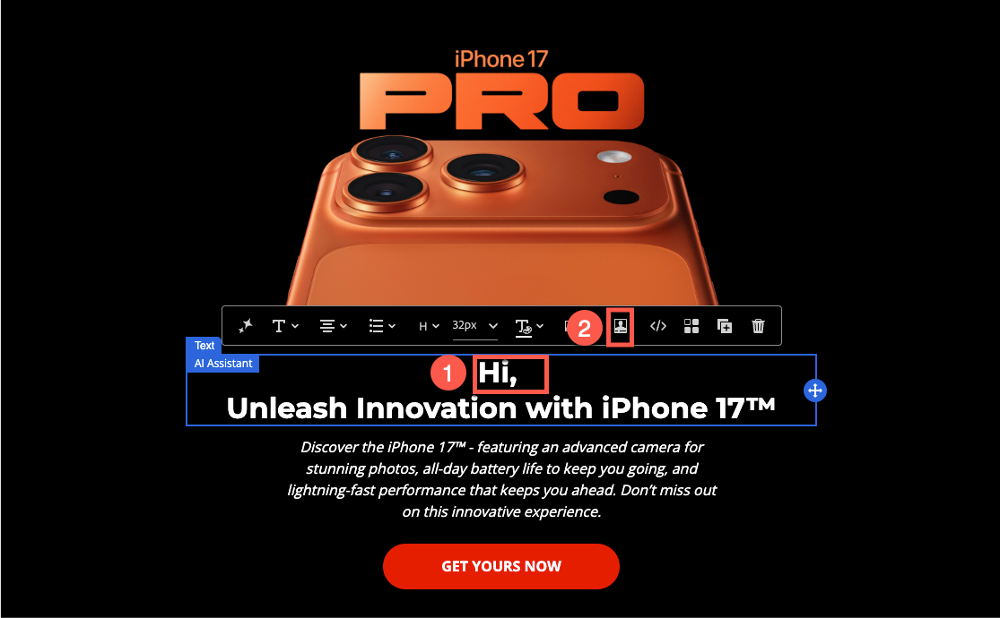
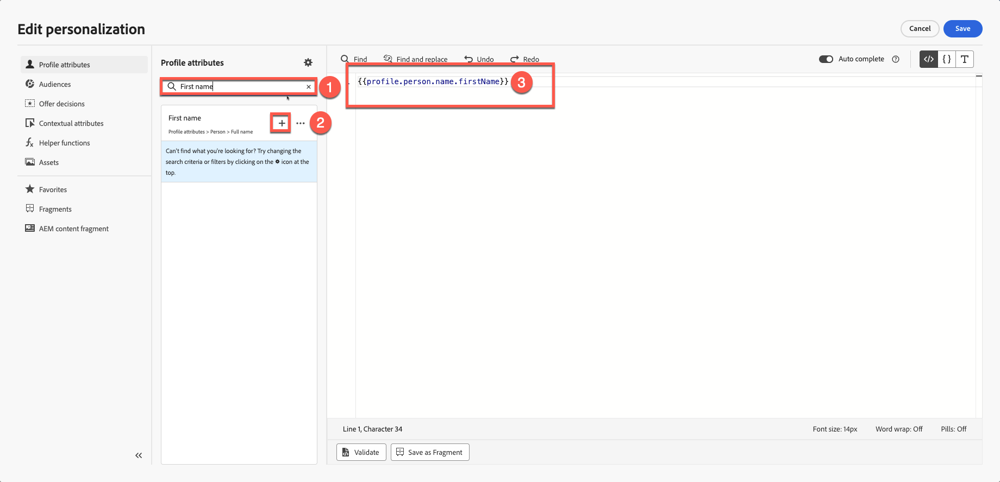
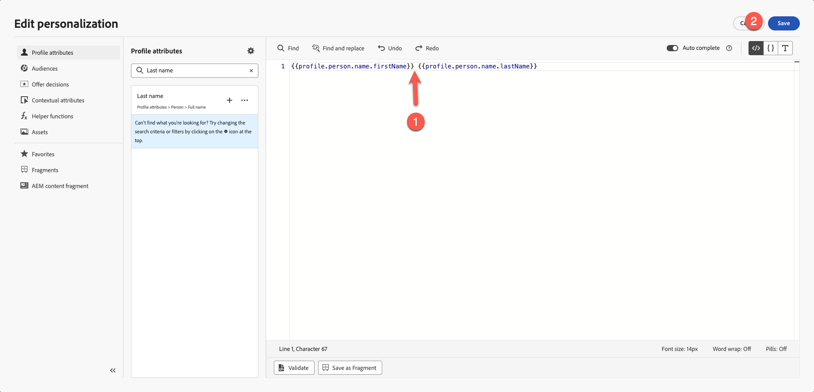
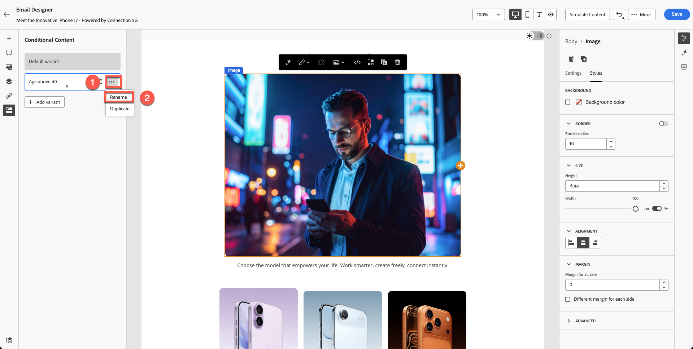
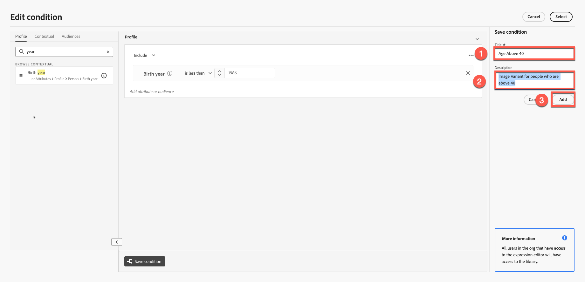
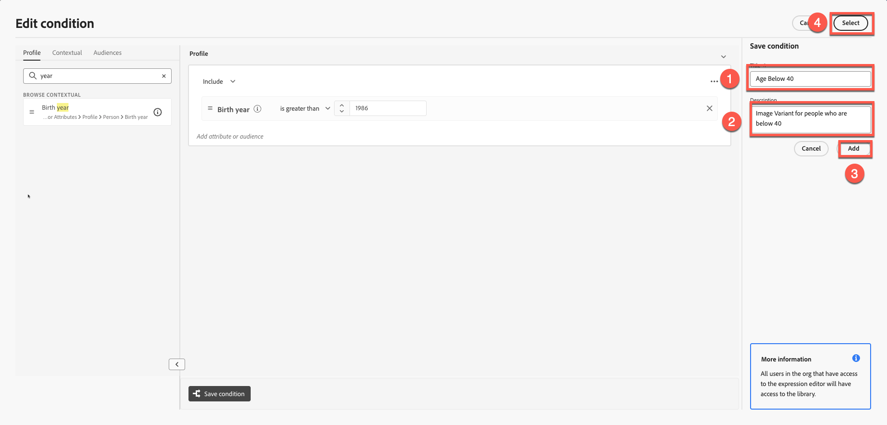
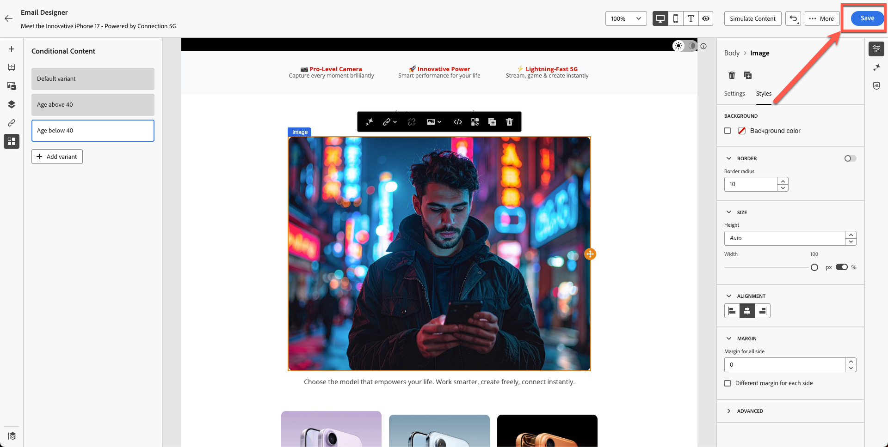

# Personalizationとコンテンツのテスト

**目的：** プロファイル属性を使用してメールコンテンツをパーソナライズし、動的コンテンツのバリエーションを作成し、Adobe Journey Optimizerで条件付きロジックを適用する方法を説明します。

## 学習目標

このモジュールの終わりまでに、次のことが可能になります。

1. プロファイル属性を使用してパーソナライゼーションフィールドを追加します。
1. パーソナライゼーションエディターとHandlebars構文を使用します。
1. プロファイルロジックにもとづいて動的なコンテンツのバリエーションを構築できます。
1. パーソナライズされたコンテンツブロックに対する条件付きルールの作成。
1. 誕生年などの属性にもとづいて、バリエーションの切り替えをテストします。

## 概要

Adobe Journey Optimizerのパーソナライゼーションは、大規模な一対一の体験を可能にします。
このモジュールでは、次の操作を行います。

- パーソナライズされたテキスト（名と姓）の挿入
- 年齢にもとづいたコンテンツのバリエーション作成
- プロファイル属性を使用した条件付きロジックの適用
- モジュール 7でのシミュレーション用のコンテンツの準備

Adobe Journey OptimizerのPersonalizationなら、個々のプロファイル、行動、コンテクストデータにもとづいてコンテンツを動的にカスタマイズすることで、パーソナライズされたインパクトのある顧客体験を構築できます。 パーソナライズされた電子メールや通知、オファーの作成など、さまざまなツールとテクニックを活用することで、適切なメッセージを的確なオーディエンスにタイミングよく配信できます。 PersonalizationのエディターやHandlebarsの構文、Adobe Experience Platformのデータを連携させてアイデアを形にしたり、式フラグメントを使用して再利用可能なコンテンツブロックを探したり、高度なヘルパー関数を使って、より深い可能性を引き出す方法をご紹介します。 各トピックは、スキルをステップバイステップで構築するため、自信を持ってパーソナライズされたジャーニーを設計する準備ができています。

## 基本的なパーソナライゼーションの追加

この部分は、パーソナライゼーションをシンプルにします。 プロファイルに基づいて、メールに氏名を追加します。 Personalizationは、定義したXDM Individual Profile スキーマで管理されるプロファイルデータに基づいています。 XDM Individual Profile スキーマは、Journey Optimizerでコンテンツをパーソナライズするために使用できる唯一のスキーマです。

1. 以前のモジュールで作成したメールを開きます。
2. ヒーロータイトルの上にテキストブロックを追加します。コンテンツ：**こんにちは、**
3. 「**パーソナライゼーション**」アイコンをクリックします。

   

4. **F**&#x200B;**first Name**&#x200B;を検索します。

   

5. **+**&#x200B;をクリックして、エクスプレッション領域に追加します。
6. **名** フィールドの後に&#x200B;**スペース**&#x200B;を追加します。

   

7. 上記のプロセスを繰り返しますが、今回は&#x200B;**姓**&#x200B;を検索して追加します。

   最後の構文では、ファーストネーム変数とラストネーム変数が明確に分けて表示されます。

   

8. フラグメントを検証します。 コンテンツをフラグメントとして保存するオプションがあることに注意してください。 これは、他のメールコンテンツの作成にフルネームを使用している場合に実行する絶好の機会です。 これをスキップして次のステップに進みます。
9. **保存**&#x200B;をクリック

あなたの見解はこのようなものです。 中括弧は変数で構成され、各個人は自分の名前を含むメールを受信します。

個人プロファイルにパーソナライゼーションを追加する方法を理解できたと思います。

## 動的コンテンツの概要

Adobe Journey Optimizerの動的コンテンツを利用すれば、オーディエンスにシームレスに適応するパーソナライズされたメッセージを作成できます。 条件付きルールを使用することで、プロファイル属性、オーディエンスメンバーシップ、リアルタイムイベントにもとづいて、メール、SMS、プッシュ通知をカスタマイズできます。 特定の条件が満たされない場合のフォールバックメッセージを作成する場合でも、一貫性を保つために再利用可能なルールを保存する場合でも、パーソナライゼーションエディターとメールDesignerは直感的なツールを提供し、アイデアを形にすることができます。

これは、条件付きコンテンツをメールに追加し、ユーザーの年齢に応じてパーソナライズする場合に最適なユースケースです。

スキーマを参照してください：**&quot;person.birthYear&quot;**&#x200B;は誕生年です。 この属性は便利です。 年齢にもとづいてキャンペーンをターゲティングし、設定する。

この演習では、年齢に基づいて2つのバリエーションを作成します。 ひとつのバージョンは40歳以上の利用者をターゲットとし、他のバージョンは40歳未満（20代半ばから30代の見込み）をターゲットにしています。 1986年以前に生まれた人は40歳以上とみなされ、1986年以降に生まれた人は40歳未満とみなされます。

**年齢ロジック**

プロファイル属性`person.birthYear`を使用します。

| ターゲットグループ | 状況 |
| ------------ | ----------------- |
| 40以上 | birthYear \&lt; 1986 |
| 40未満 | birthYear >= 1986 |

## 2つの画像バリエーションを作成

前のモジュールで作成したブロックを覚えていますか？ 君のイメージは僕のとは違う。

前のモジュールで作成された

40歳未満の人に対して別の画像を作成し（40代半ばの人のFirefly画像を作成したことを覚えておいてください）、この演習に使用します。

1. 既存の画像ブロックを選択します。 （画像をクリックし）、**条件付きブロック**&#x200B;をクリックします。
2. 「**バリアントを追加**」をクリックします。

   

3. 最初のバリエーションの名前を&#x200B;**40**&#x200B;より上の年齢に変更します。

   を超える年齢に変更します

4. **「バリアントを追加」ボタン**&#x200B;をクリックして新しいバリアントを作成し、40歳未満の年齢&#x200B;**に変更します。**

   未満の年齢に変更しています

5. 「20歳半ばの頃」などのプロンプトを使用して、Fireflyを使用して画像を作成することもできます。 ただし、時間を節約するために、「**variant-age-below-40.jpg**」という名前の画像が既にツールキットに用意されています。
6. 画像をクリックしてメディアを読み込みます。

   

7. **variant-age-below-40.jpg**&#x200B;画像を選択します。 **Next**&#x200B;をクリックして読み込み、最後にフォルダーの&#x200B;**Import**&#x200B;を押します（デフォルトでは既にフォルダーに入っている必要があります）。

   

8. バリエーションを切り替えてみると、別の画像が適用されていることがわかります。

これまでのところ、デザインは構築されましたが、ロジックはまだ適用されていません。 次の手順では、ロジックを適用します。

## バリエーションへの条件付きロジックの適用

両方のバリエーションの準備ができていますが、条件付きロジックをまだ適用していません。

## 「40歳以上」のロジック

1. 40 **より上の**&#x200B;年齢のバリエーションを選択してマウスポインターを置きます。
2. **条件付きロジック** アイコンをクリックします。

   

3. 新規条件を作成します。

   

4. 属性リストで&#x200B;**年**&#x200B;を検索します。
5. **誕生年**&#x200B;をキャンバスにドラッグします。
6. 条件を次に設定：
   - **birthYear \&lt; 1986**

   

7. 条件に名前を付けます：**40**&#x200B;より上の年齢
8. 説明を追加 – 40 **を超えるユーザーの「**&#x200B;画像バリアント」
9. 「**追加→選択**」をクリックします。

します

## &quot;Age below 40&quot;

1. 「**年齢40**」セクションを選択してマウスポインターを置きます。
2. 手順を繰り返しますが、ロジックを次のように変更します。
   - **birthYear >= 1986**

   

3. 条件に名前を付けます：**年齢が40**&#x200B;未満
4. 説明を追加します。 40 **未満のユーザーの「**&#x200B;画像のバリアント」
5. 「**追加→選択**」をクリックします。

## バリアントの切り替えを検証

両方のバリエーションを切り替えて、次のことを確認します。

- 正しい画像が表示されます
- ロジックが正しく適用されている
- 「条件が適用されていません」と表示されるバリアントはありません

バリアント：**40**&#x200B;より上

バリアント：**40**&#x200B;歳未満

「**保存**」ボタンをクリックして、電子メールを保存します。

## まとめ

このモジュールでは、次の方法について学習しました。

- One to Oneのメッセージ向けにパーソナライゼーションフィールドを追加する
- 動的画像のバリエーションを作成
- 年齢に基づく条件付きルールの適用

次のモジュール **コンテンツシミュレーション**&#x200B;で、両方のバリエーションをテストする準備が整いました。
