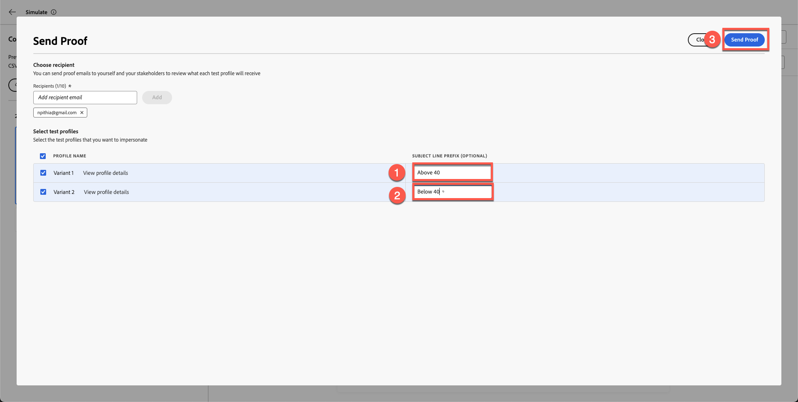
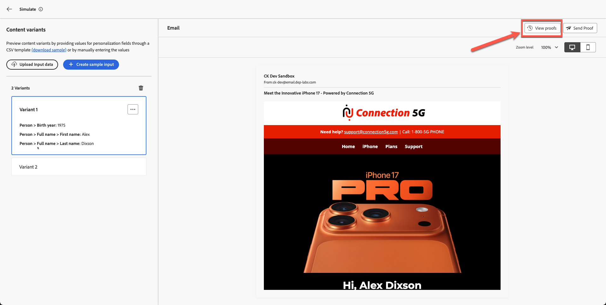

# 電子メールのテスト

## 学習目標

このモジュールの終わりまでに、次のことが可能になります。

- Adobe Journey Optimizerのメールエディターからプルーフメールを送信します。
- プルーフメールを使用して、パーソナライズされたコンテンツと条件付きのバリエーションを検証します。
- スパムやクリッピングされたメッセージの処理を含め、受信トレイでのプルーフメール配信を確認します。
- Adobe Journey Optimizer内のプルーフ配信ログ、タイムスタンプ、バリエーションを確認します。
- メールコンテンツが正確でパーソナライズされており、すぐに活用できることを確認しましょう。

## プルーフメールを送信（オプションですが、推奨）

この時点で、プロファイル属性をパーソナライズできるだけでなく、属性を使用して、表示するコンテンツを決定する条件付きロジックを作成できることがわかりました。 Adobe Journey Optimizerは非常に強力で、マーケターに多くの柔軟性をもたらします。

1. 「**コンテンツをシミュレート**」をクリックします。
2. 「**コンテンツのバリエーションをシミュレート**」を選択します。

   

   シミュレーションパネルが開きます。

3. 「**プルーフを送信**」をクリックします。

   

4. 個人のメールアドレスを追加します。

   >[!NOTE]
   >
   >企業の電子メールでは、サンドボックスからの電子メールがブロックされることがあります。 個人のメールを使うことをお勧めします。

5. 両方のバリエーションを選択します。
6. 件名の接頭辞を追加
   1. バリアント 1:40以上
   2. バリエーション 2:40未満
7. 「**プルーフを送信**」をクリックします。 緑色の確認メッセージ「**プルーフが正常に送信されました**」が表示されます

両方の電子メールが受信トレイに届いていることを確認します。

>[!NOTE]
>
>フィルターによっては、プルーフメールが&#x200B;**スパム**&#x200B;に届く場合があります。

クリッピングされたメッセージが表示される場合がありますが、フッターリンクの一部が実際のものではないので、問題ありません。 このリンクをクリックすると、バリエーションを含むメールが両方とも送信されていることがわかります。

### AJOでのプルーフ配信の確認

最後に、Adobe Journey Optimizerでのプルーフの配信を確認することもできます。

1. メールエディターに戻ります。
2. メール作成画面に戻り、**プルーフを表示**&#x200B;をクリックします。
3. 配信ログ、タイムスタンプ、送信されたバリエーションを確認します。

プルーフメールの詳細をご覧ください。

## まとめ

このモジュールでは、次の操作を正常に実行しました。

- AJOでプルーフメールを送信および検証

これで、Connection 5G AJO Labの完全なジャーニーが完了し、電子メールが正確でパーソナライズされ、アクティベートする準備ができていることを検証しました。
