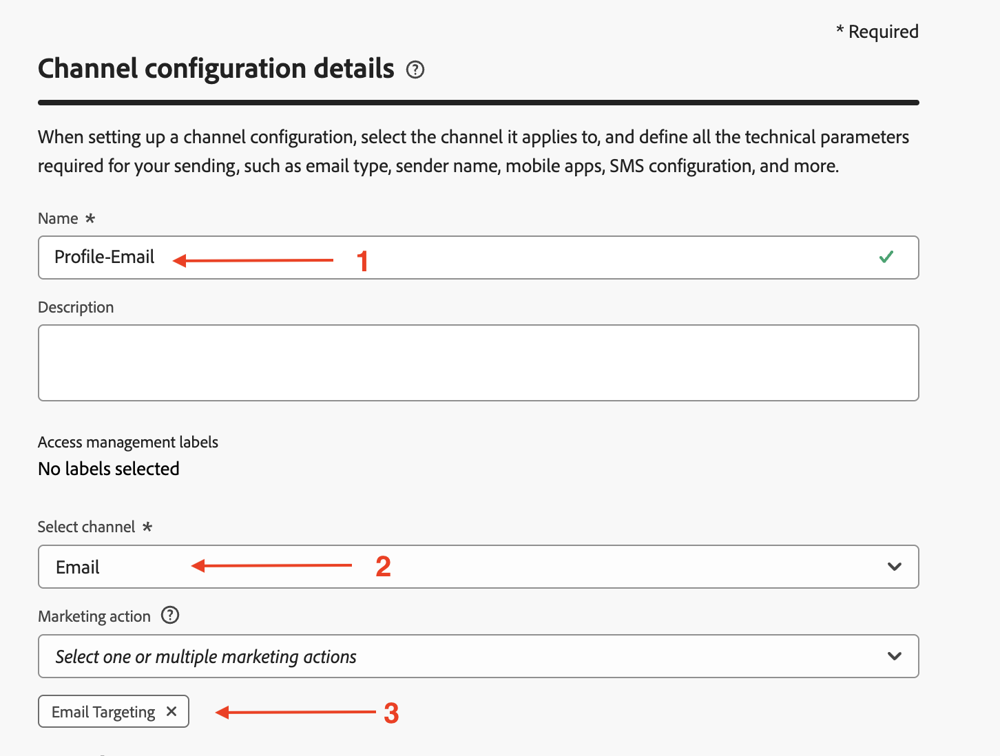
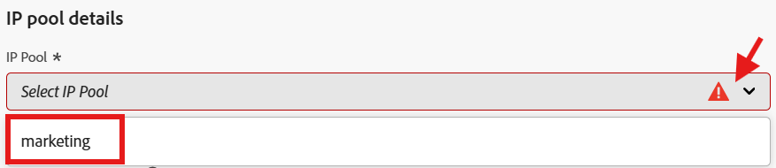
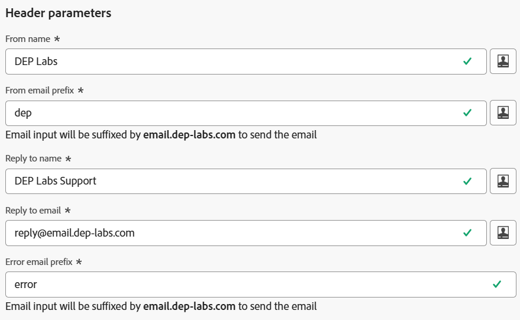
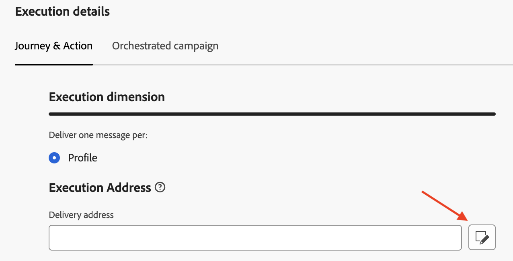
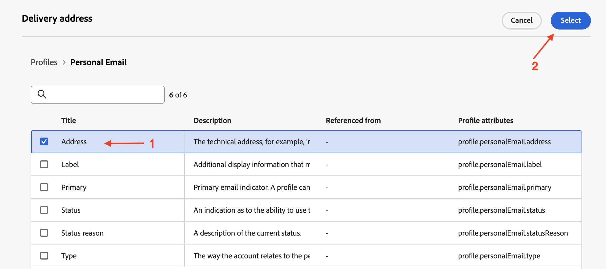
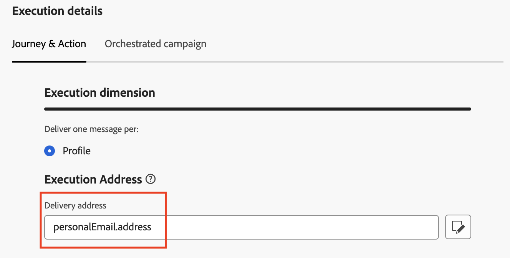
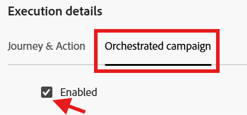

# プロファイル用に設定

## 目標

次の手順では、`personalEmail.address` AEP プロファイル属性を使用して、ジャーニーとオーケストレーションされたキャンペーンの両方を含むメールチャネル設定を作成します

## チャネル設定の作成

1. メニュー&#x200B;**チャネルの管理と一般設定**&#x200B;の下にある&#x200B;**チャネル設定**→→移動します
2. 「**設定を作成**」ボタンをクリックします

   

3. 作成ウィザードで、次の値を設定します。
   - **名前：** `Profile-Email`
   - **チャネル：** `Email`
   - **マーケティングアクション：** `Email Targeting`

>[!NOTE]
>
>チャネルとして電子メールを選択すると、新しいセクション **電子メール設定**&#x200B;が表示されます。

## メールの種類を設定

**メールの種類**&#x200B;を&#x200B;**マーケティング**&#x200B;に設定

## サブドメインの設定

**サブドメイン** ドロップダウンから、**email.dep-labs.com**&#x200B;を選択します

## IP プールの詳細の設定

**IP プール** ドロップダウンから、**マーケティング**&#x200B;を選択します

## リストの登録解除の設定

1. リストの購読解除に対して&#x200B;**有効**&#x200B;であることを確認してください
1. リストの購読解除の環境設定領域で、すべてのチェックボックスが&#x200B;**オンになっていることを確認します**
1. リンク管理で、**Adobe managed**&#x200B;が選択されていることを確認します
1. 同意レベルの場合、これが&#x200B;**チャネル**&#x200B;に設定されていることを確認してください

## ヘッダーパラメーターの設定

1. 次のフィールドを次のように設定します。
   - **送信者名：** `DEP Labs`
   - **電子メールのプレフィックスから：** `dep`
   - **名前に返信：** `DEP Labs Support`
   - **メールへの返信：** `reply@email.dep-labs.com`
   - **エラー電子メールのプレフィックス：** `error`

## BCC メールの設定

空白のままにする

>[!NOTE]
>
>BCC インボックスに送信することで、送信済みメールのコピーを保持できます。 送信されたすべてのメールがこの BCC アドレスにブラインドコピーされるように、目的のメールアドレスを入力します。 BCC アドレスのドメインは、アドビにデリゲートされたサブドメインとは異なる必要があります。 この機能はオプションです。 *メールにBCCを使用する方法*

## メール再試行パラメーターの設定

デフォルト設定の&#x200B;**時間**&#x200B;を&#x200B;**84**&#x200B;に設定したままにします

## URL トラッキングパラメーターの設定

デフォルト設定のままにする

## 実行の詳細

1. 「**実行の詳細**」セクションを完了します。 「**ジャーニーとアクション**」タブ -> **実行ディメンション**&#x200B;で、**Source**&#x200B;として&#x200B;**プロファイル**&#x200B;を選択し、**実行アドレス** セクションの&#x200B;**配信アドレス**&#x200B;の編集アイコンをクリックします

   

2. 「**個人用メール**」というタイトルのフォルダーをクリックして開きます

   

3. `Address` フィールドの&#x200B;**チェックボックス**&#x200B;をクリックし、**選択** ボタンをクリックします

   

4. **プロファイル**&#x200B;の場合、`personalEmail.address`は&#x200B;**実行アドレス** セクションの&#x200B;**配信アドレス**&#x200B;として設定されるようになりました

   

5. 「オーケストレーションされたキャンペーン」タブをクリックし、「**有効にする」チェックボックスを** オンにします。

   

6. 「実行」ディメンション見出しの下で、次の設定を行います。
   - **次の1つにつき1つのメッセージを配信します：** `Target Dimension`
   - **Profile Target Dimension:** `dep-rel: Customer Account - customer_id`

   

7. 「実行アドレス」で、次の設定を行います。
   - **Source:** `Profile`
   - **配信アドレス：** `click on the Edit icon`

   

8. 「`Personal Email`」フォルダーを検索してクリックし、開きます

   

9. 個人用メールフォルダー内の`Address` フィールドを選択し、**選択**&#x200B;をクリックします

   

10. **オーケストレーションされたキャンペーン**&#x200B;の場合、**dep-rel：顧客アカウント - customer\_id**&#x200B;は&#x200B;**実行ディメンション**&#x200B;の&#x200B;**プロファイルターゲットDimension**&#x200B;として設定され、**実行アドレス**&#x200B;には&#x200B;**Source**/**プロファイル**、配信アドレス **が**&#x200B;です`personalEmail.address`

>[!NOTE]
>
>オーケストレーションキャンペーンの場合は、顧客アカウントをメールでターゲティングするので、プロファイルごとに&#x200B;*1つのメッセージを送信するだけで済みます*。  使用する実行アドレスは、プロファイル自体から取得されます（つまり、**personalEmail.address**&#x200B;属性の下のAEP プロファイルに保存されるもの）。

## レビューして保存

1. すべての詳細を再度確認して、一致することを確認します。
1. 上にスクロールして、**送信**&#x200B;をクリックします。

>[!NOTE]
>
>メールチャネル設定の処理には、最大2時間かかることが確認されています。  イキーズ！
>
>このチャネル設定が処理されるのを待つ間、次の演習に進みます。

>[!TIP]
>
>🚀 メールチャネル設定のステータスが&#x200B;**アクティブ**&#x200B;になると、準備が整い、オーケストレーションされたキャンペーン内の&#x200B;**メールアクティビティ**&#x200B;内で直接選択できるようになりました。

## まとめ

これで、ジャーニーとオーケストレーションされたキャンペーンの両方にAEP プロファイル属性を使用するメールチャネル設定を作成する方法を確認しました。
