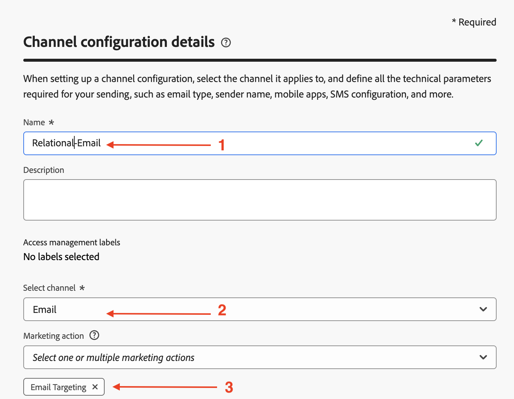
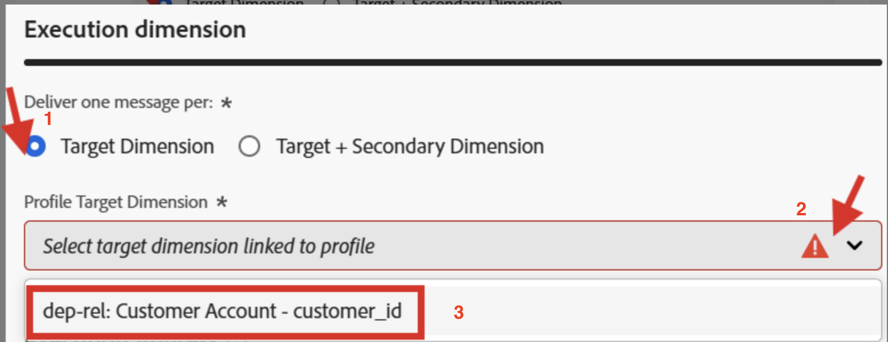
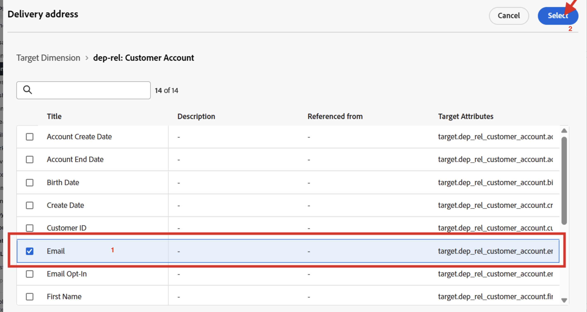

# リレーショナル用に設定

## 目標

次の一連の手順では、リレーショナルスキーマ `dep-rel: Customer Account`の`email`属性を使用して、オーケストレーションされたキャンペーンでのみ使用するためのメールチャネル設定を作成します

## チャネル設定の作成

1. メニュー&#x200B;**チャネルの管理と一般設定**&#x200B;の下にある&#x200B;**チャネル設定**→→移動します
2. 「**設定を作成**」ボタンをクリックします

   

3. 作成ウィザードで、次の値を設定します。
   - **名前：** `Relational-Email`
   - **チャネル：** `Email`
   - **マーケティングアクション：** `Email Targeting`

>[!NOTE]
>
>チャネルとして「電子メール」を選択すると、新しいセクション「メール設定」が表示されます。

## メールの種類を設定

**メールの種類**&#x200B;を&#x200B;**マーケティング**&#x200B;に設定

## サブドメインの設定

**サブドメイン** ドロップダウンから、**email.dep-labs.com**&#x200B;を選択します

>[!NOTE]
>
>自分のペースで事前にプロビジョニングされたサブドメインがない場合は、`email.dep-labs.com`ではなく、ここでAdobeにデリゲートされた独自のサブドメインを選択します。 委任する方法については、[設定](../../setup.md)を参照してください。

## IP プールの詳細の設定

**IP プール** ドロップダウンから、**マーケティング**&#x200B;を選択します

## リストの登録解除の設定

1. リストの登録解除に対して&#x200B;**有効**&#x200B;であることを確認してください
1. リストの購読解除の環境設定領域で、すべてのチェックボックスが&#x200B;**オンになっていることを確認します**
1. リンク管理で、**Adobe managed**&#x200B;が選択されていることを確認します
1. 同意レベルの場合、これが&#x200B;**チャネル**&#x200B;に設定されていることを確認してください

## ヘッダーパラメーターの設定

1. 次のフィールドを次のように設定します。
   - **送信者名：** `DEP Labs`
   - **電子メールのプレフィックスから：** `dep`
   - **名前に返信：** `DEP Labs Support`
   - **メールへの返信：** `reply@email.dep-labs.com`
   - **エラー電子メールのプレフィックス：** `error`

## BCC メールの設定

「BCC email」フィールドを空白のままにします

>[!NOTE]
>
>送信したメールのコピーを保持するには、BCCの受信トレイに送信します。 送信するすべてのメールがこのBCC アドレスに送信されるように、選択したメールアドレスを入力します。 BCC アドレスのドメインは、アドビにデリゲートされたサブドメインとは異なる必要があります。 この機能はオプションです。 *メールにBCCを使用する方法*

## メール再試行パラメーターの設定

デフォルト設定の&#x200B;**時間**&#x200B;を&#x200B;**84**&#x200B;に設定したままにします

## URL トラッキングパラメーターの設定

デフォルト設定のままにする

## 実行の詳細

1. 「オーケストレーションされたキャンペーン」タブで、「**有効にする」チェックボックスを** オンにします。

   

2. 実行ディメンションで、次の設定を行います。
   - **次の1つにつき1つのメッセージを配信します：** `Target Dimension `
   - **Profile Target Dimension:** `dep-rel: Customer Account - customer_id`

   

3. 「実行アドレス」で、次の設定を行います。
   - **Source:** `Target Dimension`
   - **配信アドレス：** `click on the Edit button`

   

4. ポップアップで、**dep-rel: Customer Account** フォルダーをクリックします

   

5. **メール**&#x200B;を選択し、**選択** ボタンをクリックします

   

6. 完了すると、最終的な実行の詳細は以下のスクリーンショットのようになります

>[!NOTE]
>
>オーケストレーションされたキャンペーンの場合は、メールで顧客アカウントをターゲティングするので、Target Dimensionごとに1つのメッセージを送信するだけで済みます。  使用する実行アドレスは、Target Dimension自体から取得されます（つまり、**email** アドレスの&#x200B;**dep-rel：顧客アカウント** テーブルに保存されているものです）

## レビューして保存

1. すべての詳細を再度確認して、一致することを確認します。
1. 上にスクロールして、**送信**&#x200B;をクリックします。
1. 完了すると、2つのメールチャネル設定が表示されます。両方とも「処理中」状態である可能性があります。

>[!WARNING]
>
>メールチャネル設定の処理には、最大2時間かかることが確認されています。

## まとめ

これで、オーケストレーションされたキャンペーンにリレーショナルスキーマ属性を使用するメールチャネル設定の作成方法を確認しました。
