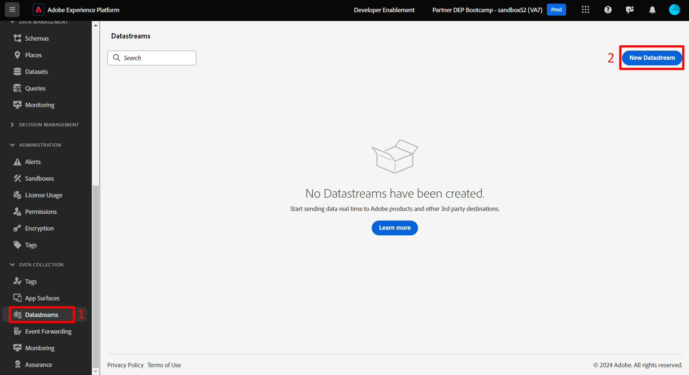
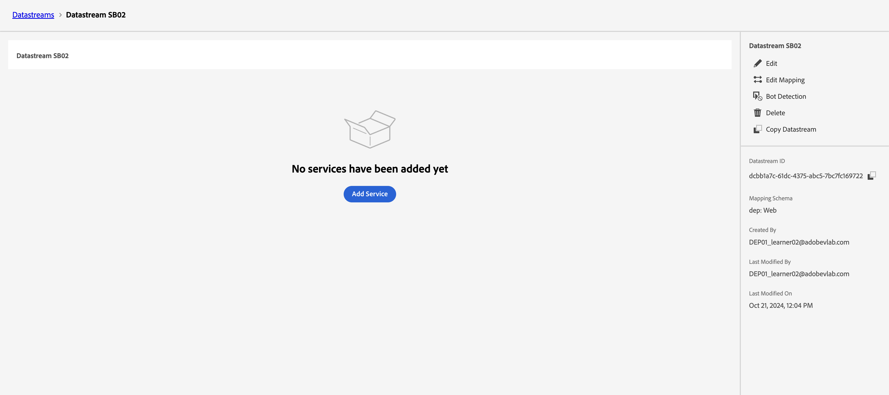
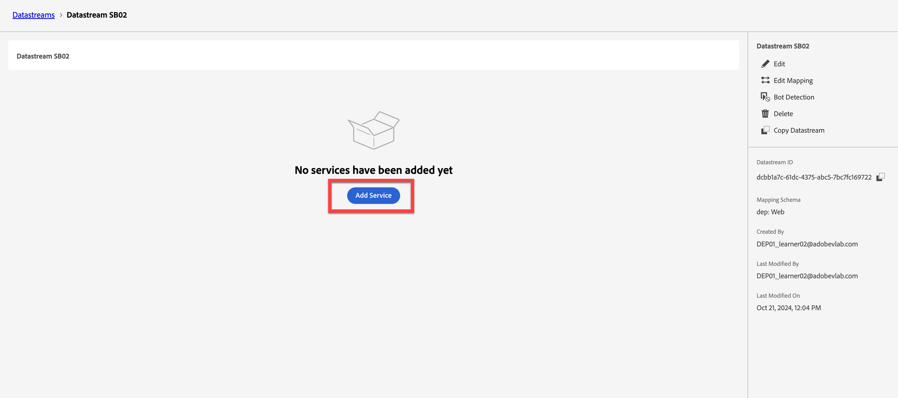
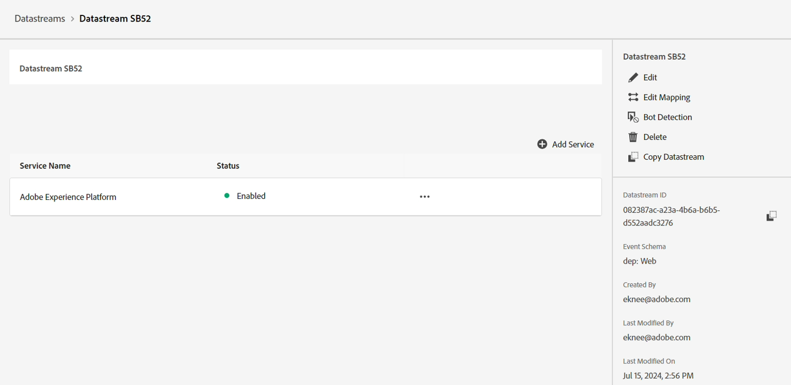

# データストリームの作成

## 学習目標

Edge イベント処理を有効にするために、必要なサービスを使用してデータストリームを作成および設定します。

データストリームは、それを利用するサービスを定義します。

- Edgeにデータを送信する場合、使用するデータストリームを指定します
- これらのデータストリームに送信されたデータは、設定されたサービスに従ってアクションを実行できます
  - Adobe Experience Platform

## 新しいデータストリームの作成

1. **データ収集**&#x200B;の下の左側のパネルで、**データストリーム**&#x200B;をクリックします
1. 次に、**新しいデータストリーム**&#x200B;をクリックして作成します

## データストリームの設定

次の情報を使用してデータストリームを設定します。

1. 名前 – > **データストリーム SB + \&lt; サンドボックス名> （データストリーム SB01）**
1. マッピングスキーマ -> **dep: Web**
1. この情報を取得する場合は、**位置情報とネットワーク検索**&#x200B;のすべてのオプションを&#x200B;**で**&#x200B;切り替えます。
1. 完了したら、**保存** ボタンをクリックします

>[!WARNING]
>
>「保存してマッピングを追加」をクリックしないでください。  誤って入力した場合は、キャンセルするだけです

データストリームを保存すると、次の画面が表示されます。

## Adobe Experience Platform サービスを追加

これにより、データをハブに送信し、このデータストリームで受信したデータのデータセットに格納できます。

1. 画面の中央にある青い&#x200B;**サービスを追加** ボタンをクリックします

&#x200B;2. 次の項目を設定します。
   - **サービス** -> `Adobe Experience Platform`
   - **イベントデータセット** -> `dep: Web`
   - **プロファイルデータセット** -> `dep: Customer Account`
   - **チェックボックスを選択** -> `Offer Decisioning`
   - **チェックボックスを選択** -> `Adobe Journey Optimizer`
&#x200B;3. 完了したら、**保存**&#x200B;をクリックします

これで、データストリームにサービスが追加されました

**Copy**&#x200B;および&#x200B;**save** the **Datastream ID**&#x200B;をローカルコンピューターに保存します（後でPostmanで使用します）

後で使用するためにコピーして保存する

## まとめ

Adobe Experience Platform サービスが設定された機能するデータストリームが必要です。
