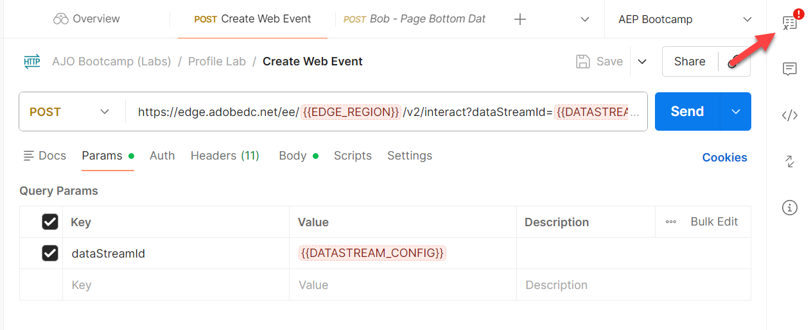
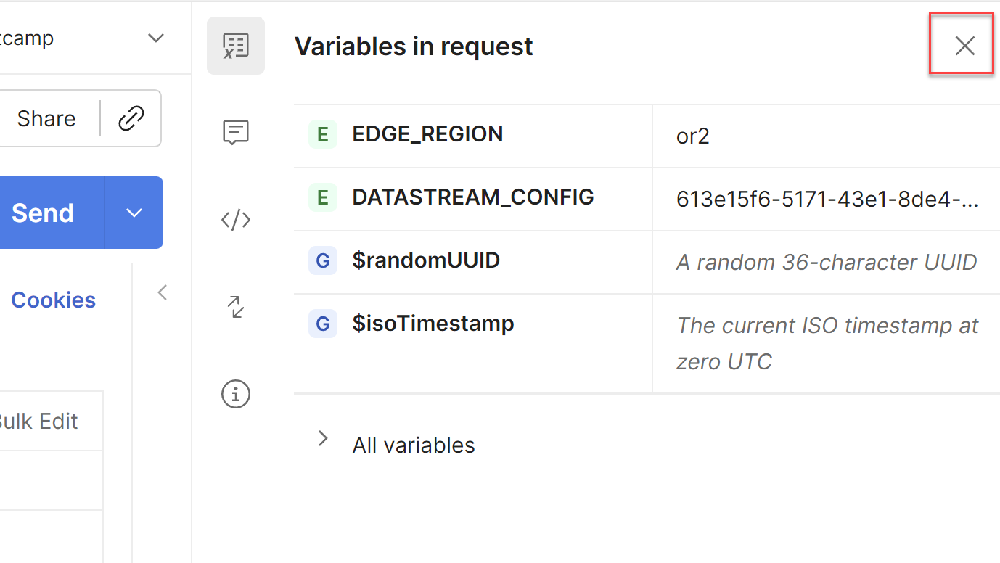

# Edge web イベントの送信

## 学習目標

APIを使用して、シミュレートされたweb イベントをAdobe Edge Networkに送信します。

AEP Edgeに読み込まれて送信されるweb ページをシミュレートするには、作成したデータストリームにPostman呼び出しを送信します。

これにより、OAuth トークンのないイベントで送信されます。  このラボを実行するには、コンピューターでPostmanが開いていることを確認します。

>[!NOTE]
>
>認証トークンを渡していないため、属性は返されません。

## ラボの期待

1. Edgeを打つエクスペリエンスイベント
1. データストリーム設定
1. AEP サービスを使用するデータストリーム設定
   1. Edge Audience to run
   2. イベントをハブに送信
1. Edge オーディエンスを含めるPostmanの応答（属性なし）
1. イベントを受信し、イベントプロファイルフラグメントを追加するプロファイルストア
1. 関係を追加するID ストア
1. データを受信し、データレイクに保存するデータセット

## Postman環境変数の更新

API リクエストを実行する前に、データストリーム IDをPostman変数環境に追加する必要があります。 まず、次の値を収集します。

### データストリーム IDの収集

1. 既に&#x200B;**データストリーム ID**&#x200B;が必要です

>[!NOTE]
>
>**データストリーム IDを失った場合**
>
>1. 左側のパネルで「**データストリーム**」（「データ収集」見出しの下）をクリックします
>2. データストリームを選択し、**データストリーム ID**&#x200B;値をコピーします
>
>

### 通話に移動

1. **Postman左サイドバー** -> `Collections`
1. **コレクション** -> `AJO Bootcamp (Labs)`
1. **フォルダー** -> `Profile & Journey Labs`
1. **API リクエスト** -> `Create Web Event`

### DATASTREAM\_CONFIG変数の更新

1. 右上の「**リクエストの変数**」をクリックします

Postman ツールバーの「

&#x200B;2. ページの最初のステップから&#x200B;**データストリーム ID**&#x200B;を使用して、**DATASTREAM_CONFIG** **Value**&#x200B;を更新します。

で更新されました

&#x200B;3. **更新プログラムを保存**&#x200B;します（ctrl+sまたはcommand+s）
&#x200B;4. 環境サイドバーの右上隅にある「**X**」をクリックして、サイドバーを閉じます

&#x200B;5. すべての変数が青になり、環境に値が含まれるようになったため、**Web イベントの作成**&#x200B;要求を送信する準備ができました。

## APIの実行

**送信** ボタンをクリックして、リクエストを実行します。

応答は次のようになります。

応答で返ってくるのは、次の重要なことです。

- 200 OKの応答は、データが正常に送信され、Edge Networkによって受け入れられたことを意味します

## まとめ

イベントは正常にEdge Networkに送信され、承認されました
