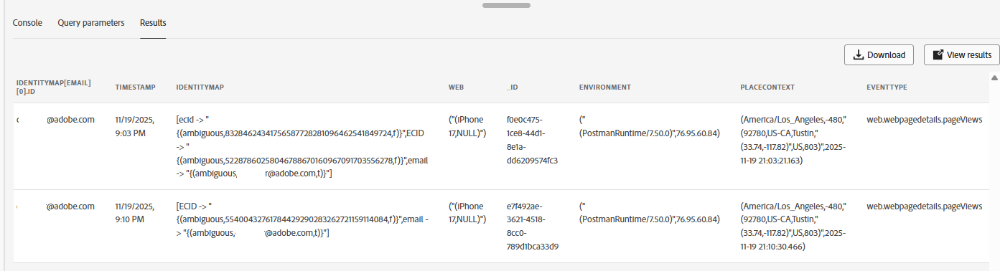

# データレイク上のイベントの検証

## 学習目標

Web イベントがExperience Platform Data Lakeに書き込まれていることを確認します。

## イベントの検証

&#x200B;> [!NOTE]
>
>最終的に、データはデータレイクに表示されます。  **これには最大60分かかる場合があります**。  データセットがプロファイルに対して有効になっているので、イベントによってプロファイルフラグメントが作成されます。
>
>Web データセットを検索してクエリできます。

1. **クエリ**&#x200B;および&#x200B;**クエリの作成**&#x200B;に移動します


&#x200B;2. このSQLをコピーしてクエリに貼り付けます

```sql
SELECT identityMap['email'][0].id, * FROM dep_web
where identityMap['email'][0].id = 'henry.creel@emailsim.io'
```

&#x200B;3. **実行** クエリ

&#x200B;> [!NOTE]
>
>**覚えておいてください**：最終的にデータはデータレイクに表示されます。  **これには最大60分かかる場合があります**。
>
>表示されるのを待つ必要はありません。 このステップに戻って、後で確認してください。




## まとめ

イベントレコードが適切なデータセットに表示されます。
