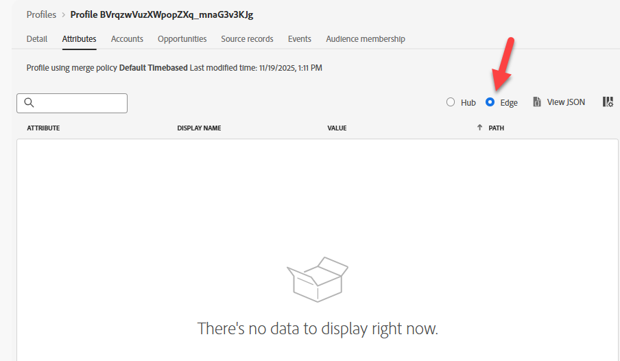

# Edgeでのプロファイルの検証

## 学習目標

プロファイルがEdge network profile storeに存在しないことを確認します。

## Edge プロフィールを確認する

1. 「**属性**」タブと「**Edge**」ラジオボタンをクリックすると、Edge プロファイルが表示されます

   

   >[!NOTE]
   >
   >時間がどのくらい経過したかによって、IDのみで構成されるプロファイルの「ストリップダウン」バージョンが表示される可能性があります。

2. 「Audience Membership」タブをクリックします。  **blank**&#x200B;になります。

Edge プロファイルの「

>[!NOTE]
>
>**なぜEdge メンバーシップが存在しないのですか？**
>
>**dep: Event Edgeが（1時間以内に）**&#x200B;の条件を満たす必要はありませんか？
>
>「Edgeの評価基準を満たすオーディエンスがあるとしても、そのオーディエンスはEdgeには存在しません。そこに理由がないからです。
>
>そのオーディエンス（例：決定や宛先）を使用する場合、オーディエンスルールはEdgeにプッシュされ、次回イベントがEdgeにストリーミングされると、そのオーディエンスが評価されます。
>
>また、Edgeのセグメンテーションサービスもオンにしていませんでした。

## まとめ

プロファイルはEdgeに存在しません（まだ）
