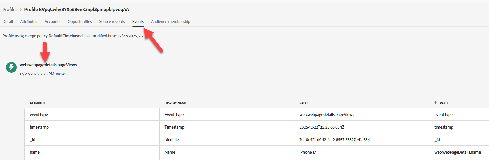
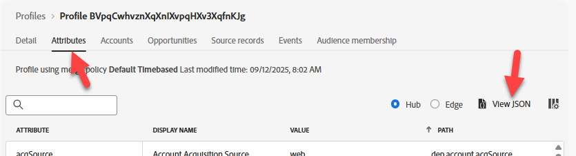
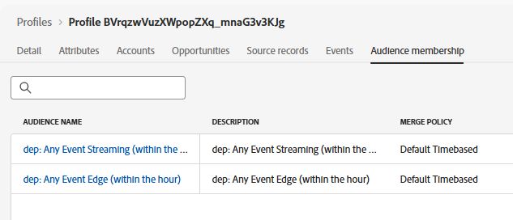

# ハブでプロファイルを検証

## 学習目標

イベントがハブのリアルタイムプロファイルでプロファイルの更新とセグメントの選定につながったことを確認します。

## Hubでプロファイルを検索する

Adobe Experience Platformでは、Edge Networkに送信したばかりのイベントから、送信したばかりのプロファイルを検索できます。

1. **顧客** -> **プロファイル** -> **参照**&#x200B;に移動して、次の情報を使用して検索を実行します。
   - **結合ポリシー** -> `Default Timebased`
   - **ID名前空間** -> `Email`
   - **ID値** -> `henry.creel@emailsim.io`
1. **表示**&#x200B;をクリックしてプロファイルを検索します


## ハブプロファイルを確認

1. **プロファイル ID**&#x200B;をクリックしてプロファイルを開きます
1. 最初に「**属性**」タブと「**ハブ**」ラジオボタンをクリックすると、**ハブプロファイル**」が表示されます


## イベントの検証

1. 上部のナビゲーションの&#x200B;**イベント**&#x200B;をクリックすると、送信したばかりのイベントが表示されます

プロファイル上のストリーミングイベントを表示する

## セグメントの検証

### JSON経由

1. **属性** ヘッダーをクリックし、**JSON**&#x200B;を表示します



2. **segmentMembership**&#x200B;を検索します。  次のようになります（IDが異なります）

```json
  "segmentMembership": {
    "ups": {
      "ce0b8386-ef2a-4244-8ad0-1a72d6494181": {
        "status": "realized",
        "lastQualificationTime": "2025-12-15T23:11:49Z"
      },
      "8ce516fe-920a-4f9d-b92b-0403890a8491": {
        "status": "realized",
        "lastQualificationTime": "2025-12-12T15:01:01Z"
      }
    }
```

>[!NOTE]
>
>**segmentMembershipの読み方？**
>
>[https://experienceleague.adobe.com/en/docs/experience-platform/xdm/field-groups/profile/segmentation](https://experienceleague.adobe.com/en/docs/experience-platform/xdm/field-groups/profile/segmentation)
>
>**ups:**&#x200B;これは、AEPでサポートされているさまざまな種類のオーディエンスのマップキーです。  ups キーには、ルールビルダーで作成されたオーディエンスが含まれます。  その他のオーディエンスは、他のキー（AAMなど）に含まれます。
>
>**lastQualificationTime**&#x200B;このプロファイルがセグメントに対して最後に選定された時刻のタイムスタンプ
>
>**ステータス**
>
>*realized*: プロファイルはセグメントに適格です。
>*exited*: プロファイルは、現在のリクエストの一部としてセグメントを終了しています。
>
>

### UI経由

1. プロファイルがオーディエンスに適格であることを検証する簡単な方法は、「**オーディエンスメンバーシップ**」タブを見ることです（少なくともこれらを確認してください）。
   - dep：任意のイベントストリーミング（時間内）
   - dep：任意のイベントEdge（時間内）

適格セグメントを表示する

>[!NOTE]
>
>**バッチオーディエンスが存在しないのはなぜですか？**
>
>データでストリーミングされ、バッチ評価が1日1回行われるので、**dep:（1日以内に）**&#x200B;が適格と見なされることはありません。

## まとめ

プロファイルはハブ上に存在し、想定されるオーディエンスに適格です。
