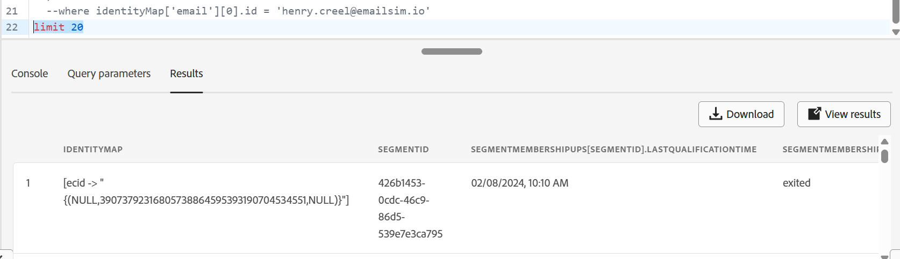

# プロファイルスナップショットの検証

## 学習目標

プロファイルがプロファイルスナップショットデータセットにまだ表示されていないことを確認します。

## プロファイルスナップショットデータセットの使用

1. データ管理セクションの左側のナビゲーションで「**データセット**」をクリックし、上部パネルにある「**参照」タブ**」をクリックします

   データ管理セクションの「

2. **検索ボックス**&#x200B;に「`profile`」と入力し、**タイトルが「Profile-Snapshot...」の行**&#x200B;をクリックします。右側のパネルに&#x200B;**テーブル名**&#x200B;をコピーして、次の手順で参照できる場所に貼り付けます。

   >[!NOTE]
   >
   >「Profile-Snapshot...」が表示されない場合、フィルターをクリアする必要がある場合があります。 データセット：


   

3. クエリエディターに戻り、以下のSQLをエディターにコピー&amp;ペーストします

   ```sql
   select
     identityMap,
     segmentID,
     segmentMembershipUps[segmentID] ['lastQualificationTime'],
     segmentMembershipUps[segmentID] ['status'],
     current_timestamp
   from
     (
    select
      identityMap,
      explode (map_keys (segmentMembership['ups'])) as segmentID,
      segmentMembership['ups'] as segmentMembershipUps
    from
   
    where
      map_keys (segmentMembership['ups']) is not null
    limit 100
     )
     --where identityMap['email'][0].id = 'henry.creel@emailsim.io'
     limit 50
   ```

4. 以下の説明に従って、テーブル名とメールアドレスを更新します。
   - **14行目のテーブル名：**&#x200B;は、`from`と`where`の間にプロファイルスナップショットテーブル用のテーブル名をコピー&amp;ペーストします
   - **今のところ、19行目にWeb イベントで送信したメールアドレスと同じメールアドレスを入力します（変更しない限り、henry.creel\@emailsim.ioを使用しました）。**
     - この時点で、私たちはこれをコメントしました（そのままにしておく）。 クエリが実行され、ヘンリーを探しても、あなたは彼を見つけません。

   

5. 左上の矢印をクリックして、**クエリを実行**
6. 結果は以下のとおりです（しかし、あなたがヘンリーを探しているなら、あなたは彼を見つけません）



>[!NOTE]
>
>**ヘンリーの検索結果が表示されないのはなぜですか？**
>
>**リマインダー**: プロファイル スナップショットは、**リフレクション**&#x200B;または&#x200B;**特定の時点**&#x200B;でプロファイルに存在していたもののスナップショットです。 ジョブは&#x200B;**毎日**&#x200B;実行され、AJOなどのダウンストリームの目的で使用されます。 このデータをストリーミングしたばかりなので、プロファイルスナップショットにはまだ含まれていません。  明日です。

## まとめ

スナップショットデータセットは、すぐに更新するのではなく、スケジュールされたバッチプロセスで更新されることを理解してください。
