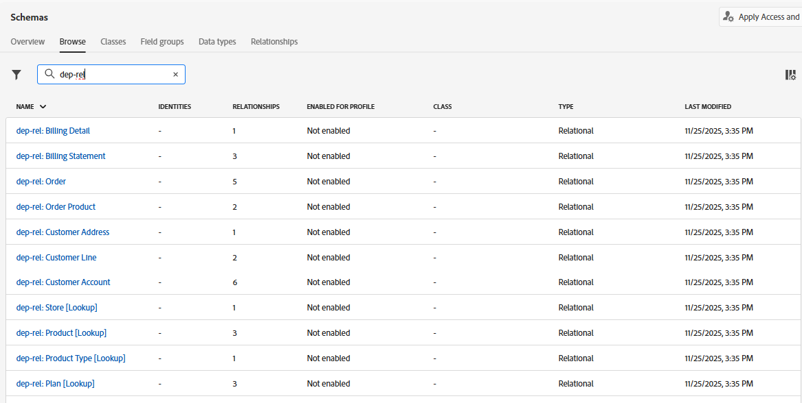
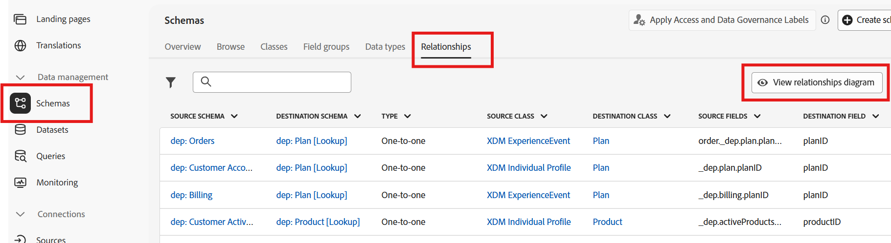
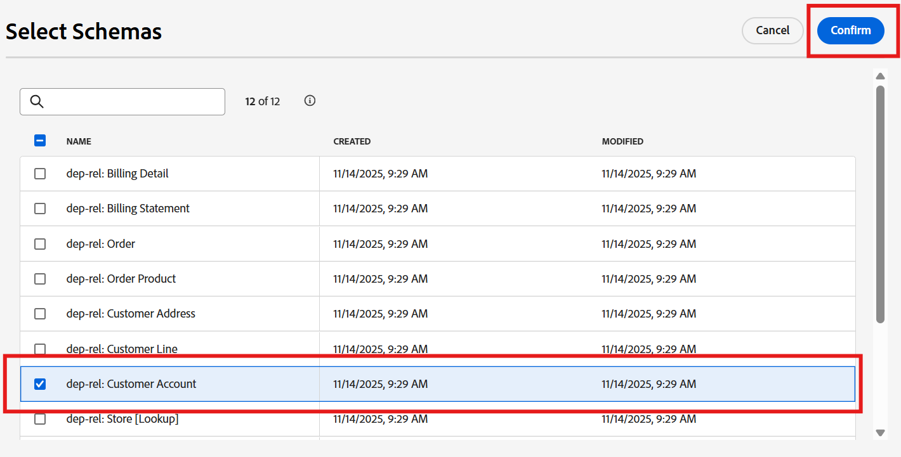
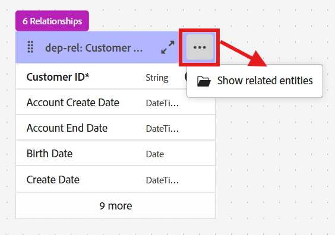

# スキーマを参照

## 目標

次の一連の手順では、UIをナビゲートして、スキーマとその関係を表示します。  これは、キャンペーンを構築する際に使用できるスキーマと関係を理解するために重要です。

## スキーマの表示

Connection 5G リレーショナルデータモデルは既に作成されています。 UIの&#x200B;**スキーマ ->参照** ページに移動すると、自分のスキーマを確認できます。

検索ボックスに「`dep-rel`」と入力すると、すべてのスキーマが表示されます。

>[!NOTE]
>
>すべてのスキーマのタイプは&#x200B;*リレーショナル*&#x200B;です

## 関係図の表示

リレーショナル XDM スキーマを使用すると、任意のスキーマを選択して「リレーションシップダイアグラムを表示」ボタンをクリックすることで、エンティティのリレーションシップダイアグラム（ERD）を簡単に表示できます。

次の操作を行います。

1. 「**関係**」タブをクリックし、「**関係図を表示**」ボタンをクリックします

   

2. 「**スキーマを選択**」をクリックします
3. ポップアップから、`dep-rel: Customer Account`を選択し、**確認**&#x200B;をクリックします

   

4. ERDで、**3 ドット**&#x200B;をクリックし、**関連エンティティを表示**&#x200B;を選択します

   

5. dep-rel：顧客アカウントに直接関連するすべてのテーブルを含むERDを表示します。 オプションで、ERDをPNG ファイルとしてダウンロードできます。

顧客アカウントに関連するテーブルを示す

>[!TIP]
>
>かなりすごいことです？!

## まとめ

これで、スキーマと関係UIを簡単に操作できるようになりました。  特定のスキーマを選択し、移動して関係を表示し、キャンペーンオーケストレーションでデータを理解し、使用するのに役立ちます。

ご興味のある方は、[こちら](https://experienceleague.adobe.com/en/docs/journey-optimizer/using/data-management/get-started-schemas)をご覧ください。
