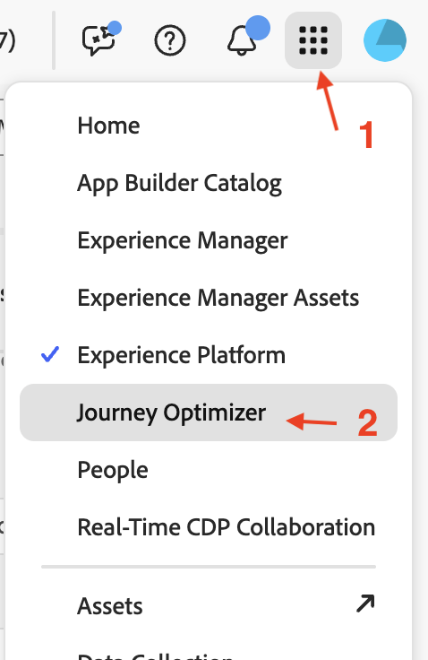
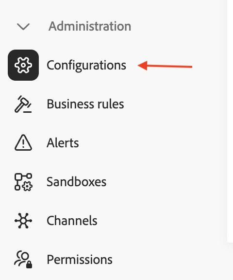
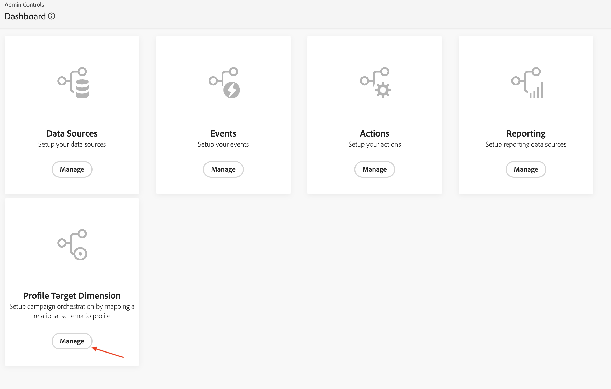
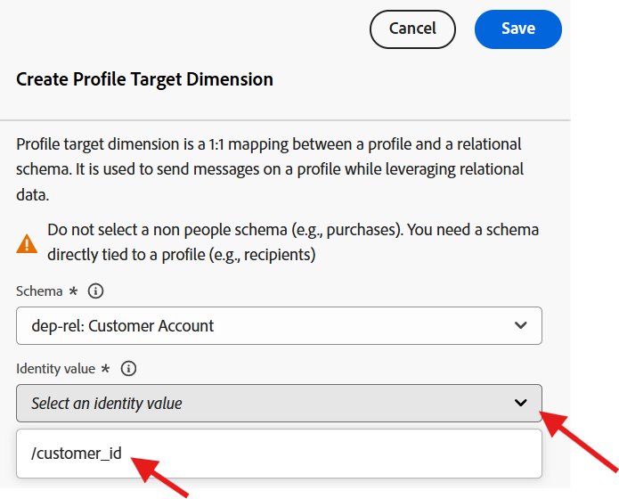
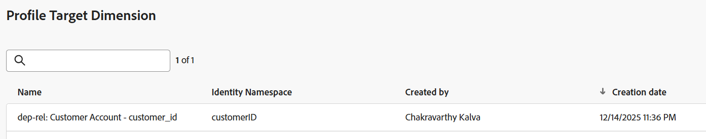

# Profile Target Dimension

## 目標

次の一連の手順では、UIを移動してスキーマを表示し、IDを設定します。 次に、プロファイルターゲットDimensionを設定します。これは、キャンペーンがターゲットとするエンティティタイプで、配信用にAEP プロファイルと照合されます。

## この設定が重要な理由

Profile Target Dimensionは、Real-Time Customer Profileとリレーショナルストア間のデータを結合する方法をAdobe Journey Optimizerに伝えるために使用されます。 この設定のコンポーネントは次のとおりです。

- 関係スキーマ
- 関係スキーマからの単一フィールド
- そのフィールドに関連付けられたID名前空間

>[!CAUTION]
>
>オーディエンスの読み取りや共有、オーケストレーションされたキャンペーンからのメッセージの送信を行う前に、この設定を行う必要があります

## IDのラベル付け

1. **アプリ** アイコンをクリックし、**Journey Optimizer**&#x200B;を選択します

   

2. データ管理メニューの「**スキーマ**」をクリックし、「**参照**」タブが選択されていることを確認します。
3. `dep-rel: Customer Account`というスキーマを検索します

   のスキーマ検索

4. 名前をクリックしてスキーマを開き、**customer\_id**&#x200B;というフィールドをクリックします

   顧客IDが選択された

5. 右側のパネルで、**ID**&#x200B;という名前のチェックボックスを見つけ、**チェックボックス**&#x200B;を選択し、**customerID**&#x200B;というタイトルのID名前空間を選択します

   顧客ID名前空間が選択された

6. 「**保存**」ボタンをクリックして、スキーマを保存します。 確認メッセージが表示されます
7. 左側のパネルの&#x200B;**キャンセル** ボタンまたは&#x200B;**スキーマ**&#x200B;をクリックして、スキーマ UIを終了します

>[!CAUTION]
>
>ID ラベルを追加した後にスキーマを保存しないと、次の一連の設定手順が機能しません

>[!NOTE]
>
>「保存」の後、次の手順でProfile Target Dimension ドロップダウンに表示されるまでに数分（5分以内）かかります。

## Profile Target Dimensionの作成

1. **管理**&#x200B;の下の&#x200B;**設定**&#x200B;をクリックします

   

2. **プロファイルターゲットDimension**&#x200B;を選択し、**管理**&#x200B;をクリックします

   

3. プロファイルターゲットDimension ペインが開き、**作成**&#x200B;をクリックします

   

4. ドロップダウンからスキーマ `dep-rel: Customer Account`を選択します。

   >[!NOTE]
   >
   >IDをマークした後、スキーマがこの画面に表示されるまでに数分かかる場合があります。 ページを更新し、スキーマが表示されるまで前の2つの手順を繰り返します。

   

5. **ID値**&#x200B;の場合は、`/customer_id`を選択します

   

   >[!NOTE]
   >
   >リレーショナルスキーマは、IDでラベル付けされた多くのフィールドを持つことができます。したがって、これはリストボックスになります。

6. 「**保存**」ボタンをクリックして、プロファイルターゲットDimensionを作成します。 レコードが表示されます。

>[!NOTE]
>
>作成されたレコードの名前は、スキーマ名&#x200B;*（dep-rel: Customer Account）*&#x200B;と、ID *（customer\_id）*&#x200B;でラベル付けされたフィールドの連結です

>[!SUCCESS]
>
>おめでとうございます。 これで、ラボでのProfile Target Dimensionの作成ステップが終了します。

## まとめ

これで、スキーマをナビゲートし、属性をIDとしてマークし、プロファイルターゲットDimensionを作成することがいかに簡単かを確認しました。

ご興味のある方は、[こちら](https://experienceleague.adobe.com/ja/docs/journey-optimizer/using/campaigns/orchestrated-campaigns/data-configuration/target-dimension)をご覧ください。
