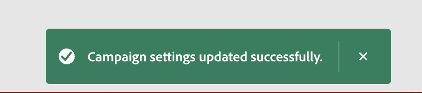
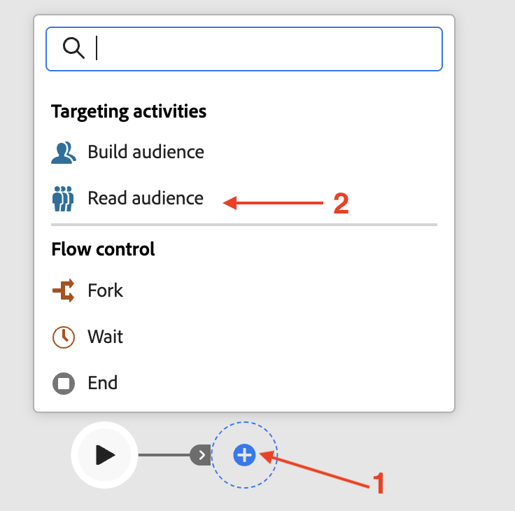
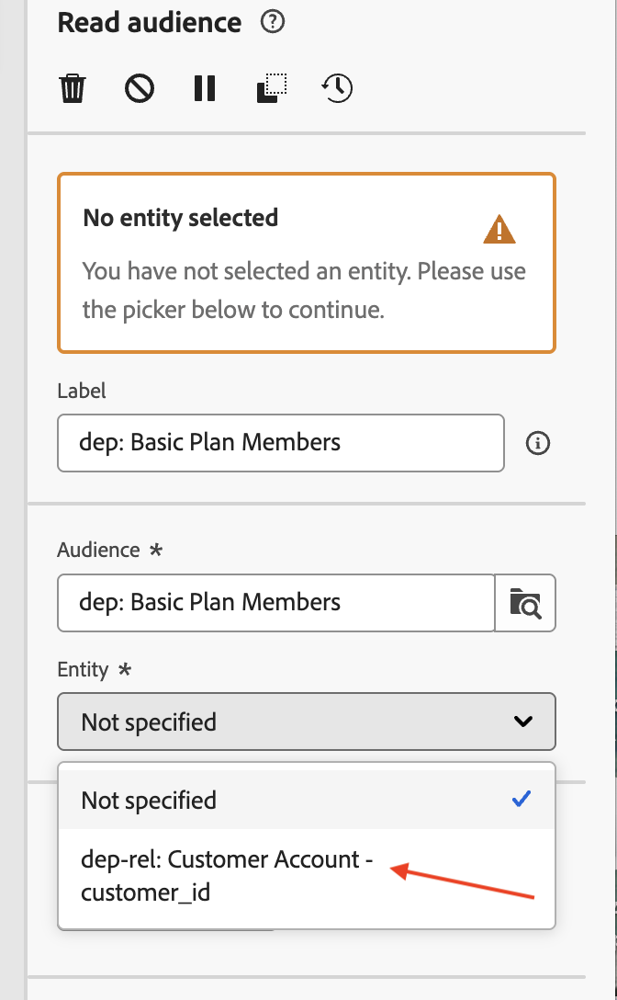
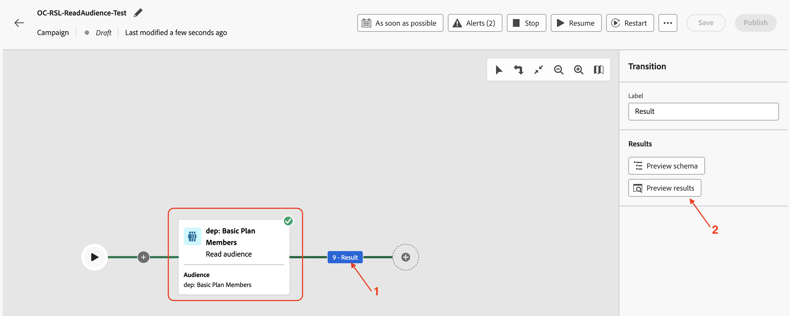
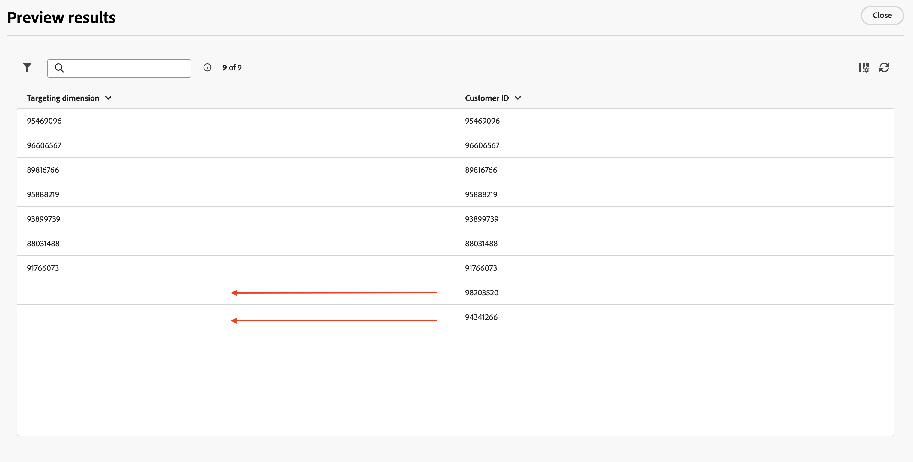
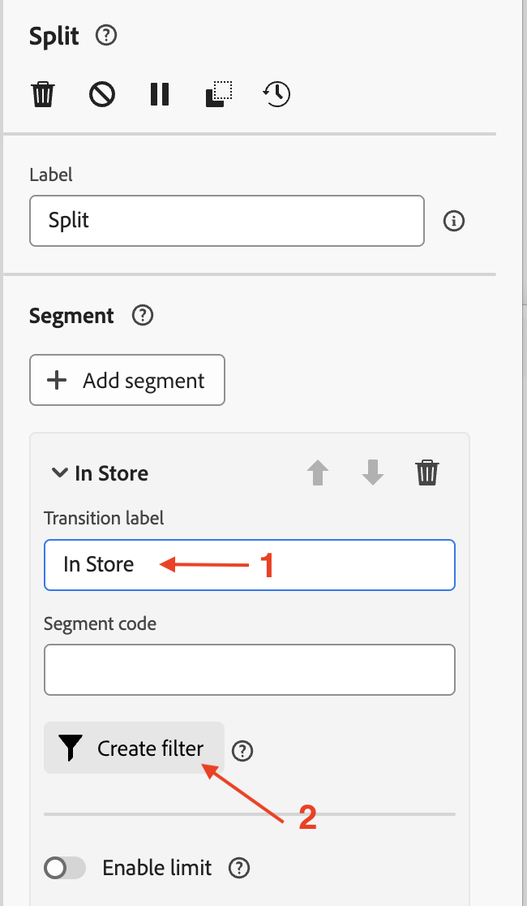
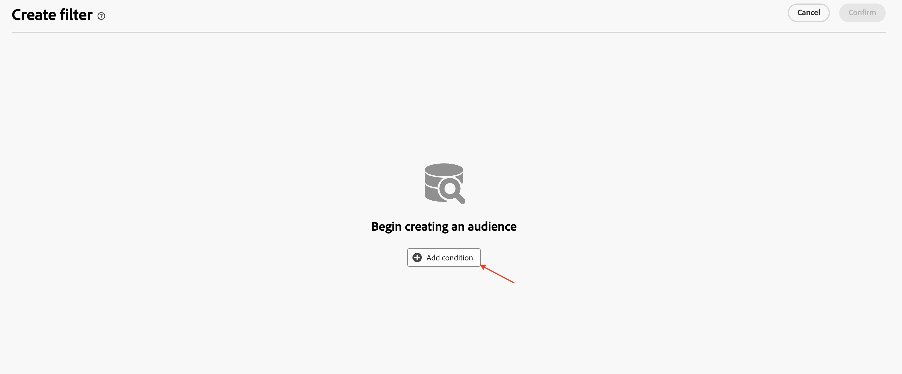
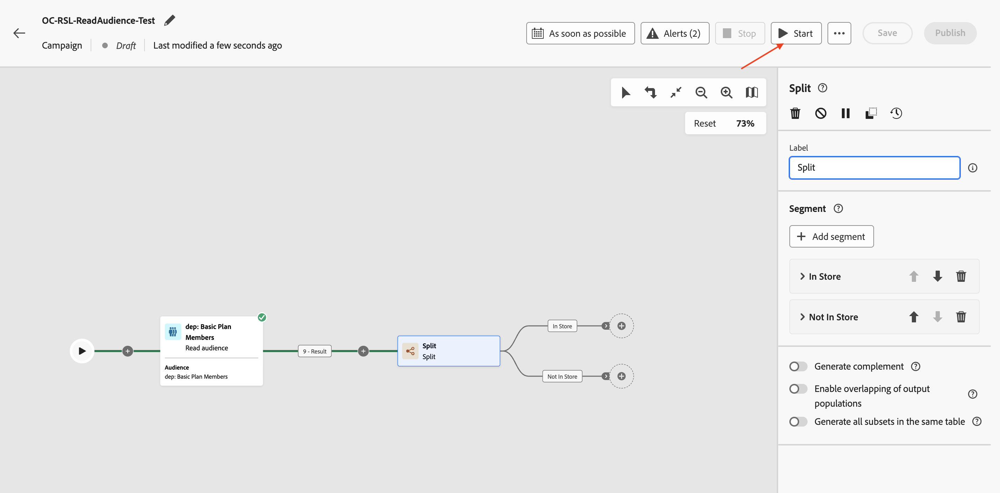
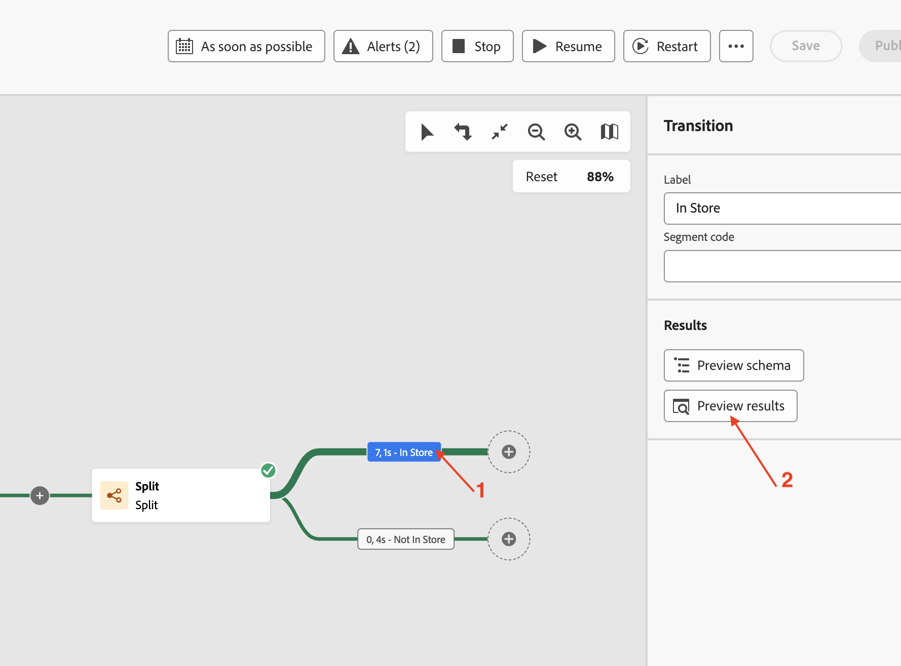
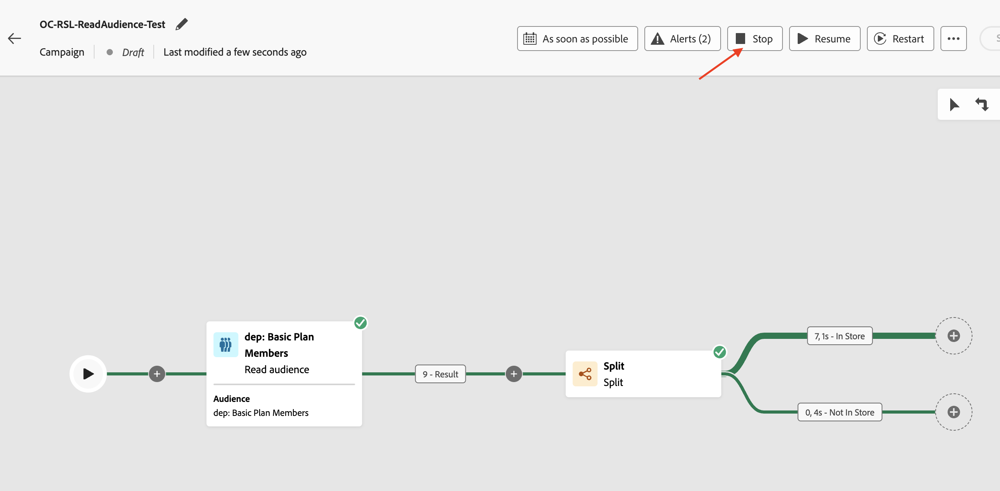

# オーディエンスを読む

## 目標

次の一連の手順では、AEPからオーディエンスを読み取り、以前に作成したプロファイルターゲット Dimensionと共に使用するキャンペーンを作成します。 「分割」アクティビティを使用して、条件に基づいてデータを分割します。 最後に、キャンペーンをテストして、これらのオーディエンスがリレーショナルスキーマで使用される場合にどのように機能するかを理解します。

## オーディエンスを読み取り

このラボでは、「オーディエンスを読み取り」アクティビティとリレーショナルスキーマを組み合わせてエンリッチメントを行う方法について説明します。

Orchestrated Campaignは、すべてのアクティビティにリレーショナルスキーマを使用します。 AEPからオーディエンスを読み取る「オーディエンスを読み取り」アクティビティを使用する場合は、対応するエンティティ（Target Dimension）をCampaign Target Dimensionと紐付けるように設定する必要があります。

## キャンペーンの作成

1. 左側のパネルで、**キャンペーン**&#x200B;をクリックします

   

2. 「**キャンペーンを作成**」をクリック

   

3. **オーケストレーション – マーケティング**&#x200B;を選択し、**確認**&#x200B;をクリックします

   

4. キャンペーンの詳細を次のように入力し、**保存ボタン**&#x200B;をクリックします
   - 名前：**OC-RSL-ReadAudience-Test**
   - 説明：**RSL読み取りオーディエンステスト**

   名前フィールドと説明フィールドを含む

5. 確認メッセージを待ちます

キャンペーン設定を保存した後の

## オーディエンスを読み取りアクティビティを追加

1. キャンバス内の&#x200B;**+**&#x200B;をクリックしてオプションメニューを開き、**ターゲティングアクティビティ**&#x200B;から「**オーディエンス**&#x200B;を読み取る」を選択します

   

2. **オーディエンスの読み取り**&#x200B;詳細ペインで、**オーディエンス**&#x200B;の検索アイコンをクリックします

   

3. プロファイル数&#x200B;**9**&#x200B;の&#x200B;**dep：基本プランメンバー** オーディエンスを選択し、**オーディエンスを追加**&#x200B;をクリックします

   の基本プランメンバーのオーディエンスが選択されました

4. 次に、**Entity**&#x200B;のドロップダウンをクリックし、`dep-rel: Customer Account - customer_id` Campaign Target Dimensionを選択します

>[!NOTE]
>
>その他の属性は、**属性を追加** ボタンを使用して、キャンバスで使用するためにAEP プロファイルから抽出することもできます。 このラボでは、追加の属性は必要ないため、その手順はスキップされます。

## キャンペーンのテスト

1. **オーディエンスの読み取り** アクティビティの設定が入力されます。 **開始**&#x200B;をクリックして、**テストモード**&#x200B;でキャンペーンを実行します

   

   >[!NOTE]
   >
   >実行するのに数分かかります。
   >
   >テストモードでは、キャンペーンの実行が、各アクティビティの結果とともにキャンペーンの動作を検証および監視できます。 アクティビティは、キャンバスの最後まで順に実行されます。

2. テスト実行が開始され、完了時に結果が表示されます。 **結果** ノードをクリックし、「結果をプレビュー」をクリックして実行結果を確認します

   

3. **読み取りオーディエンス**&#x200B;の&#x200B;**2** （9つのうち）プロファイルに、リレーショナルスキーマの対応する&#x200B;**ターゲットディメンション**&#x200B;がありません（つまり、プロファイルストアには存在しますが、リレーショナルストアには存在しません）。 Orchestrated Campaignはリレーショナルスキーマで動作するため、**読み取りオーディエンス**&#x200B;からの一致しない`customer_id` （**2**）は削除され、この場合は&#x200B;*一致する* **個のみが、キャンペーン内の** リレーショナルデータ **を活用する後続のアクティビティで使用できます**

   

   >[!NOTE]
   >
   >次の手順では、リレーショナルデータを使用して、一致しない`customer_id`がドロップされたという上記のステートメントを確認します。

4. **停止**&#x200B;をクリックして、キャンペーンの&#x200B;**テストモード**&#x200B;を停止します

   

5. フローの最後にある&#x200B;**+**&#x200B;をクリックし、**ターゲティングアクティビティ**&#x200B;から&#x200B;**分割**&#x200B;を追加します

   

6. **分割** アクティビティの詳細ペインで、**サブセット**&#x200B;という最初の分割を展開します

   

7. 名前を「**ストア内**」に変更し、**フィルターを作成**&#x200B;をクリックしてフィルター条件を設定します

   

8. **フィルターを作成** r ペインで、**条件を追加**&#x200B;をクリックします

   

9. AEP プロファイルから他の属性は抽出されなかったので、ここで使用できるAEP プロファイル属性は`Customer ID`のみです。 ただし、一致するTarget ディメンションに対応するリレーショナルストアの列は、フィルター条件の設定に使用できます。 **>**&#x200B;をクリックして、**ターゲティングディメンション**&#x200B;を展開します

   

10. リストから`Source`を選択し、**確認**&#x200B;をクリックします

ターゲティングディメンション列から

1. Source列の個別の値は、ドロップダウンで使用できます。 **カスタム条件**&#x200B;の場合、ドロップダウンから「**&quot;ストア内&quot;**」を選択し、**確認**」をクリックして終了します

   に設定されました

1. **分割** アクティビティの詳細ペインに戻ると、最初の分割の設定が完了します。 2番目の分割に&#x200B;**セグメントを追加**&#x200B;をクリックします

   

   **結果**&#x200B;という名前の新しいセグメントが作成されます

   という名前の新しいセグメント

1. 「**結果**」の名前を「**実店舗にありません**」に変更し、**フィルターを作成**&#x200B;をクリックしてフィルター条件を設定します

   を使用して実店舗にありません

1. **フィルターを作成** ペインで、**条件を追加**&#x200B;をクリックします。 上記と同じ方法で、**>**&#x200B;をクリックして&#x200B;**ターゲティングディメンション**&#x200B;を展開し、リストから`Source`を選択して&#x200B;**確認**&#x200B;をクリックします

   

   ターゲティングディメンション列から

1. **カスタム条件**&#x200B;に対して、ドロップダウンから「**&quot;ストア内&quot;**」を選択し、オペレーターに「**次と等しくない&quot;**」を選択します。 **確認**&#x200B;をクリックして終了します

   と等しくありません

1. **分割** アクティビティの詳細ペインに戻ると、2つの分割の設定が完了します。 **開始**&#x200B;をクリックして、**テストモード**&#x200B;でキャンペーンを実行します

   

1. テスト実行が開始され、完了時に結果が表示されます。 リレーショナルスキーマに一致するターゲットディメンションは&#x200B;**7**&#x200B;個しか見つからなかったため、分割操作（**7**&#x200B;と&#x200B;**0**）の後でも同じカウントが観察されます

   のカウントを示すアクティビティ結果を分割

1. 各結果ボックスと&#x200B;**結果をプレビュー**&#x200B;をクリックして結果を表示します

   

1. **停止**&#x200B;をクリックして、キャンペーンの&#x200B;**テストモード**&#x200B;を停止します

>[!NOTE]
>
>「オーディエンスを読み取り」に&#x200B;**9**&#x200B;個のプロファイルが表示されました。 Sourceでフィルターを作成し、リレーショナルストアにSource フィールドが存在するため、プロファイルストアとリレーショナルストアを結合してチェックする必要がありました。 Campaign Target Dimensionを介してリレーショナルスキーマと結合すると、一致したプロファイルは合計&#x200B;**7**&#x200B;個のみです。 これらの&#x200B;**7**&#x200B;一致した顧客IDは、リレーショナルデータを使用しようとする次のアクティビティで使用できます。 **7**&#x200B;の顧客IDはすべて`Source`が&#x200B;**「実店舗」**&#x200B;に設定されており、これは分割フローを介して明らかでした。
>
>そのため、AEP プロファイルと、リレーショナルなプロファイルを組み合わせて活用する場合、データの一貫性を維持することが重要になります。

>[!SUCCESS]
>
>これで、リレーショナルスキーマでオーディエンスを読み取りアクティビティを使用するラボが完了しました。

## まとめ

これで、リレーショナルスキーマを使用するために、Campaignを作成し、Profile Target Dimensionと共にオーディエンスを読み取りアクティビティを実行することがいかに簡単かを確認しました。 「分割」アクティビティを使用して、条件に基づいてオーディエンスを分割しました。 最後に、テストモードは、プロファイルとリレーショナルスキーマの間にデータの一貫性を持つことが重要であることを理解するのに役立ちました。

ご興味のある方は、[こちら](https://experienceleague.adobe.com/ja/docs/journey-optimizer/using/campaigns/orchestrated-campaigns/design-campaigns/read-audience)をご覧ください。
