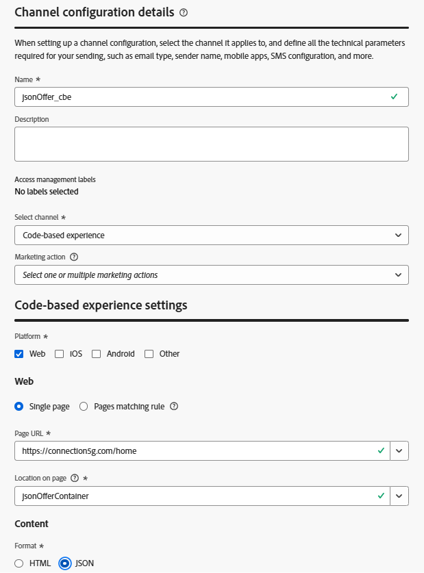

# コードベースのエクスペリエンスチャネルの構築

## 目標

ビジネス要件は、Connection 5Gのシステムのいずれかが適切なオファーを返すことができるようにすることです。 顧客担当者のコンピューター、店舗内キオスク、モバイルアプリ、web サイトなど、顧客は同じオファー体験を受け取るべきです。 それができる唯一のAJO チャネルは、インバウンド AJO チャネルの1つであるコードベースのエクスペリエンス（CBE）です。 CBEはHTMLを返すことができますが、その主な機能は、どのオファーを受信システムに表示すべきかに関する情報を返すことであり、そのオファー情報で何をすべきかをシステムが把握できます。 web チャネルとは異なり、CBEは自動的にレンダリングされたり、レポートされたりすることはありません。 顧客にとっては手作業の部分が少し多いですが、モバイル、web、IoTのシステムなら何でも意思決定を実行するために利用できるJSONを返すように設定できるため、柔軟性が高いです。

1. 必要に応じて、左側のパネルの&#x200B;**管理** メニュー項目を展開し（下にスクロールする必要がある場合があります）、**チャネル**&#x200B;をクリックします。 「チャネル設定」ページに移動します。
2. 青い&#x200B;**チャネル設定を作成** ボタンをクリックします
3. 「チャネル設定の詳細」ページで、チャネル **jsonOffer\_cbe**&#x200B;という名前を付けます

>[!NOTE]
>
>CBEは&#x200B;*N*&#x200B;個のプラットフォームで任意の数のクライアントで呼び出すことができるため、このCBEを場所に対して汎用的なものに名前を付けますが、JSON形式でオファーを返すという事実に特化しています。

4. 「**チャネルを選択**」ドロップダウンを&#x200B;**コードベースのエクスペリエンスに設定します。**

>[!WARNING]
>
>このラボではマーケティングアクションを設定しません。これは、デモに不必要な複雑さを追加するためですが、CBEは任意の数のシステムからアクセスできるため、実際のユースケースでは、DULE ラベルが適用されるようにこのチャネルに対するすべての可能なマーケティングアクションを設定します。

5. 「コードベースのエクスペリエンス設定」エリアの「**Web**」ボックスにチェックを入れ、「**単一ページ**」オプションを選択したままにします。
6. **ページ URL** テキストボックスに、テキスト `https://connection5g.com/home`を入力します
7. **ページ上の場所** テキストボックスに、テキスト **jsonOfferContainer**&#x200B;を入力します

>[!NOTE]
>
>Edge トリガーに送信されたすべてのエクスペリエンスイベントが、パーソナライズされたオファーのリクエストを送信するわけではありません。 次のセクションで、先ほど設定した選択方法でこのCBEを設定するジャーニーを作成します。 「ページ上の場所」設定は、Experience Eventsで渡されるパラメーターの名前です。Experience Edgeに対して、そのCBEに割り当てられているオファーを返すように指示します。 サーフェスとも呼ばれます。 モバイルアプリ、web ページ、またはその他のIoT デバイスのいずれであっても、jsonOfferContainer値がExperience Event経由で正しいeventTypeとともにEdgeに渡された場合、Edgeはラボでこれまで設定されたロジックを実行し、適切なオファーを返します。

8. 「形式」セクションの「**JSON**」ラジオボタンをクリックします。 終了すると、CBE チャネル設定は次のようになります。

&#x200B;9. すべての問題が解決したら、右上隅にある青い&#x200B;**送信** ボタンをクリックします。

>[!TIP]
>
>保存すると、チャネル設定ページに戻り、新しく作成したCBEが表示されます。

## まとめ

このページでは、コードベースのエクスペリエンス（CBE）チャネルを設定し、オファーの決定をJSON形式で返すことができる新しいインバウンドチャネルを設定して、外部システム（web ページ、アプリ、キオスクなど）が、以前に構築した選択戦略に基づいて適切なオファーをリクエストおよび受信できるようにします。
