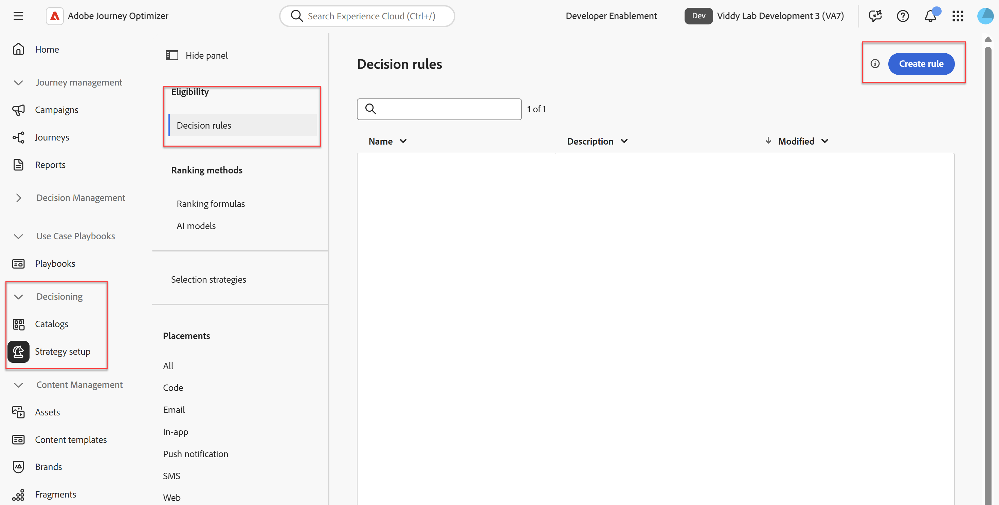
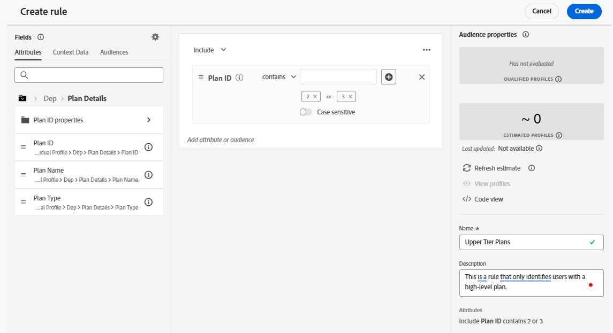

# 決定ルールの作成

## 目標

適格性は、オファーの重要な構成要素のひとつであるため、最初のステップは、オファーをサポートするために必要なエンティティを作成することです。 オーディエンスのメンバーシップが決め手となるケースが多くありますが、この場合は決定ルールを使用します。 Connection 5Gでは、ハイエンドのiPhone 17は、高階層プランを持つユーザーのみがアクティブ化できます。 そのため、決定ルールを使用して、高性能な電話機向けのオファーが、十分なプランを持つユーザーのみが利用できるようにします。

## 決定ルールの作成

1. 必要に応じて、Adobe Experience Cloudにログインし、**Adobe Journey Optimizerに移動します。**
2. 必要に応じて、左側のパネルの&#x200B;**決定** メニュー項目を展開し、**戦略設定**&#x200B;をクリックします。

   >[!WARNING]
   >
   >決定管理メニューではなく、「決定」メニューに移動していることを確認します。 意思決定管理メニューが展開されている場合は、このラボでのナビゲーションの混乱を避けるためにメニューを折りたたみます。

3. 「実施要件」メニューの「**決定ルール**」をクリックし、右上隅の「**ルールを作成**」ボタンをクリックします。

   ルールを作成ボタンを含む

4. セグメントビルダーUIに類似した画面が開きます。 **XDM個人プロファイル/DEP/プラン詳細**&#x200B;をクリックし、**プラン ID**&#x200B;属性をキャンバスにドラッグして、プラン ID属性をルールキャンバスに追加します。
5. ドロップダウンを「次に等しい」から「**次を含む」に変更します。**
6. ボックスにテキスト **2**&#x200B;を入力し、**Tab** キーを押して2値を受け入れ、**3,**&#x200B;を入力し、**Tab**&#x200B;を再度押して、ルールが2または3を含むプラン IDを探すように設定します
7. 右側のパネルの&#x200B;**名前** テキストボックスを使用して、決定ルール **上層部計画**&#x200B;に名前を付けます。 必要に応じて説明を追加します。 終了すると、決定ルールは次のようになります。

   を含むプラン IDを含む完了した上位プラン決定ルール

8. ルールが正しい場合は、右上隅にある青い&#x200B;**作成** ボタンをクリックすると、作成した決定ルールが唯一の決定ルールとして表示された戦略設定ページに戻ります。

>[!NOTE]
>
>オーディエンスではなく決定ルールを使用する理由？ 実際には、主な理由は、決定パッケージに固有の適格性基準が必要だったか、条件でオファーの属性が必要だったことです。 オファー属性は、オーディエンスビルダーでは使用できません。
>
>このラボで使用される上位レベルのプラン決定ルールは、決定の外で再利用性が高いことを考慮すると、実際の実装では実際のオーディエンスになる可能性があります。 しかし、ここでは、教育目的で決定ルールを使用し、その機能と複数の方法で実施要件を適用できることを示しました。

## まとめ

これで、再利用可能な決定ルールが作成されました。このルールをオファーの適格性に使用します。
