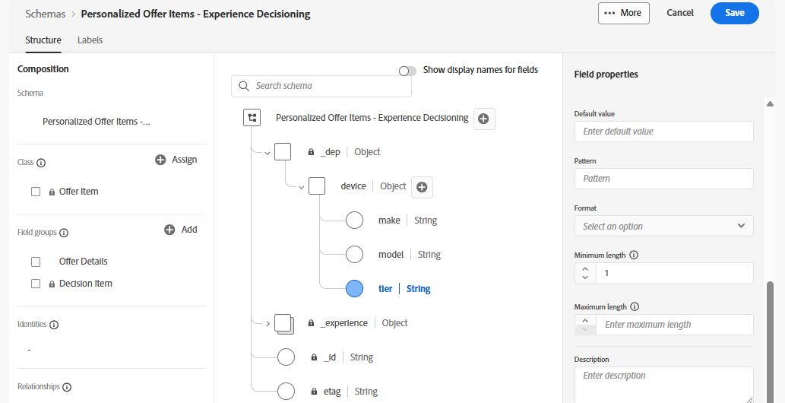

# オファー属性の作成

## 目標

このセクションでは、カスタム XDM フィールドを標準オファーXDM スキーマに追加します。 これらのカスタムフィールドは、ランキング、並べ替え、適格性の基準で使用できます。 また、要求デバイスに返されるデータを指定することもできます。

## カスタム デバイスの親オブジェクトの作成

1. 必要に応じて、左側のパネルの&#x200B;**決定** メニュー項目を展開し、**カタログ**&#x200B;をクリックします。
2. デフォルトでは、「オファー」ページが表示されます。 右上隅の「**スキーマを編集**」ボタンをクリックします。

   

   >[!TIP]
   >
   >作成されるページは、標準のXDM スキーマエディターです。 XDMがデータセットのデータ構造を定義するために使用されるのと同様に、XDMはオファーの属性を定義するためにここで使用されます。

   >[!NOTE]
   >
   >「Personalized Offer Items - Experience Decisioning」スキーマは、すべてのオファーに適用されるシステム生成の標準スキーマです。 ただし、このスキーマに追加して、独自のビジネスニーズを満たすことができます。この節では、
   >
   >さらに、オファーページを通過することは、このスキーマにアクセスするためのショートカットです。 左側のパネルのスキーマメニューから移動することもできます。

3. スキーマのルートレベルの右側にある&#x200B;**+** アイコンをクリックし、右側のパネルに表示されている「フィールドプロパティ」メニューを使用して、次のフィールドに指定された値を入力します。
   - フィールド名：**デバイス**
   - 表示名：**デバイス**
   - 種類ドロップダウン：**オブジェクト**
   - フィールドグループに割り当て（この値をに入力）: **オファーの詳細**

   >[!NOTE]
   >
   >「フィールドグループに割り当て」はドロップダウンのように見えますが、直接テキスト入力も受け付けます。したがって、「オファーの詳細」というテキストを入力します。 入力すると、「オファーの詳細（新規）」項目も表示されます。 新しい属性はフィールドグループに割り当てる必要があるので、このステップでは、オファーの詳細という新しいフィールドグループを作成します。

4. すべてのプロパティが次のスクリーンショットのように入力されていることを確認します。

   ](assets/create-offer-attributes-device-object-field-properties.png)に入力された新しいデバイスオブジェクトの

>[!TIP]
>
>通常のXDMと同様に、カスタム属性は、IMS組織に固有の名前空間、つまり読み込みテナント IDまたは「dep」の下にグループ化されます。 また、新しい「オファーの詳細」フィールドグループが、スキーマの左側の「構成」ペインに一覧表示されるようになりました。

>[!WARNING]
>
>これらの変更は保存されないことに注意してください。 単に“適用”されているだけです。 保存せずにページから離れると、作業が失われます。 移動する前に、このセクションの手順を完了してください。

## カスタム デバイス属性の作成

デバイス XDM オブジェクトが作成されたので、デバイス固有のフィールドの作成に進むことができます。

1. 作成した新しい&#x200B;**デバイス** オブジェクトの右側にある&#x200B;**+** アイコンをクリックし、右側のパネルの「フィールドのプロパティ」メニューを使用して、次のフィールドに指定された値を入力します。
   - フィールド名：**make**
   - 表示名：**Make**
   - タイプ ドロップダウン：**文字列**
   - フィールドグループに割り当て：**オファーの詳細** （既に選択されている必要があります）
   - すべてのフィールドが正しいことを確認したら、青い&#x200B;**適用** ボタンをクリックして、スキーマに適用された変更を確認します
2. 前の手順を繰り返して、**モデル**&#x200B;と&#x200B;**階層**&#x200B;の2つの追加の属性を追加します。 同じ命名パターン、タイプ、フィールドグループを使用します。 終了すると、スキーマは次のようになります。

   

3. 新しいXDM フィールド/属性がすべて作成されたら、右上隅の&#x200B;**保存**&#x200B;をクリックすると、画面の下部に緑色の「スキーマが正常に保存されました」メッセージが表示されます。 これで、このセクションの手順を完了しました。

>[!WARNING]
>
>更新したスキーマは、今後のすべてのオファーを含むすべてのオファーに適用されます。 このスキーマに属性を追加する場合は、細心の注意を払う必要があります。 携帯電話を販売する通信会社のユースケースの例では、デバイスのメーカー、モデル、およびティア属性は、今後数年間、多くのオファーに広く使用される可能性が高いため、追加することは理にかなっています。 オファーに必要な属性について考える際には、特定のキャンペーンに固有の属性を追加しないでください。 数か月または数年にわたって、このスキーマが肥大化し、オファーの作成時に問題が発生する可能性があります。 オファーを作成するセクションでは、これが適用される方法を確認できます。

## まとめ

オファーの作成と評価を行う際に、ラボの後の部分で活用される再利用可能なカスタムフィールドを使用して、標準オファースキーマを正常に更新しました。
