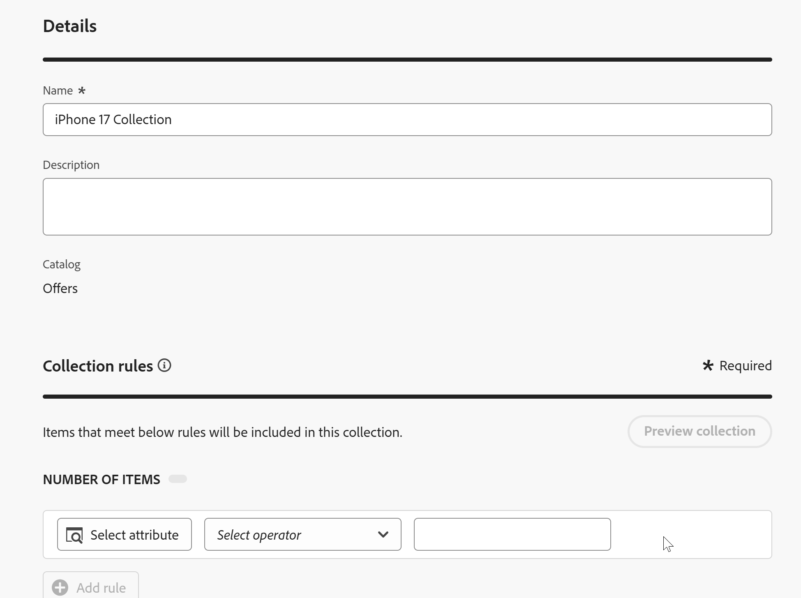

# オファーコレクションを作成

## 目標

オファーを作成したら、コレクションに整理する必要があります。 コレクションには1つ以上のオファーアイテムがあり、1つのオファーアイテムは複数のコレクションに含めることができます。

## IPhone オファーコレクションの作成

1. 必要に応じて、左側のパネルで「**Decisioning**」を展開し、「**カタログ**」をクリックします。 前のセクションで作成した4つのオファーが表示されます。
2. オファー名の左側にある&#x200B;**コレクション**&#x200B;をクリックします

   カタログページの「

3. 青い&#x200B;**コレクションを作成**&#x200B;をクリックして、新しいコレクションを作成します。
4. コレクションに&#x200B;**iPhone 17 Collection**&#x200B;という名前を付けます
5. 「コレクションのルール」セクションで、テキストが含まれているテキストボックスをクリックします&#x200B;**_クリックして決定項目を作成します_**。 クリックすると、ルールを作成するためのオプションが表示されます。

   決定項目の作成用に

6. **属性を選択** ボタンをクリックし、**デバイス/Make**&#x200B;をクリックしてオファー項目スキーマ内を移動します。 **保存、**&#x200B;をクリックすると、「Make」属性が決定ルールに追加されます。

   

   >[!NOTE]
   >
   >使用可能なオプションは、オファーアイテムの作成時に使用した設定可能フィールドと同じです。 コレクションはオファーアイテムのグループ化であるため、グループ化するルールは属性に応じて異なることは理にかなっています。

7. 「次と等しい」演算子を配置したままにして、「値」フィールドにテキスト **iPhone**&#x200B;を入力すると、項目の数が4に変わり、すべてのオファー項目がその条件を満たしていることが示されます

   iPhone条件に一致する4つのオファーアイテムを示す

   >[!NOTE]
   >
   >「**コレクションをプレビュー**」ボタンをクリックして、条件を満たすオファー項目を表示することもできます。

8. 4つのオファーアイテムをすべて選択した状態で、青い&#x200B;**作成** ボタンをクリックします。 これにより、新しく作成したコレクションを表示するページに移動します。

>[!NOTE]
>
>コレクションは単なる組織化手段ではありません。 前の手順では、「決定」で、選択ロジックをオファーのコレクションに適用していることがわかります。 エンタープライズサイズの実装について考えると、何年にもわたってどれだけのオファーが作成されるのかを把握するのは難しいことではありません。 適切なコレクション管理がどれほど重要かを明らかにするために、選択戦略が適用すべきオファーを決定するために。
>
>この場合、条件が「iPhone」だけのコレクションは、iPhone リリースの数年後にオファーが多すぎます。 「Make equals 17」などの条件を追加したり、AEPタグを使用して特定のキャンペーンのオファーにタグを付けたりすることもできます。 ここでは簡単にするために、このシンプルなロジックを使用してコレクションを作成します。

## まとめ

これで、以前に作成したオファーアイテムをグループ化するオファーコレクションを作成しました。 すべてのiPhone 17 オファーをコレクションに追加し、関連するオファーのみがコレクションに属するように、オファー属性（デバイスの作成など）に基づいてルールを定義しました。
