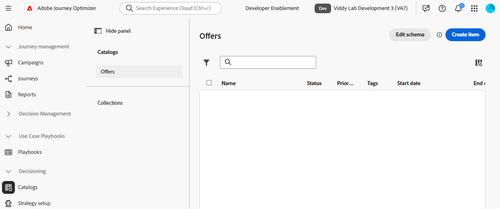
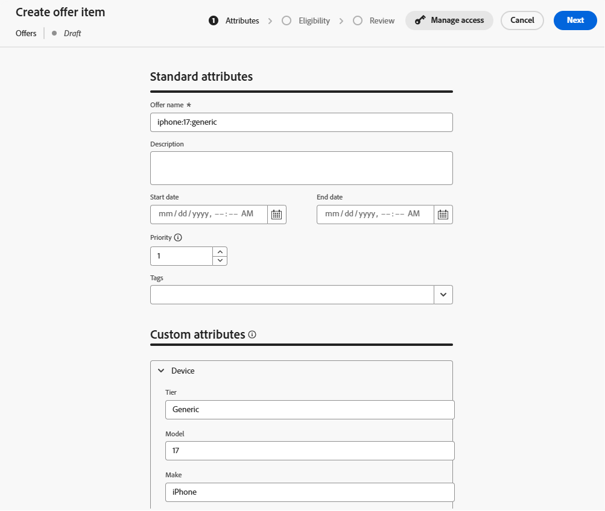
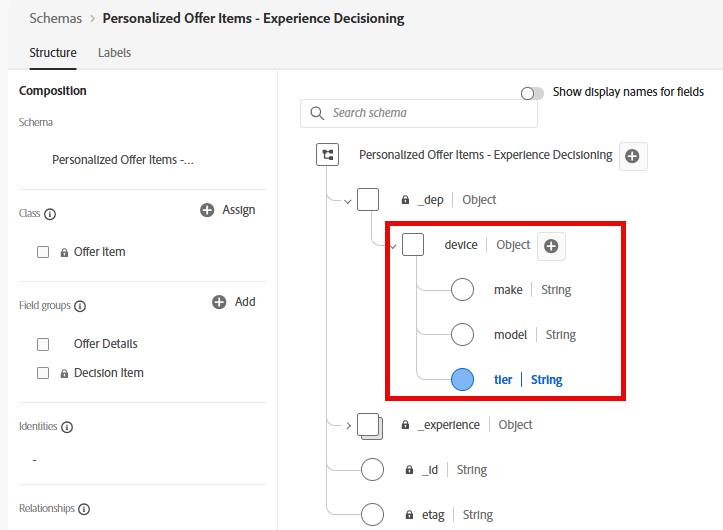
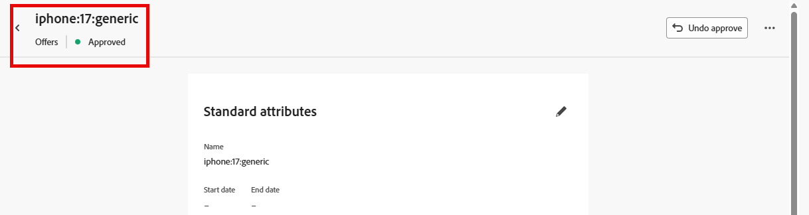
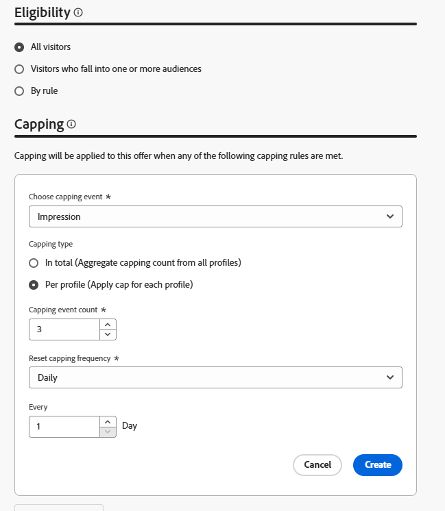
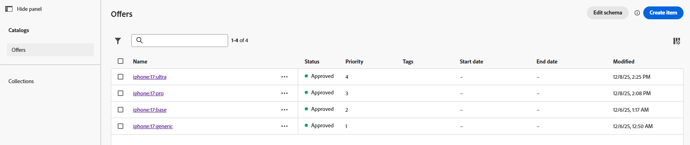

# オファーアイテムの作成

## 目標

このセクションでは、コードベースエクスペリエンス（CBE）がリクエスト側のクライアントに返す実際のオファー項目を作成します。 オファー項目の中には、適格要件と頻度の上限が設定されているものもあれば、そうでないものもあります。

## シナリオの概要

ここでは、オファー項目を作成する前に、シナリオに関する簡単な注意事項をいくつか紹介します。 まず、シナリオには、Ultra、Pro、Baseの3つのiPhone 17層があります。 受け取り側システムがiPhone 17に関する一般的な情報をすべての階層にわたって表示するために使用できる一般的なフォールバックオファーに加えて、各階層に4つの合計オファーを作成します。

2つ目は、プラン IDが2または3の顧客のみがUltraおよびPro レベルの携帯電話を利用できます。

次に、企業は、各オファーを1日3回だけ表示してから、次の下位の電話を表示するように要求しています。

最後に、すべてのものが等しいので、Connection 5GはUltra層、続いてPro、そしてベースモデルを販売することを好むでしょう。 このように、各オファー項目に優先度スコアを与えると、これらの優先度が表示されます。

## デフォルト/フォールバックオファーアイテムの作成

作成する最初の最も簡単なオファー項目は、誰でも無制限に表示できるフォールバックオファーです。

1. 必要に応じて、左側のパネルで「**Decisioning**」を展開し、「**カタログ**」をクリックします
1. 空のオファーページが表示されます。

   オファー項目を作成する前に

1. 青い「**項目を作成**」ボタンをクリックします。 「オファー項目を作成」ページが開きます。
1. 「オファー名」フィールドに、テキスト **iphone:17\:generic**&#x200B;を入力します。 必要に応じて説明を入力します。

   >[!NOTE]
   >
   >小文字のコロン区切りの命名規則は、実際の顧客に対して従うデザインの1つにすぎません。 実際、オファー項目に対して異なる命名戦略を策定できます。 オファー項目を作成する前に、その内容が文書化され、一貫していることを確認してください。 これにより、オファーアイテムを簡単に見つけてコレクションにグループ化できるようになります。 詳細については後ほど説明します。

1. これは最優先度/デフォルトのオファー項目であるため、デフォルトの優先度は1のままにしておきます。

   >[!NOTE]
   >
   >決定機能では、スコアが低いほど優先度が低くなります。 例えば、優先度が1のオファー項目の前に、優先度が100のオファー項目が表示されます

1. 「カスタム属性」エリアの&#x200B;**デバイス**&#x200B;項目を展開し、テキストボックスに次の情報を入力します。

   - 階層：**汎用**
   - モデル：**17**
   - Make: **iPhone**

   これらは、オファーを表す実際のテキスト値と、並べ替え、ランキング、適格性の基準で使用できる値の両方です。 また、要求デバイスに返すことができるテキスト値でもあります。

   に設定されています

   >[!NOTE]
   >
   >拡張したデバイス領域は、前の節でカスタム属性を使用して「パーソナライズされたオファー項目 – エクスペリエンス決定」スキーマが更新されたときに作成された「デバイス」親オブジェクトと同じです。 Tier フィールド、Model フィールド、Make フィールドは、追加された個々の属性です。
   >
   >

   >[!WARNING]
   >
   >前の節では、システム生成の「パーソナライズされたオファー項目 – エクスペリエンス決定」スキーマにカスタム属性を追加する際には、細心の注意を払う必要があると述べました。 各カスタムノードは、オファー項目ごとに可能なフィールドとして表示されます。 不要な属性やキャンペーン固有の属性を作成すると、オファー項目作成UIが混乱し、混乱が生じる可能性があります。

1. 右上隅の青い&#x200B;**次へ** ボタンをクリックして、次のステップに進みます。
1. このオファーは、すべてのユーザー/すべての訪問者が利用でき、頻度の上限がないものにする必要があります。そのため、「実施要件」または「上限」セクションを変更する必要はありません。 青い「**次へ**」ボタンをもう一度クリックして、最後の手順に進みます。
1. 「レビュー」ステップで、すべてのデータが正しいことを確認します。

   

1. 必要な変更を加えます。 準備ができたら、青い「**保存**」ボタンをクリックします。
1. 保存すると、以前は「保存」ボタンがあった場所に白い「承認」ボタンが表示されます。 白い「**承認**」ボタンをクリックして、このオファーアイテムを承認します。 オファー項目タイトルの下に緑色の「承認済み」インジケーターが表示されます。

   

   >[!NOTE]
   >
   >実際には、より複雑なオファーでは、オファー項目が正しく作成されていることを確認するために、適切な承認プロセスを実行する必要があります。 このラボで時間を節約するには、作成するすべてのオファー項目を承認するだけです。

1. オファー項目タイトルの横にある&#x200B;**左向き矢印**&#x200B;をクリックして「オファー」ページに戻ると、iphone:17\:generic offerが表示されます。

## 基本モデルのオファー項目の作成

これで、汎用オファー項目が作成されたので、iPhone 17の基本モデルの次の優先度オファー項目を作成できます。

1. 青い&#x200B;**項目を作成** ボタンをもう一度クリックし、オファーに&#x200B;**iphone:17\:base**&#x200B;という名前を付けます
2. これは次に優先度の低いオファー項目なので、**優先度** フィールドを&#x200B;**2**&#x200B;に増やします
3. **デバイス**&#x200B;領域を展開し、フィールドに次の値を指定します。
   - 階層：**Base**
   - モデル：**17**
   - Make: **iPhone**

   完了すると、オファー項目は次のようになります（優先順位が正しいことを確認するために赤いボックスが追加されます）。

   に設定されている基本モデルのオファー項目

   すべて正しい場合は、青い「**次へ**」ボタンをクリックして、次の手順に進みます。

4. このオファー項目は全員が利用できる必要があるため、適格要件はありません。ただし、1日あたり3つのインプレッションに上限を設定する必要があります。 「**+ キャッピングを作成&#39;**」ボタンをクリックします。
5. 新しいキャッピングルールで、**キャッピングイベントの選択**&#x200B;を&#x200B;**インプレッション**&#x200B;に変更します。
6. **キャッピングイベント数**&#x200B;を&#x200B;**3**&#x200B;に変更します。 終了すると、キャッピングルールは次のようになります。

   

   正解したら、青い&#x200B;**作成** ボタンをクリックして、キャッピングルールを保存します。

   >[!NOTE]
   >
   >追加のキャッピングルールを作成する方法に注意してください。 実際には、複数のルールを追加することもできます。 この場合、購入イベントなどの特定のイベントが発生した場合に、これを制限するルールを追加することができます。 このラボでは、単一のキャッピングルールを使用して簡単に説明します。
   >
   >

   >[!NOTE]
   >
   >フリークエンシーキャッピングルールで言及されている「日数」は、GMT タイムゾーンの日数を指します。  ロジックの日数による頻度の上限は、GMTの深夜にリセットされます。

7. 「**次へ**」をクリックして、レビュー手順に進みます。
8. すべてが期待どおりに表示されていることを確認し、**保存** ボタンをクリックします。 保存したら、**承認をクリックします。**
9. 承認されたら、タイトルの横にある左向き矢印をクリックし、オファーページに戻ります。 2つのオファーが表示され、それぞれに適切な優先度が設定されています。

## 上層モデルのオファー項目の作成

これで、汎用モデルと基本モデルのオファーが作成されたので、pro モデルとultra モデルのオファー項目に移動できます。 また、特定のプランレベルを有するメンバーのみがこれらのオファーを確認できるため、これらのオファー項目には適格性の要素を含める必要があります。

1. 上記のセクションで説明した手順と命名パターンに従って、**iphone:17\:pro**&#x200B;という名前の新しいオファーを作成し、その優先度を&#x200B;**3に設定します。**
2. **階層**&#x200B;属性を&#x200B;**Pro**&#x200B;に設定し、他のオファーと同様に他のカスタム属性を設定します。
3. 「実施要件」ステップで、「**ルール別**」ラジオボタンを選択します。
4. 左側のパネルには、1つの決定ルールのみが表示され、以前に作成されたルールは「上位レベルのプラン」と呼ばれます。 ルールの横にある&#x200B;**+** アイコンをクリックして、ルールをキャンバスに追加します。
5. 前述のように、同社は、フォールバックオファー以外のオファーには、1日あたり3つのディスプレイ（またはインプレッション）の頻度制限を設ける必要があると述べています。 前の節の手順に従って、1日あたり3つのインプレッションのキャッピングルールを作成します。 完了すると、ページは次のようになります。

   

6. すべてが正しいことを確認したら、**次へ**&#x200B;をクリックします。 最終的なオファー項目設定は次のようになります。

   

7. 正しく表示されたら、オファー項目を&#x200B;**保存**&#x200B;して&#x200B;**承認**&#x200B;します。
8. オファーページに戻り、3つのオファーがあり、それぞれに適切な優先順位があることを確認します。
9. 最終的なオファー項目を作成し、**iphone:17\:ultra,**&#x200B;という名前を付けて&#x200B;**4,**&#x200B;の優先度を指定し、他のオファーと同じ値を持つ他のカスタム属性を設定します。
10. 最後のオファー項目と同様に、実施要件を「上位プラン」決定ルールに設定し、1日に3つのインプレッションの頻度の上限を設定します。 完了すると、オファー項目は次のようになります。

1. すべての設定が正しいことを確認したら、このオファー項目を保存して承認します。 これで、4つのオファー項目がすべて表示され、それぞれに独自の優先順位が付いています。

>[!NOTE]
>
>このラボの手順では、オファー項目ごとに優先順位が異なることを確認することに重点を置いています。 この単純なユースケースでは重要ですが、UIには、各オファー項目に一意の優先順位を付けるような機能はありません。 時間の経過とともに、同じ優先順位のオファー項目が複数ある可能性があります。 なぜこれが重要なのかは、後のセクションで説明します。

## まとめ

一般的なフォールバックオファーや階層固有のオファー（base、pro、ultra）など、様々なiPhone 17階層に対して複数のオファーを定義しました。 また、4つのオファー項目すべてに、適切な優先度、適格性、インプレッションの上限の設定が適用されていることを承認したので、意思決定パッケージで使用する準備が整っています。
