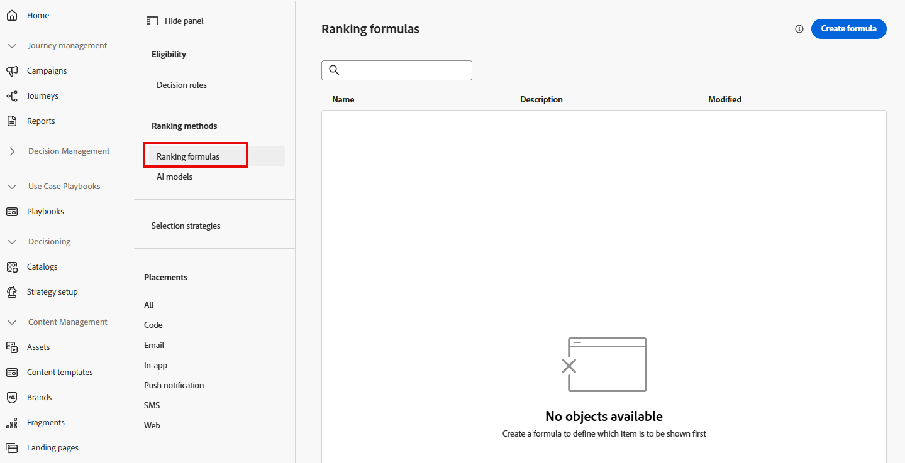
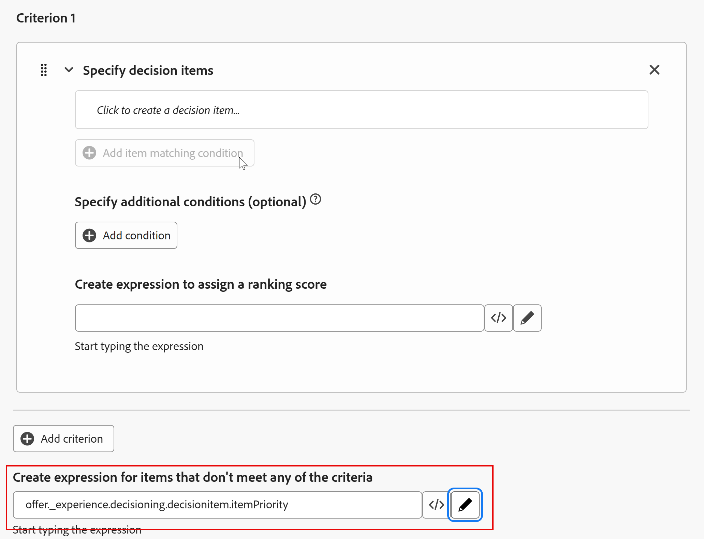
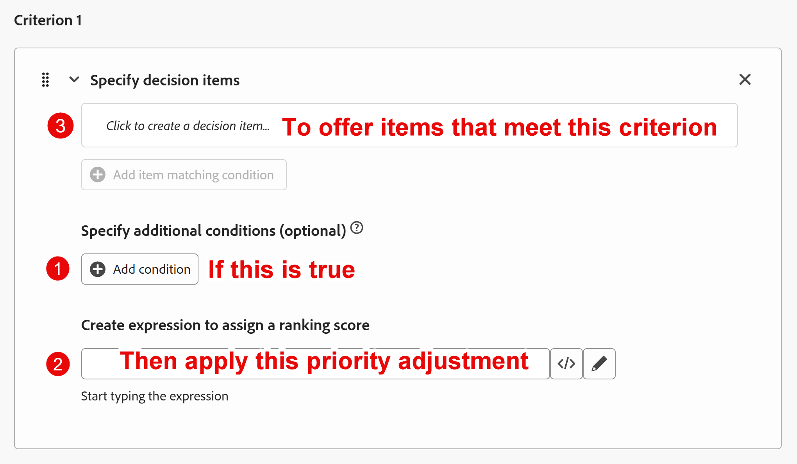

# ランキング式の作成

## 目標

すべてのオファー項目が作成され、優先順位付けされ、適格性が適用され、コレクションに整理されたので、特定のプロファイルでどのようにランク付けされるかを決定することに注目できます。 これは、ランキング式を作成することによって行われます。

ランキング式は、特定のオファーの優先順位付けを動的に強化し、Web/Mobile プロパティまたはエクスペリエンスイベント自体とやり取りするプロファイルの基準に基づいて、特定のオファーの優先順位付けを「上位に上昇」させます。

このラボシナリオでは、Connection 5Gのリサーチマーケティングチームが、39歳未満の人はUltraまたはPro階層に、40～59歳はBaseおよびPro階層に引き寄せることを示したふりをします。 また、コネクション 5Gは高層の携帯電話を販売したいと考えているので、すべてが同じであれば、ウルトラモデルは39歳未満で最初に提示され、プロモデルは40-59の方が最初に提示されます。 このセクションでは、これらのビジネス要件を満たすためにランキング式を作成する方法を紹介します。

## ランキング式とデフォルト式の作成

1. 必要に応じて、左側のパネルで「**Decisioning**」を展開し、「**戦略設定**」をクリックします。 「決定ルール」ページに移動し、以前に作成し、上位の電話オファー項目の適格要件として使用した「上位レベルのプラン」決定ルールを確認します。
2. 「ランキング方法」メニューの「**ランキング式**」をクリックします。 まだランキング式がないので、空のページが開きます。

   

3. 青い&#x200B;**式を作成** ボタンをクリックして、新しいランキング式の作成を開始します
4. ランキング式&#x200B;**iPhone 17 ランキング式**&#x200B;に名前を付けます

   >[!NOTE]
   >
   >アクティブなDecisioning パッケージからオファーをリクエストするために必要なパラメーターを使用して、Experience EventがEdge Data Collectionに送信されると、そのパッケージ内のすべてのオファーがランキング式を使用して評価されます。 各オファーは、元の優先度を維持するか、エクスペリエンスイベントをトリガーしたプロファイルに基づいて動的に優先度を調整します。

5. 「条件」セクションの一番下までスクロールし、一番下のテキストボックスの&#x200B;**\&lt;/>** アイコンをクリックして、**オファーの優先度スコア**&#x200B;変数を選択します。

ランキング式の条件で

デフォルトの式は次のように設定されました。

>[!NOTE]
>
>この下のテキストボックスは、優先度の調整条件を満たさないオファー項目に適用されるデフォルトの式です。 この場合、これはオファーが作成されたときにオファーに割り当てられた優先度に過ぎません。 このランキング式が実行されるコレクションにデフォルトの優先度スコアが与えられない場合は、デフォルトのスコアを割り当てます

## 優先度調整ルールの作成

デフォルトの式が設定されたので、ユーザーの年齢に基づいて動的に優先度を調整するルールを追加できます。

優先度調整ルールについて考える方法の1つは、特定のオファーにのみ適用される標準的なif/then ステートメントとして扱うことです。 テストがtrueであることが証明された場合は、特定の基準を満たすオファーの優先順位を調整します。 UIは、このスクリーンショットで説明したように、これらを少し異なる順序で配置します。

>[!NOTE]
>
>「if」はオプションです。条件付きステートメントを最初に使用せずに、オファーが特定の基準を満たす優先度調整ルールを適用できるからです。 このガイドの例では、phone OS属性（AndroidとiOSの比較）を持つオファーがいくつかあったとします。 プロファイルの優先OSがiOSである場合、すべてのiPhone オファーの優先度を上げることができます。 「if」はありません。 「オファー属性=プロファイル属性のスコアを調整します」だけです。 次の画像は、上記の画像と同様に、条件付きステートメントなしでこのアイデアを概説しています。
>
>

## 基準1:39歳未満の人の調整ルールの作成

1. まず、Ultra層オファー項目のランキングルールを作成します。 **条件1** セクションの最初のテキストボックスをクリックし、表示されたら「**属性を選択**」ボタンをクリックします。

   に表示される属性オプションを選択

2. 「属性を選択」ダイアログボックスが開いたら、**オファー名**&#x200B;をクリックします。 選択したら、**保存**&#x200B;をクリックします

   >[!NOTE]
   >
   >「決定属性」は、オファー項目の要素を指します。 ここで、条件が適用されるオファーアイテムの概要を説明します。使用可能なオプションは、オファーアイテムの属性のみです。
   >

3. オペレーターを「次と等しい」に設定したままにし、残りのテキストボックスに、ウルトラ層オファー項目の名前（**iphone:17\:ultra**）を入力します。 テキストを入力すると、UIが更新され、一致する条件が受け入れられたことが反映されます。
4. **+条件を追加**&#x200B;をクリックし、表示される&#x200B;**新しいテキストボックスをクリックします** （テキスト「*クリックして決定項目を作成します…*」）
5. 現在使用可能な&#x200B;**属性を選択** オプションをクリック&#x200B;**.**
6. 「属性を選択」ダイアログボックスが開いたら、**プロファイル属性/人物** （スクロールダウンする必要がある可能性があります） **>誕生年**&#x200B;をクリックします。 選択したら、**保存**&#x200B;をクリックします

   >[!NOTE]
   >
   > 「プロファイル属性」はエクスペリエンスイベントを送信したユーザーまたはプロファイルを指し、「コンテキストデータ」はエクスペリエンスイベント自体の要素（URL、ページ名、エクスペリエンスイベントのペイロードのその他の属性など）を指します。

7. 演算子を&#x200B;**1&rbrace;より大きい値に変更し、誕生年** 1986 **を入力します（UIでは年にコンマが入ります）。**&#x200B;入力後、UIが更新され、条件が受け入れられたことが反映されます。 ビジネスのユースケースでは、40歳未満の人にウルトラ層を提供するため、1986年以降に生まれた人を対象に優先度が調整されます。

   >[!NOTE]
   >
   >前述のように、UIでは、これらの追加条件が「オプション」であることを示しています。 追加の基準を使用せずに、一連のオファー項目の優先度を動的に調整したい場合があるためです。 同じオファー項目を異なるコレクションで使用し、異なるランキングルールのセットでランク付けできる場合があります。 このラボでは、オファー項目のセットを1つだけ使用するため、優先度を調整するために追加の条件が使用されます。

8. Ultra層オファー項目の元の優先度は4です。 優先順位を高めるには、それを100倍します。 これを行うには、最後のテキストボックスの横にある&#x200B;**\&lt;/>** アイコンをクリックし、**オファーの優先スコア**&#x200B;変数を選択します。 自動的に入力されたテキストの後に&#x200B;**\*100**&#x200B;を追加します。 この式は、元の優先度（4）に100を乗算し、400の新しい優先度を与えます。

   ルールは次のようになります。

増加

>[!NOTE]
>
>なぜ100を掛けるの？ 優先順位を他の優先順位よりも高く調整したい場合、100は、それを実現するための簡単な計算の方法にすぎません。 次のセクションで説明するように、数式のランキングは複雑になる可能性があるため、計算をシンプルにすることが有効です。
>
>さらに、優先度スコアを上げるために乗算を使用しましたが、優先度スコアを下げるために他の数式を使用した可能性があります。 しかし、一般的に、望ましいオファーを「上に浮かぶ」ことよりも、望ましいオファーを「下に沈める」ことのほうが簡単です。

## 基準2を作成：40～59の調整ルール

1. 作成した調整ルールのすぐ下にある「**+条件を追加**」ボタンをクリックします。
2. **オファー名**&#x200B;が&#x200B;**iphone:17\:ultra**&#x200B;と等しくない場所に一致する条件を作成します。

   >[!WARNING]
   >
   >このルールは、他のすべてのオファー項目に適用されます。 このページでは、その理由について詳しく説明しますが、この値を持たないコレクション内のすべてのオファーに適用されるため、この種類のロジックを実際に使用する場合は非常に注意する必要があります。 私たちの場合はそれで構いませんが、他のユースケースでは構いません。

3. このルールは、誕生年が&#x200B;**1966**&#x200B;より大きい人（60歳未満の人）に適用される条件を追加します。
4. 前のルールと同様に、オファー項目のデフォルトの優先度スコアに100を掛けます。 完了すると、「基準2」ルールは次のようになります。

1966年以降に生まれたプロファイルの優先度を調整する

>[!NOTE]
>
>ランキング式と適格性ルールを組み合わせて使用すると、複雑に感じるかもしれませんが、ここでは中心となるアイデアを紹介します。
>
>- **ランキング式**&#x200B;は、優先度スコアを動的に調整するため、オファーの順序を調整します。
>- **実施要件ルール** （決定ルールや頻度の上限など）は、ユーザーがオファーを表示できない場合に、注文リストからオファーを削除します。
>
>次に、これらの例と先ほど作成したランキング式を使用して、オファーを並べ替える方法を示します。
>
>**誕生年= 1990**
>
>- 超優先度が&#x200B;**400**&#x200B;になります
>- Pro = **3**、Base = **2**、Generic = **1**
>  結果：最初にUltraが表示され（最大3回）、次にPro、Base、最後にGenericが表示されます。
>
>**誕生年= 1970**
>
>- 超優先度は&#x200B;**4**&#x200B;のままです
>- Proは&#x200B;**300**、Base = **200**、Generic = **100になります**
>  結果：Proは最初に（3回）、次にBase、Genericを表示します。 Ultraは、優先度（4）が汎用（100）よりも低いため、最後に並べられます。
>
>決定ルールと頻度の上限によって実施要件が適用された場合
>
>- 1990年に&#x200B;**プラン ID = 1**&#x200B;で生まれたユーザーは、上位にランクインしているにもかかわらず、UltraおよびPro オファーが削除されます。 UltraとProの階層には追加の条件が設定されているため、ユーザーは基本オファーと汎用オファーのみを表示します。**プラン ID 2または3**&#x200B;のユーザーのみが表示できます。
>- 汎用オファーには頻度の上限ルールがないため、優先度スコアが汎用スコアよりも低いため、**1970**&#x200B;の誕生年のユーザーはUltra オファーを表示できません。

1. すべてのルールとデフォルトの優先度スコアが設定された状態で、一番上までスクロールして、右上隅にある青い&#x200B;**作成** ボタンをクリックします。

>[!TIP]
>
>これで「戦略設定」ページに戻り、作成した1つのランキング式が表示されます。

>[!NOTE]
>
>2つのオファーが同じ優先度になった場合はどうなりますか？ 同じ優先度スコアのオファーは、リクエスト側システムに返すためにランダムに選択されます。

## まとめ

このページでは、各プロファイルに対してオファー項目を動的に順序付ける方法を決定するランキング式を作成しました。 また、デフォルトの式（元の優先度スコア）を定義し、プロファイル条件（年齢など）に基づいてオファーの優先度を高める優先度調整ルールを追加しました。 このランキングロジックにより、特定の年齢層に対するUltraやProなどの適切なオファーが、評価時に上位に表示されます。
