# ジャーニーの構築

## エントリ基準の名前と定義

1. 必要に応じて、左側のパネルの&#x200B;**ジャーニー管理** メニュー項目を展開し、**ジャーニー**&#x200B;をクリックします。 「ジャーニー」ページに移動します。
2. 青い「**ジャーニーを作成**」ボタンをクリックします。
3. 「ジャーニーを作成」オーバーレイが表示されたら、**ゼロから作成**&#x200B;を選択し、**確認**&#x200B;をクリックします
4. 右側のパネルで、ジャーニーに「**iPhone 17 Abandon Browse**」という名前を付け、青い「**Save**」ボタンをクリックして、ジャーニーキャンバスにアクションを追加できるようにします。
5. **Audience Qualification** イベントをキャンバスにドラッグします。
6. 右側のパネルで、**鉛筆** アイコンをクリックして、このイベントのオーディエンスを選択します。
7. 「**dep: Interest in iPhone 17** audience」を選択します。
8. **名前空間** ドロップダウンが&#x200B;**customerID.**&#x200B;に設定されていることを確認します この時点でのジャーニーは次のようになります。

   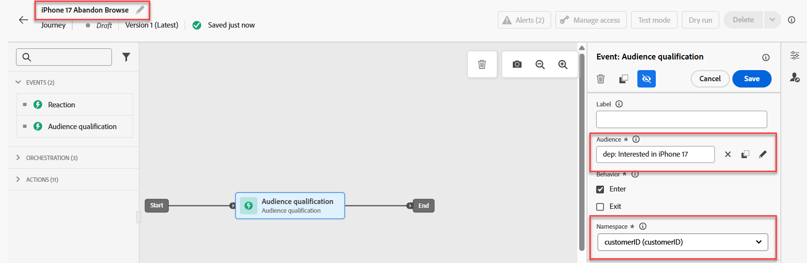に設定されたジャーニーキャンバス

9. 全員が正しく見えたら、青い&#x200B;**保存** ボタンをクリックして進行状況を保存します。

>[!NOTE]
>
>「dep: iPhone 17に興味がある」オーディエンスは、入学基準が架空のConnection 5G iPhone 17の概要ページを同じ日に3回表示するストリーミングオーディエンスです。 多くの製品概要ページと同様に、Connection 5GのiPhone 17の概要ページは、ページのリロードを必要とせずに更新される複数の要素を持つ動的なページです。 IPhone 17の様々な階層とその機能を1 ページで比較できます。 そのため、誰かが同じ日に3回このページを閲覧した場合、その人はiPhone17に興味を持っている可能性があります。 ただし、ページのすべての要素がタグ付けおよび測定されるわけではないため、Connection 5Gでは、認証済みユーザーの年齢を使用して、Connection 5G ブランドの様々な顧客接点と対話する際に表示する電話の階層を決定します。


## CBE ポリシーと決定ポリシーの設定

1. キャンバスの左側にある&#x200B;**アクション** アコーディオンを展開し、**アクション**&#x200B;要素をキャンバスにドラッグして、最初のノードに接続します。
2. 「アクションタイプを選択」オーバーレイが表示されたら、**コードベースエクスペリエンス** アクションを選択し、青い&#x200B;**追加** ボタンをクリックします。
3. 現在表示されている「アクション\：コードベースのエクスペリエンス」プロパティで、「**アクションを設定**」ボタンをクリックします。

   

4. **コードベース設定** ドロップダウンを、前のセクションで作成した&#x200B;**jsonOffer\_cbe** cbeに変更します。

   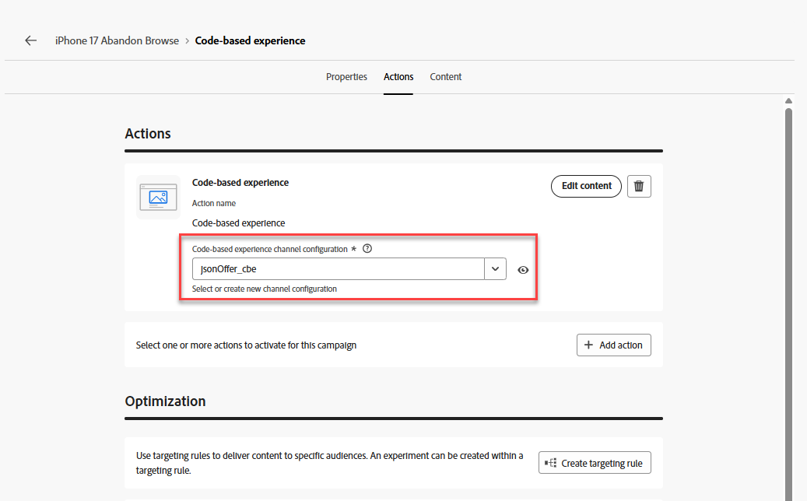

5. 「コードベースの設定」ドロップダウンのすぐ上にある「**コンテンツを編集**」ボタンをクリックします。
6. 結果のコードベースエクスペリエンスエディター画面で、「**コードを編集**」ボタンをクリックします。 結果の画面では、Experience Event リクエストに返されるJSONを追加します

   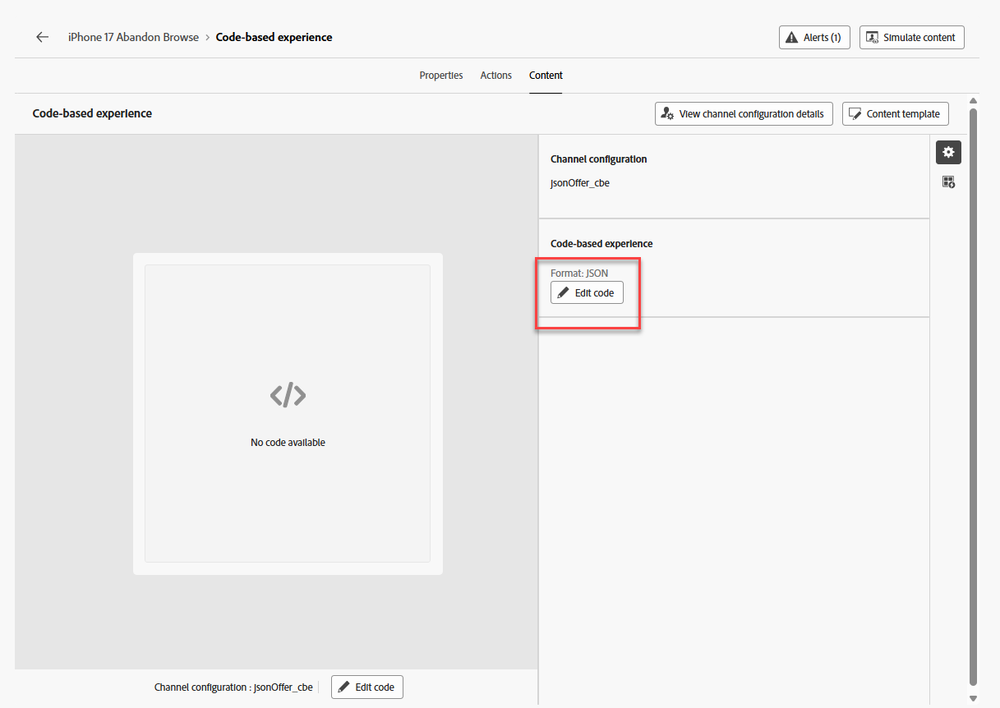

7. コードエディターの左端にある「**決定ポリシー**」メニュー項目をクリックし、新しいメニューの「**決定ポリシーを追加**」ボタンをクリックします。

   決定ポリシーを追加ボタン付きの

   >[!NOTE]
   >
   >選択戦略では、オファーコレクションをランキング方法に関連付け（および戦略レベルの適格性を適用）る場合、決定ポリシーでは、選択戦略をチャネルの特定の配信に関連付けます。

8. この決定ポリシー&#x200B;**iPhone 17 DP**&#x200B;に名前を付け、項目数を1のままにします。

   >[!NOTE]
   >
   >ここまでは、オファーと注文方法を設定しましたが、返品数を設定していません。 ここで、返されるオファーの数を設定します。

9. 青い「**次へ**」ボタンをクリックします。 選択戦略を追加します。 「**+追加**」ボタンをクリックし（下にスクロールして表示する必要がある場合があります）、**選択戦略**&#x200B;を選択します。
10. 選択する必要がある唯一の選択方法（**iPhone 17 Selection Strategy**）の横にあるボックスにチェックを入れ、**保存**&#x200B;をクリックします。 完成したら、次のようになります。

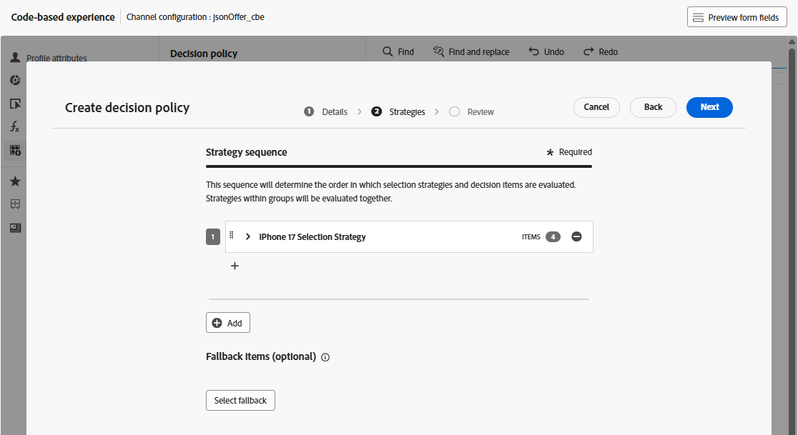

>[!NOTE]
>
>複数の選択戦略を追加する方法や、決定項目を自分で追加する方法に注意してください。 複数の選択戦略をいつ使用しますか？ デジタルプロパティのひとつに4 X 4のレコメンデーショングリッドがあるとします。 全部で16のオファーを入れたいとします。 これらのオファーを複数のコレクションに分散させることもあれば、最初の2行には1つの選択戦略が必要で、下の2行には異なる戦略が必要な場合もあります。 前の画面では、16を選択した後、この画面を使用して、必要に応じて16に到達するために必要な数の選択戦略またはオファーを追加します。
>
>フォールバックオファーはオプションです。これは、エンドユーザーがいずれかのオファーに対して不適格になる（または不適格になる）可能性がある場合にのみ適用されます。 私たちの場合は、すべての訪問者に対して選択戦略を実行し、CBE ノードに到達するのはジャーニーに入った人だけでした。 認証を受けることはジャーニーの入り口の要件です（ジャーニーで設定された名前空間は、認証された場合にのみ持つものです）。 また、フォールバックオファーをランキング式に組み込んだので、この場合、フォールバックオファーを設定する必要はありません。

&#x200B;11. 青い「**次へ**」ボタンをクリックして、決定ポリシーを確認します。

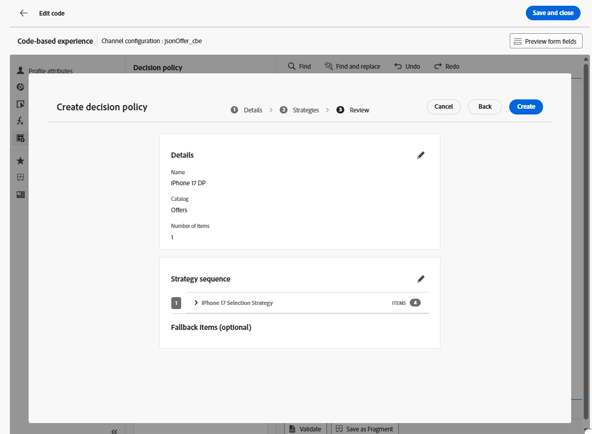

&#x200B;12. 正しく表示されたら、青い「**作成**」ボタンをクリックします。 作成したら、式エディターページに戻ります。
&#x200B;13. 以下のような画面が表示されます。表示されない場合は、**決定ポリシー**&#x200B;をもう一度クリックすると、決定ポリシーが表示されます。

決定ポリシーを挿入する準備ができていることを示す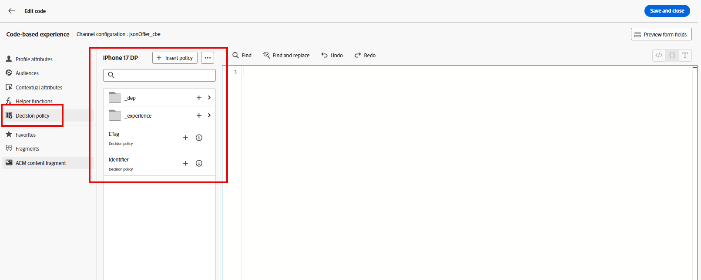

&#x200B;14. 「**+ ポリシーを挿入**」ボタンをクリックすると、ForEach ループがコードエディターに表示されます。

決定ポリシーを挿入した後にコードエディターに挿入された

>[!NOTE]
>
>各ループに対してを選択する理由 今回は、1つのオファーだけを返します。 ただし、複数のオファーを返すことができる前の手順を考えてみましょう。 機能を検討する際には、このループ機構は理にかなっています。

&#x200B;15. ループの境界内に有効なJSONを追加して、エンドユーザーに提供する電話のメーカー、モデル、および階層を返します。 頻度の上限も設定されているので、応答にtrackingTokenを追加する必要があります。 詳しくは、後で説明します。 時間を節約するには、次のコード行をコピーして、For Each ループ内のコードエディターに貼り付けるだけです。

```javascript
{
     "make":"",
     "model":"",
     "tier":"",
     "trackingToken":""
 },
```


>[!NOTE]
>
>標準オファーのXDM スキーマ、特にmake、model、およびtierに属性を追加したことを思い出してください。 オファーが作成されたときに、これらの属性を入力しました。 これらの属性を、選択したオファーの値が入力された変数として追加します。 trackingToken フィールドは、クリックとインプレッションのトラッキングに使用されるシステム生成の値です。

&#x200B;16. 「make」ノードの&#x200B;**&quot;&quot;**&#x200B;の間にカーソルを置きます。 決定ポリシーメニューの&#x200B;**\_dep / デバイス / Make** ノードに移動して、オファーの作成を挿入します。  **Make**&#x200B;要素の&#x200B;**+** アイコンをクリックすると、エディターに入力されます。

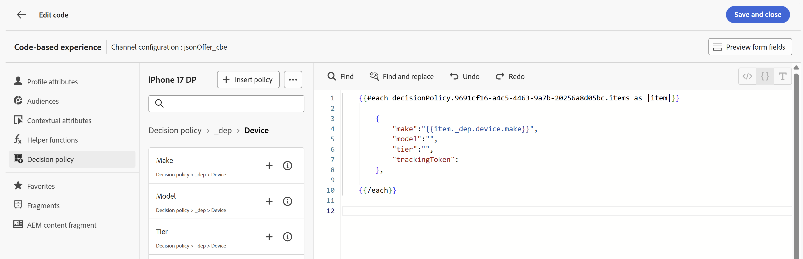

&#x200B;17. **モデル**&#x200B;と&#x200B;**階層**&#x200B;の属性を同様の方法で追加します。
&#x200B;18. 属性ナビゲーションの&#x200B;**決定ポリシー**&#x200B;をクリックして、ルートレベルに戻ります。
&#x200B;19. **\_experience > decisioning > decisionitem > Tracking Token** パスを使用して、トラッキングトークンの値に移動してtrackingToken属性を設定します。
&#x200B;20. 最後に、コード全体を角括弧（**\[]**）で囲みます。 最終的なJSON コードは次のようになります。

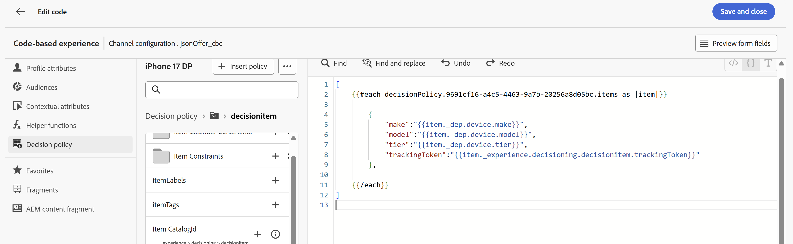

>[!WARNING]
>
>決定項目全体の周囲に括弧「\[ ]」が含まれていることを確認してください。 混乱？ 手順#20もう一度参照してください。


&#x200B;21. 上記のスクリーンショットが表示されたら、右上の&#x200B;**保存して閉じる**&#x200B;をクリックして、コードを保存します。 次に、コードベースのエクスペリエンスペリエンスペリエンスペリエンス ページに戻ります。
&#x200B;22. ジャーニー名の横にある後方矢印&#x200B;**\&lt;** アイコンをクリックすると、キャンバスに戻ります。

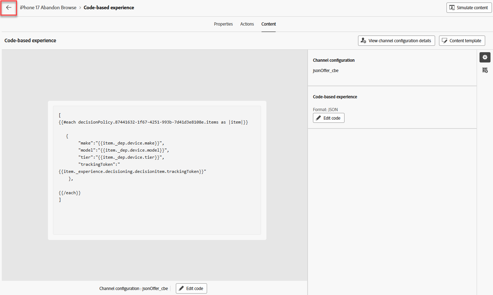

&#x200B;23. 青い&#x200B;**保存** ボタンをクリックして、CBE アクションノードを保存します。 ジャーニーは次のようになります。

完了したCBE アクションノードを示す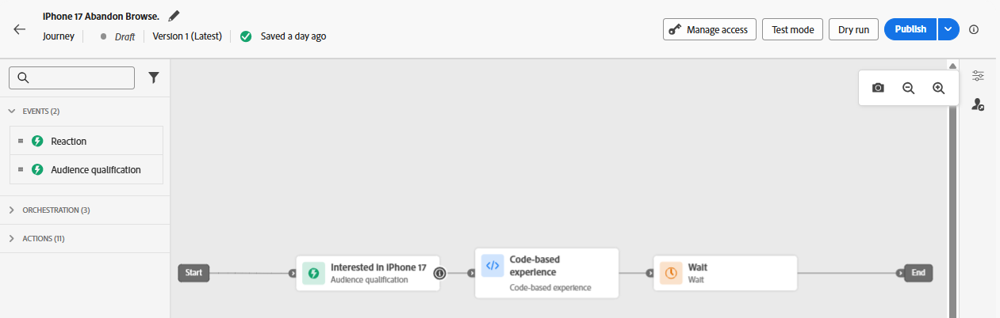

&#x200B;24. ジャーニーが完了したら、右上の青い&#x200B;**公開** ボタンをクリックし、確認ボックスが表示されたら、もう一度&#x200B;**公開** ボタンをクリックします。 しばらくすると、ジャーニーが公開されます。

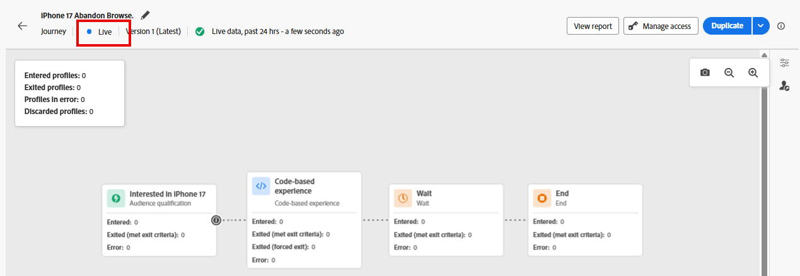

>[!TIP]
>
>これで、ジャーニーがこの決定パッケージのJSON オファーを提供する準備が整いました。

>[!NOTE]
>
>CBEをキャンバスに配置した後に、待機ノードが自動的に作成されたのはなぜですか？ CBEはインバウンドチャネルです。 CBEは、電子メールやプッシュ通知をエンドユーザーに先見的に送信するのではなく、Edgeにプッシュし、エンドユーザーがデジタルプロパティにアクセスしてオファーを要求するのを待ちます。 待機する時間は、その待機ノードによって定義されます。 デフォルトでは3日間に設定されていますが、設定可能です。 このラボでは3日間のままにしますが、実際のシナリオでは、待ち時間が経過すると、そのユーザーのジャーニーがエンドノードに進み、CBEがそのユーザーのEdge プロファイルストアから削除されるため、長く延長する必要があります。
>
>また、これは重要なアーキテクチャとタイミングの考慮事項でもあります。 そのユーザーのCBEは、いつEdge プロファイルストアにプッシュされますか？ ユーザーがそのノードに進むと、つまりセグメントの適格になった後になります。 つまり、ストリーミングセグメンテーションが実行される前に3番目のページを表示してから数秒から数分後に、ユーザーがそのセグメントに配置され、ジャーニーに入り、CBE ノードに進み、そのCBEがそのユーザーのEdgeに投影されます。  データや処理要求が非常に少ないテスト組織では、プロセス全体が数秒から数分です。 スループットがはるかに高い大規模な組織の場合は、少なくとも15分を最大2時間の可能性で計画します。


## まとめ

このページでは、API スタイルのインバウンドチャネルを介して外部システムがオファーの決定をリクエストできるようにするコードベースのエクスペリエンス（CBE）チャネルを設定しました。 この設定には、クライアントシステムが送信するサーフェス/ロケーションパラメーターの指定と、JSON出力形式の選択が含まれます。
