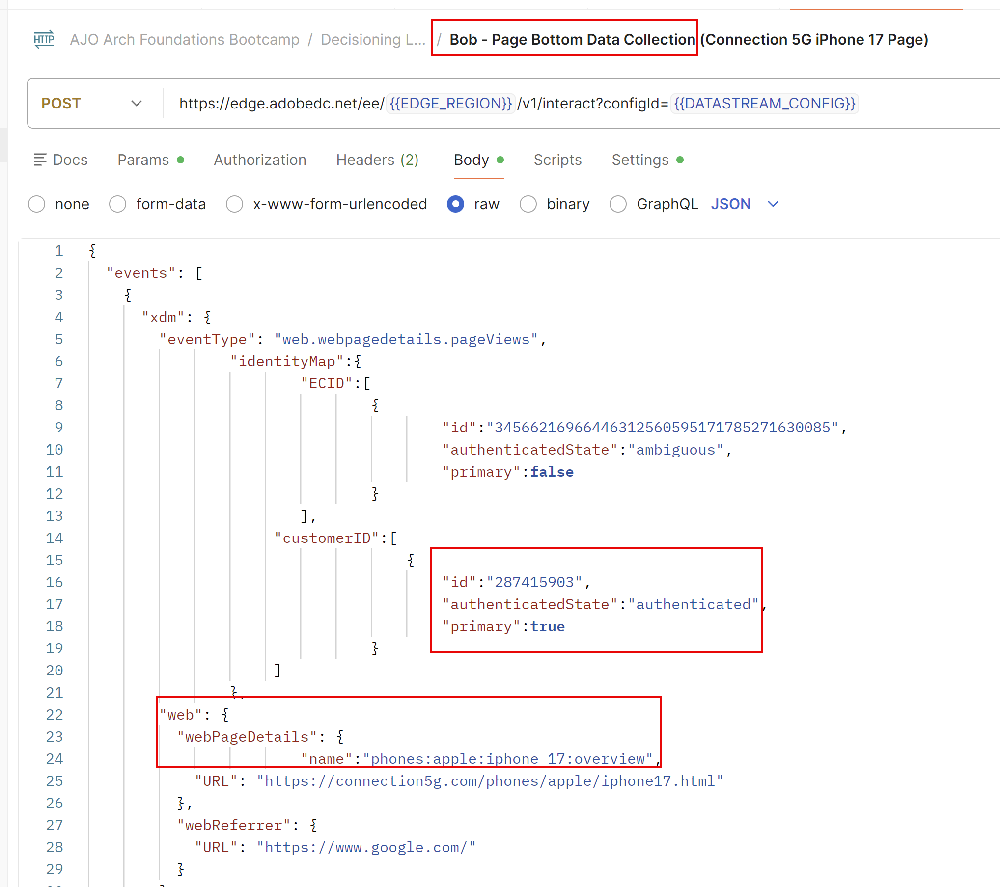

# 意思決定とCBEの活用

## 目標

ジャーニーが公開されたら、Experience Eventsで送信を開始し、返されるオファーを確認できます。 個々のプロファイルの誕生年と電話プラン IDがオファーの返品対象に影響を与えるため、特定の誕生年とプラン IDを持つ事前設定済みのプロファイルに対してExperience Eventsを送信する必要があります。

## プロファイルとPostmanの設定

使用する3つのプロファイルは既にサンドボックス内にあり、次の表で説明します。

| 名 | 姓 | 誕生年 | プラン ID | customerID | ECID | 電子メール |
| ---------- | ------------ | ---------- | ------- | ---------- | -------------------------------------- | --------------- |
| ボブ | 基本 | 1974 | 1 | 287415903 | 34566216966446312560595171785271630085 | bob\@dep.com |
| Peter | Professional | 1981 | 2 | 105946728 | 22344522145769262754334953788432801285 | peter\@dep.com |
| ウルスラ | Ultimate | 2002 | 3 | 730682145 | 35615467908312308343036144243711275069 | ursula\@dep.com |

これらのプロファイルをAEPで探します

1. 必要に応じて、左側のパネルの&#x200B;**顧客**&#x200B;項目を展開し、**プロファイル**&#x200B;をクリックします
1. 「**参照**」タブをクリックすると、既に作成されたプロファイルまたは以前のラボの一部として作成したプロファイルの中に、次の3つのプロファイルが表示されます。

   Postman コレクションの各プロファイルに対応するエクスペリエンスイベントを検索します

1. 必要に応じて、Postmanを開きます
1. **EDGE\_REGION**&#x200B;および&#x200B;**DATASTREAM\_CONFIG**&#x200B;の環境変数が引き続き設定されていることを確認します。 もう一度設定する必要がある場合は、「環境とコレクションの読み込み」ラボの手順を確認してください。
1. **Decisioning Lab** フォルダーを展開します。 プロファイルごとに2つのエクスペリエンスイベントが表示されます。

## Experience Eventsでの送信

>[!IMPORTANT]
>
>このセクションの冒頭のテキスト説明をスキップしないでください。

時間とリソースに制限はありませんが、AEP Web SDKを使用してタグライブラリを構築し、実際のweb サイトにデプロイしていただきます。 この例では、オファーを取得してレポートする方法を示します。 しかし、これらのラボで取り上げられているコンテンツの幅広さと深さを考慮して、アドビでは、web サイトにタグを付けるのではなく、Postman コレクションでジャーニーを入力し、オファーを取得し、それらのオファーについてレポートを作成するために必要なExperience Eventsを事前に構築することを選択しました。 このコレクションを正しく使用すると、適切にタグ付けされたサイト（または任意のデジタルチャネル）がジャーニーでCBE配信チャネルをどのように使用するかを模倣できます。

AEP Web SDKのデプロイメントで推奨されるアプローチは、ページごとに2回呼び出しのアプローチを使用することです。 このパターンでは、Web SDKは、ページの上部にある「fetch」呼び出しをEdgeに送信し、ユーザーに必要なパーソナライゼーションをリクエストします。 これらのパーソナライゼーションは、Edgeによって返され、その後Web SDKによってレンダリングされます。 ページの下部にある2回目の呼び出し（通常はデータ収集呼び出しと呼ばれます）がEdgeに送信され、Analytics、CJA、その他のソリューションのデータとともに、エンドユーザーに表示された内容に関するレポートが送信されます。 Edgeから提案書を取得する場合は、Fetch、Apply、Reportを表すFARという単純なニーモニックを覚えておいてください。 すべての提案は、取得、適用、またはレンダリング（エンドユーザーに表示）され、次に報告する必要があります。 頻度の上限ルールが機能するように、これらのオファーが表示されることが重要です。

Adobe Target アクティビティとAJO Web チャネルは、AEP Web SDKによって応答を自動的に取得および適用できます。 レポートは、ページの下部にあるデータ収集呼び出しで送信することもできます。 しかし、CBEは違います。 AEP Web SDKは提案を取得できますが、返された内容を適用（レンダリング）してから、AEP Web SDKを使用して表示された内容を報告するのは、お客様の責任です。 CBEは通常、データ収集呼び出しを使用して表示された内容をレポートしないため、手動で渡す必要があります。

Postman コレクションでは、各プロファイルに2つのExperience Event呼び出しがあります

ページ上部の取得エクスペリエンスイベント

ページ下部のデータ収集エクスペリエンスイベント

ページトップエクスペリエンスイベントには、CBE用に設定した「ページ上の場所」である「jsonOfferContainer」パラメーターがリクエストに含まれます。 さらに、この呼び出しは、Postmanのスクリプト機能を使用してEdgeから応答を受け取り、その後すぐに2回目の呼び出しをEdgeに送信して、オファーがエンドユーザーに表示されたことを報告します。 このラボのWeb サイトがないため、オファーの実際のアプリケーションやレンダリングはありません。 しかし、AJOの観点からは、オファーは返され、見たように報告されました。

ページボトムのデータ収集コールは、iPhone 17の概要ページのページビューを生成するためのものです。 ジャーニー自体に入るためのセグメントには、このページの3つのビューが必要です。 エクスペリエンスイベントが3回送信されると、そのユーザーはジャーニーにエントリし、オファーを取得して表示されたことをレポートするには、「ページの上位の取得」エクスペリエンスイベントのみが必要になります。

まずはボブのプロフィールから。

1. **Bob - Page Bottom Data Collection** リクエストをクリックします。
2. 「**Body**」タブをクリックし、IdentityMapのcustomerID名前空間など、認証されたことを示すパラメーターと、「phones\:apple\:iphone 17\:overview」のページ名に渡される「web.webPageDetails.name」パラメーターが渡されます。

   

3. 右上隅の&#x200B;**送信**&#x200B;をクリックして、ページビューを送信します。 類似した応答が返されます

   

4. 適切な応答を受け取ったら、**送信**&#x200B;をもう一度クリックして、同じページの下部イベントを2回目に再送信します。 数秒待ってから、3回目のデータ収集呼び出しをBob プロファイルに送信します。 合計3件のページ最下部の通話を送信しました。

   現時点では、これらのヒットを処理し、ボブを「dep: Interested in iPhone 17」ストリーミングセグメントに追加しています。 それが完了すると、ボブはジャーニーに入れられます。 ジャーニーに入ると、ボブのジャーニーとセグメントへのボブの入り口がEdge プロファイルストアに投影されるまでにわずか数分かかります。

5. AJO UIに戻り、左側のパネルの「**プロファイル**」をクリックし、続いて「**参照**」タブをクリックします。
6. 値&#x200B;**287415903**&#x200B;の&#x200B;**customerID**&#x200B;名前空間を使用して、ボブのプロファイルを検索します。

   

7. **表示**&#x200B;をクリックして、ボブのプロファイルを開きます（ボブのプロファイルの色は、スクリーンショットに表示されている色と異なる場合があります）。

   

8. Bobのプロファイルが開いたら、「**オーディエンスメンバーシップ**」タブをクリックすると、少なくともAEP Hubの観点から、Bobが「dep: iPhone 17に興味がある」セグメントのメンバーであることがわかります。
9. 「**属性、**」をクリックし、「**Edge**」ラジオボタンを選択して、Edge ビューに切り替えます。

   プロファイルビューを切り替える「

   >[!WARNING]
   >
   >ラジオボタンをEdgeに切り替えるには、「属性」タブをクリックする必要があるUIのバグがあります。

10. **Audience メンバーシップ、**&#x200B;をもう一度クリックすると、これらの手順を十分にすばやく実行した場合、Edgeが選択され、BobにAudience メンバーシップがないことが表示されます

1. 新しいブラウザータブで、作成したジャーニーに移動し、そのタブをクリックします。 1つのプロファイルがノードに入力され、CBE ジャーニーに配置されていることがわかります。

   

   この時点で、ボブはジャーニーに入り、Edge図法は現在、Edge上のボブのプロフィールを更新する図法を組み立てています。

1. Postmanに切り替えて、BobのExperience Event呼び出しの2番目の&#x200B;**Bob - Page Top Fetchをクリックします。**
1. **送信**&#x200B;をクリックします。 どうなるのでしょうか？
   - BobのEdge プロファイルがまだ更新されていない場合は、Data Collection呼び出しから得たものと非常によく似た応答が返されます。 この場合は、もう1分か2分待ってから、BobのPage Top Fetch呼び出しを再度送信してみてください。
   - BobのEdge プロファイルが更新された場合、以前に設定したJSONと、レポートに使用する追加情報を含む応答が返されます。 しかし、先に進む前に、iPhone17のオファーはボブが提供されるべきですか？

     ボブは1974年に生まれ、1966年よりも大きいので、2番目のランキング式の基準に適格となり、彼のGeneric、Base、Pro オファーの優先順位スコアはそれぞれ100を掛け、100、200、300のオファースコアを与えます。 ただし、Bob Basicにはプラン ID 1があるため、UltraまたはPro レベルのオファーの対象にはなりません。 したがって、スコアが200のベース層オファーが表示されます。 応答で確認できます（おそらく下にスクロールする必要があります）。

   Bob](assets/decisioning-and-cbes-in-action-bob-base-offer-response.png)に対して返されたベース層オファーを示す

1. **送信**&#x200B;をもう一度クリックすると、汎用階層オファーが表示されます。 「送信」を100回以上クリックすると、フリークエンシーキャップがリセットされた翌日まで同じオファーが返されます。

   >[!WARNING]
   >
   >AJOでは、日は深夜GMTにリセットされます。 深夜GMTの後に別のFetch呼び出しを送信する場合は、代わりにベース層オファーが返されます。

1. Journey Orchestration UIに戻り、作成した&#x200B;**iPhone 17 Abandon Browse** ジャーニーをクリックします。 ジャーニーが公開されているため、統計情報が表示されます。 1つのプロファイルがノードに入力され、現在CBE ジャーニーにあることがわかります。

>[!NOTE]
>
>この時点で、なぜプロファイルが待機ノードにないのか疑問に思うかもしれません。 CBE ノードにヒットし、BobのEdge プロファイルに更新を反映したら、待機ノードに移動しますか？ 簡単に言えば、それは可能かもしれませんが、CBEが積極的に返されるので、ボブがこのジャーニーに載っているという議論を行う可能性もあります。 しかし、3日後、ジャーニーは、プロファイルが実際に待機ノードにいることなく、ジャーニーを完了したことを示します。

## 他のプロファイル用にExperience Eventsで送信

ジャーニーがボブのプロフィールで機能するのを見た今、テストする他の2つのプロフィールがあります。

1. Postmanに戻り、PeterとUrsulaのエクスペリエンスイベントを探します。
2. 「Page Bottom Data Collection」イベントを各プロファイルに対して3回実行し、各送信/データ収集リクエストの間に1～3秒を割り当てることを忘れないようにします。
3. 3つのプロファイルがストリーミングセグメントの対象となるまで数分待ってから、ジャーニーを入力し、CBEをEdge プロファイルに投影します。
4. ページの先頭にFetch呼び出しを必要に応じて何度でも送信して、決定ルールとランキング式が期待どおりに機能していることを確認します。

   **決定プロファイル：期待される動作**

   | 名 | 姓 | ファーストオファー | セカンドオファー | 3rd オファー | 第4回オファー |
   | ---------- | ------------ | --------- | --------- | --------- | --------- |
   | ボブ | 基本 | ベース | 汎用 | 汎用 | 汎用 |
   | Peter | Professional | Pro | ベース | 汎用 | 汎用 |
   | ウルスラ | Ultimate | Ultra | Pro | ベース | 汎用 |

5. 終了したら、ジャーニーに戻ります。 3つのプロファイルがすべてノードに入力され、CBE ジャーニーにあることがわかります。

>[!NOTE]
>
>3日間待ってページの先頭の取得を再送信すると、オファーが返されず、3つのプロファイルがすべてジャーニーを完了したことがわかります

## まとめ

ラボのこの最後のページでは、実行フェーズに移行しました。このフェーズでは、エクスペリエンスイベントとコードベースエクスペリエンス（CBE）チャネルを使用して決定設定をテストしました。 Postmanを使用して、シミュレートされたエクスペリエンスイベントをAdobe Journey Optimizerに送信することで、次のことが可能になりました。

- ストリーミングセグメントの条件を満たしているため、作成したジャーニーに入力されたプロファイル。
- プロファイルデータ（誕生年、電話プランなど）に基づくオファー決定を取得するために、CBE チャネルをフェッチイベントで呼び出しました。
- オファーが返され、設定された頻度の上限に対してカウントされ、様々なルールとランキングロジックがどのオファーの配信に影響を与えたかを示します。
- オファーフェッチ呼び出しを繰り返し送信することで、頻度の上限と実施要件が期待どおりに機能することを確認しました。

実際の意思決定の呼び出しを実行し、プロファイルが意思決定エンジンと対話する際に、適格性ルール、ランキング式、オファー設定が正しく動作することを検証しました。
