# ジャーニーを構築

## 学習目標

設定された注文出荷イベントで始まる単一ジャーニーを作成し、外部サービスからETAを取得してメールを送信します。

## ジャーニーを作成

**ジャーニー**&#x200B;に移動し、**ジャーニーを作成 – ゼロから作成**&#x200B;をクリックします

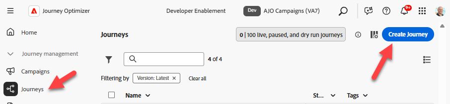


## ジャーニーのプロパティ

1. 右側のパネルのジャーニープロパティを次のように更新します。
   - **名前**: `Order Shipped Journey`
   - **説明**: `Notify customer that order has shipped. Include shipping details.`
   - **タグ**: `Default`
   - **ジャーニー指標**: *空白のままにする*

     >[!NOTE]
     >
     >**空のドロップダウン？**
     >
     >心配しないで、先に進みなさい。 サンドボックスで最初に作成したジャーニーは、「ポンプの始動」する必要があります。  ジャーニーを公開すると、このドロップダウンにオプションが表示されます。

   - **再エントリを許可**: `checked`

   - **再入場待機期間：** `5 minutes`

   - **アクセスラベル**: *空白のままにする*

   - **タイムゾーン**: `Your Local timezone`

   - **待機と条件でプロファイルタイムゾーンを使用**: `NOT checked`

   - **開始日/終了日**: *空白のままにする*

   - **タイムアウトまたはエラー**: `30`

   - **キャッピングルール：** *空白のままにする*

   - **優先度**: `0`


2. 問題ないようです。**保存** ボタンをクリックします

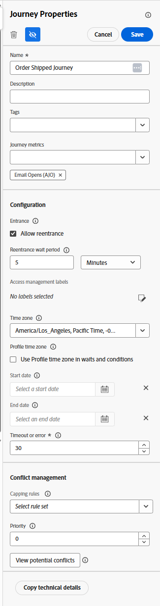


## ジャーニーキャンバス

### 単一イベントの追加

**イベントメニュー**&#x200B;の下の左側のペインから、**orderShipped** イベントを下に示すようにキャンバスにドラッグします

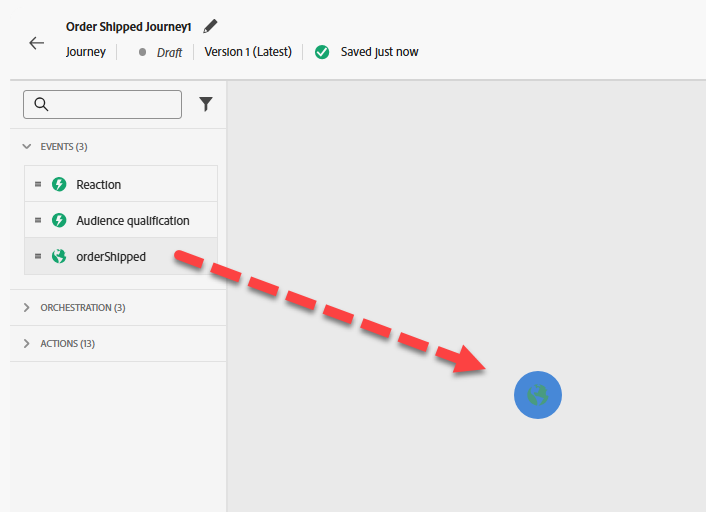


### カスタムアクションを追加

1. 左側のペインで&#x200B;**アクション メニュー**&#x200B;を展開し、orderShipped イベントの後に&#x200B;**GetShippingDetails**&#x200B;という名前で作成したアクションをキャンバスにドラッグしない場合

   

2. 右側のパネルで、「アクセスとプライバシー設定 – > マーケティングアクション」ドロップダウンで、値が&#x200B;**None**&#x200B;に設定されていることを確認します

   アクセスおよびプライバシー設定で

3. エンドポイント設定/ クエリパラメーターのメニューで、orderidの横にある&#x200B;**鉛筆アイコン**&#x200B;をクリックします

   

4. 表示されるモーダルで、**Context** -> **orderShipped** -> **Order**&#x200B;を展開し、**Order ID （orderID）**&#x200B;を選択して&#x200B;**OK**&#x200B;をクリックします

   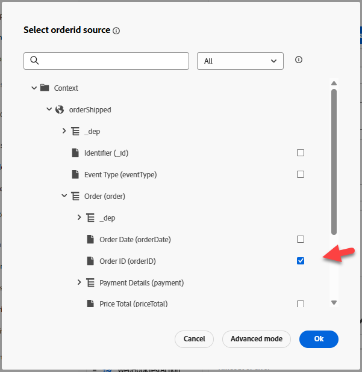

5. 右側のパネルに戻り、タイムアウトまたはエラーのオプションが&#x200B;**オフ**&#x200B;であることを確認し、**保存ボタン**&#x200B;をクリックします


### メールアクションを追加

1. 「アクション」メニューの「**アクション**」アクションを「GetShippingDetails」アクションの後にキャンバスにドラッグ&amp;ドロップします

   の後で、アクションノードをキャンバスにドラッグします

2. マーケティングアクションに「**電子メール**」を選択し、**追加**&#x200B;を選択します。

   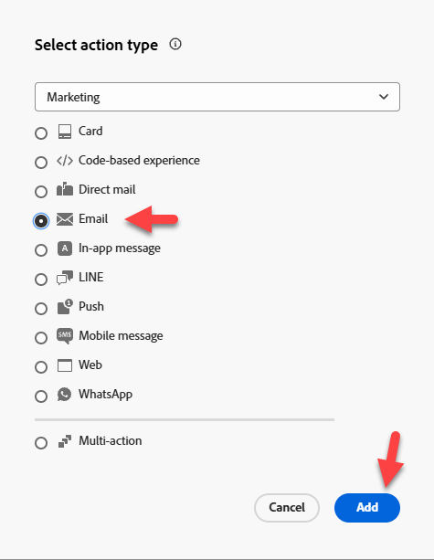

3. 右側のパネルで、**アクションの設定**&#x200B;をクリックします

   

4. **メールチャネル設定**&#x200B;を`Profile-Email`に設定し、**コンテンツを編集**&#x200B;をクリックします

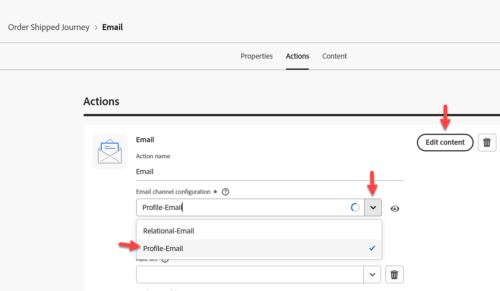を使用して、メールチャネル設定をProfile-Emailに設定しました


### メール本文コンテンツの追加

コンテンツについては、物事をシンプルにする必要があります。 間抜けなシンプルさ。

1. 件名を`Order Shipped`に更新し、**メール本文を編集ボタン**&#x200B;をクリックします

   

2. 上部のバーで、**ゼロからデザイン** コンテンツブロックをクリックします

   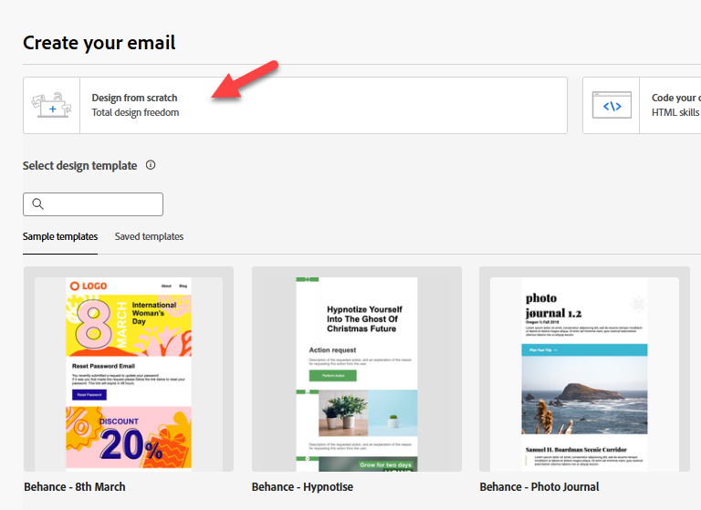

3. 構造コンテナの下の左バーから、**1:1列**&#x200B;をキャンバスにドラッグ&amp;ドロップします

   

4. 次に、コンテンツコンテナの下に、**テキスト** コンポーネントを&#x200B;**1:1列**&#x200B;にドラッグ&amp;ドロップします

   

5. テキストコンポーネントをクリックし、現在のテキスト **を**&#x200B;削除してから、**Personalizationを追加** アイコンをクリックします

   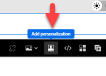

6. 左側のパネルで、**コンテキスト属性** フォルダーをクリックし、**Journey Orchestration** -> **アクション**&#x200B;に移動して、**GetShippingDetails**&#x200B;を選択します

   の下にあるGetShippingDetailsを選択します

7. メールの本文で、次のJSONを&#x200B;**コピーして** Personalization **editor**&#x200B;に貼り付けます

   ```json
   {{profile.person.name.firstName}}, your order has shipped
   ETA: 
   Tracking Number: 
   ```

8. パーソナライゼーションフィールドを次のように追加します（**左側のパネルのフィールドの横にあるプラス「+」記号をクリックします**）。
   - **ETA:** `eta`
   - **トラッキング番号：** `tracking_number`

   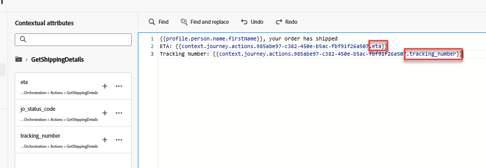

   >[!NOTE]
   >
   >**+記号**&#x200B;をクリックして、パネルからキャンバスにパーソナライゼーション属性を追加します。  カーソルが置かれている場所に配置されるので、適切に「整列」していることを確認します

   >[!NOTE]
   >
   >メールでは、コンテキスト属性（ETAとトラッキング番号）とプロファイル属性（名）の組み合わせを使用します。 他のプロファイル属性を追加する場合は、「プロファイル属性」タブをクリックして、表示される任意の項目を選択できます。
   >
   >プロファイル属性を追加するための

9. 画面の下部にある「**検証**」ボタンをクリックし、エラーがないことを確認します

   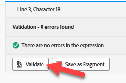

10. すべて問題ないようです。右上の&#x200B;**保存ボタン**&#x200B;をクリックします
11. 次に、右上の&#x200B;**保存** ボタンをもう一度クリックし、左上の&#x200B;**\&lt; – 左矢印**&#x200B;をクリックします


&#x200B;12. 最後に、左上の&#x200B;**\&lt; Back icon**&#x200B;をクリックして、ジャーニーキャンバスに戻ります

左上の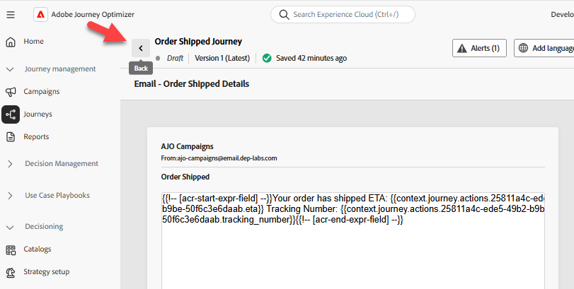

>[!TIP]
>
>次に、**戻る** ボタンをもう一度クリックします…冗談です！ これが最後の「戻る」ボタンです。このセクション 😜


### 電子メールパラメーターの上書き

メインジャーニーのCanvasに戻り、メールノードで読み取り専用フィールドが表示されていることを確認します（**読み取り専用フィールドを表示** アイコンをクリックする必要がある場合があります）


1. **メールパラメーター**&#x200B;までスクロールし、**パラメーターの上書きを有効にする** アイコンをクリックします

   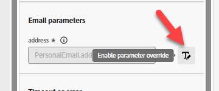のパラメーターの上書きアイコンを有効にする

2. 空のテキストボックスをクリックし、左側のパネルで&#x200B;**Context** -> **orderShipped** -> **\_dep**&#x200B;にドリルダウンして、**personalEmail** フィールドをクリックします。  次に、**OK ボタン**&#x200B;をクリックします

   の下のpersonalEmail フィールドを選択します

   >[!WARNING]
   >
   >これは危険なことなので、実稼動設定で必要な場合を除き、使用を避けてください。  これにより、ジャーニーがメッセージを実行するためにプロファイルで検索するデフォルトの場所が上書きされます。


3. 右上の&#x200B;**保存ボタン**&#x200B;をクリックし、左上の&#x200B;**戻る矢印** \&lt; – をクリックして、**ジャーニーを閉じる**&#x200B;します


## まとめ

「Order Shipped」イベントトリガーに対応し、外部サービスからETAを取得し、メールを送信できる公開ジャーニー。
