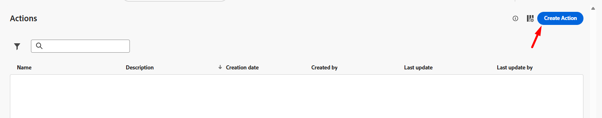
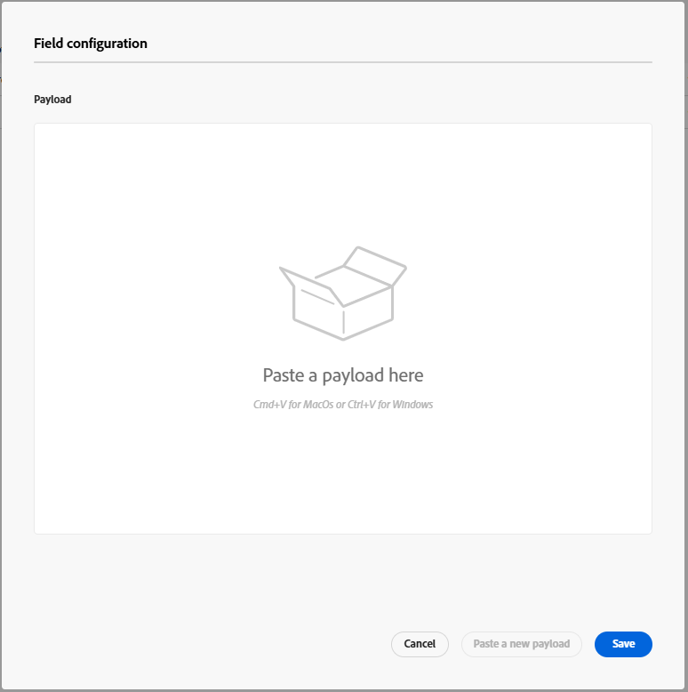

# カスタムアクションの設定

## 学習目標

パッケージの到着時にETAを取得するために、ジャーニーが外部エンドポイントまたはサービスと通信する方法を定義するカスタムアクションを作成します。

## アクションに移動

管理メニューの左側のパネルで「**設定**」をクリックし、「**管理**」ボタンをクリックします

のアクション タイルの「管理」ボタン


## アクションの設定

### アクション名と詳細

1. 右上の「**アクションを作成**」ボタンをクリックします

   

2. 表示される設定パネルで、次に示すように次の基本値を更新します。
   - **名前**: `GetShippingDetails`
   - **説明**: `Call third party to get Shipping ETA and Tracking Number`
   - **アクションの種類**: `Custom`
   - **チャネル**: `Email`
   - **必要なマーケティング活動**: `Email Targeting`


### エンドポイントの詳細

エンドポイント設定領域には、次の詳細が表示されます。

- **エンドポイント URL**: `https://api.mockaroo.com/api/67077bb0?count=1&key=a0dbce20`
- **方法**: `GET`
- **ヘッダー：** *そのまま残す*
- **クエリパラメーター：**
  - **名前**: `orderid`
  - **種類**: `variable`

>[!NOTE]
>
>変数を使用すると、すべてのジャーニーに静的な値を使用するのではなく、ジャーニー中に値を渡すことができます

- **認証タイプ**: `No Authentication`


に設定されました


### 応答ペイロードの詳細

次に、応答ペイロードがどのように表示されるかをアクションが把握できるように、サンプルペイロードを指定する必要があります。

1. ペイロード領域で、**鉛筆アイコン**&#x200B;をクリックして、フィールド設定画面を開きます

   

   応答ペイロードの


2. **以下のペイロードをペイロードボックスにコピーして**&#x200B;貼り付けます

   ```json
   {
    "eta": "11/19/2025",
    "tracking_number": "072000326"
   }
   ```

   >[!NOTE]
   >
   >これは、上記のMockaroo エンドポイントが返すのと同じJSON構造です。


3. 応答ペイロードが表示されます。 「**保存**」ボタンをクリックします。


>[!NOTE]
>
>すべてを文字列として残すこともできますが、実際には、データタイプに一致するように更新する必要があります


### アクションのテスト

1. 右下のパネルの「**テストリクエストを送信**」ボタンをクリックして、設定が正しく機能することを確認します

   


2. 「**クエリパラメーター**」タブをクリックし、`orderId`の値を&#x200B;**123**&#x200B;に更新します

   に設定された「クエリパラメーター」タブ


3. **送信ボタン**&#x200B;をクリックすると、すべて正常に動作した場合は、応答コード 200とペイロードのプレビューが表示されます（下図を参照）。..

   

   プレビュー

   ```json
   {
     "eta": "12/26/2025",
     "tracking_number": "063112249"
   }
   ```

   >[!WARNING]
   >
   >200件の応答またはプレビューが表示されない場合は、続行しないでください。 ファシリテーターに助けを求めます。


4. 「**キャンセル**」ボタンをクリックしてアクション画面に戻り、右上のレールで上にスクロールして、**保存** ボタンをクリックします

>[!SUCCESS]
>
>おめでとうございます！ エキスパートレベルのCtrl+C、Ctrl+V スキルを使用すると、カスタムアクションがライブになります。

## まとめ

Adobe Journey Optimizerで設定された再利用可能なカスタムアクション。注文IDを取得し、ETAとトラッキング番号を返します。
